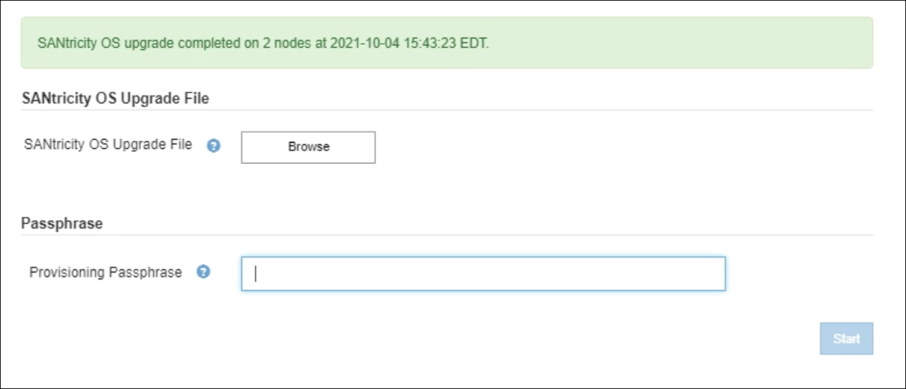

= 
:allow-uri-read: 

[role="lead"]
現在 SANtricity OS 08.42.20.00 （ 11.42 ）以降を使用しているストレージコントローラの場合、 Grid Manager を使用してアップグレードを適用する必要があります。

.必要なもの
* NetApp Interoperability Matrix Tool （ IMT ）を参照して、アップグレードに使用する SANtricity OS のバージョンがお使いのアプライアンスと互換性があることを確認してください。
* Maintenance または Root アクセス権限が必要です。
* を使用して Grid Manager にサインインします xref:../admin/web-browser-requirements.adoc[サポートされている Web ブラウザ]。
* プロビジョニングパスフレーズを用意します。
* SANtricity OS に関するネットアップのダウンロードページを利用できます。

SANtricity OS のアップグレードプロセスが完了するまで、他のソフトウェアの更新（ StorageGRID ソフトウェアのアップグレードまたはホットフィックス）は実行できません。SANtricity OS のアップグレードプロセスが完了する前にホットフィックスや StorageGRID ソフトウェアのアップグレードを開始しようとすると、 SANtricity OS のアップグレードページが表示されます。

手順 は、アップグレード対象として選択されたすべての該当ノードに SANtricity OS のアップグレードが正常に適用されるまでは完了しません。各ノードの SANtricity OS を（順次）ロードする場合は 30 分以上、各 StorageGRID ストレージアプライアンスをリブートする場合は最大 90 分かかることがあります。

CAUTION: 次の手順は、 Grid Manager を使用してアップグレードを実行する場合にのみ実行できます。コントローラで 08.42.20.00 （ 11.42 ）より前の SANtricity OS を使用している場合、アプライアンス内のストレージコントローラを Grid Manager を使用してアップグレードすることはできません。

NOTE: この手順 は、 SANtricity OS のアップグレードに関連付けられた最新バージョンに NVSRAM を自動的にアップグレードします。個別の NVSRAM アップグレードファイルを適用する必要はありません。

.手順
. [[download_SANtricity_os]] ネットアップサポートサイトから新しい SANtricity OS ソフトウェアファイルをダウンロードします。
+
ご使用のストレージコントローラに対応する SANtricity OS バージョンを選択してください。

+
https://mysupport.netapp.com/site/products/all/details/storagegrid-appliance/downloads-tab["ネットアップのダウンロード：StorageGRID アプライアンス"^]

. 「 * maintenance * > * System * > * Software update * 」を選択します。
+
image::../media/software_update_landing.png[ソフトウェアアップデートのランディングページ]

. SANtricity OS アップデートセクションで、 * アップデート * を選択します。
+
SANtricity OS のアップグレードページが表示されます。

+
image::../media/santricity_os_upgrade_first.png[StorageGRID First SANtricity OS ページを示すスクリーンショット]

. ネットアップサポートサイトからダウンロードした SANtricity OS アップグレードファイルを選択します。
+
.. [ * 参照 * ] を選択します。
.. ファイルを探して選択します。
.. 「 * 開く * 」を選択します。
+
ファイルがアップロードされて検証されます。検証プロセスが完了すると、 * 参照 * ボタンの横にファイル名が表示されます。

+

NOTE: ファイル名は検証プロセスで指定されるため変更しないでください。

. プロビジョニングパスフレーズを入力します。
+
「 * Start * （スタート * ）」ボタンが有効になります。

+
image::../media/santricity_start_button.png[StorageGRID First SANtricity OS ページを示すスクリーンショット]

. 「 * Start （開始）」を選択します
+
アップグレードされたノードのサービスを再起動するとブラウザの接続が一時的に失われる可能性があることを示す警告ボックスが表示されます。

+
image::../media/santricity_upgrade_warning.png[接続が一時的に失われることを示すダイアログボックスのスクリーンショット]

. 「 * OK 」を選択して、 SANtricity OS アップグレードファイルをプライマリ管理ノードにステージングします。
+
SANtricity OS のアップグレードを開始すると、次の処理が行わ

+
.. 健全性チェックが実行されます。このプロセスにより、ステータスが「 Needs Attention 」になっているノードがないかどうかが確認されます。
+

NOTE: エラーが報告された場合は、エラーを解決してから、「 * Start * （開始）」を再度選択します。

.. SANtricity OS Upgrade Progress テーブルが表示されます。この表には、グリッド内のすべてのストレージノードと、各ノードのアップグレードの現在のステージが表示されます。
+

NOTE: すべてのアプライアンスストレージノードが表に表示されます。ソフトウェアベースのストレージノードは表示されません。アップグレードが必要なすべてのノードに対して「 * 承認」を選択します。

+
image::../media/santricity_upgrade_progress_table.png[SANtricity OS のアップグレードページの「 SANtricity OS のアップグレードの進捗状況」部分を示すスクリーンショット]

. 必要に応じて、ノードのリストを * Site * 、 * Name * 、 * Progress * 、 * Stage * 、 * Details * 、 または * 現在のコントローラファームウェアバージョン * 。または、 * 検索 * ボックスに用語を入力して特定のノードを検索します。
+
ノードのリストをスクロールするには、セクションの右下隅にある左右の矢印を使用します。

. アップグレードキューに追加する準備ができたグリッドノードを承認します。同じタイプの承認済みノードが一度に 1 つずつアップグレードされます。
+

IMPORTANT: アプライアンスストレージノードを停止およびリブートして問題ないことを確認するまでは、そのノードの SANtricity OS アップグレードを承認しないでください。ノードで SANtricity OS のアップグレードが承認されると、そのノードのサービスが停止し、アップグレードプロセスが開始されます。その後、ノードのアップグレードが完了すると、アプライアンスノードがリブートされます。このような処理を実行すると、ノードと通信しているクライアントで原因 サービスが中断する可能性があります。

+
** すべてのストレージノードを SANtricity OS アップグレードキューに追加するには、すべて承認ボタン * を選択します。
+

NOTE: ノードのアップグレード順序が重要な場合は、ノードまたはノードグループを 1 つずつ承認し、各ノードでアップグレードが完了するまで待ってから、次のノードを承認します。

** 1 つ以上の * 承認 * ボタンを選択して、 SANtricity OS アップグレードキューに 1 つ以上のノードを追加します。
+
[* Approve * （承認） ] を選択すると、アップグレードプロセスによってノードをアップグレードできるかどうかが決定されます。ノードをアップグレード可能な場合は、アップグレードキューに追加されます。

+
ノードによっては、選択したアップグレードファイルが意図的に適用されていないため、これらのノードをアップグレードせずにアップグレードプロセスを完了することができます。ノードが意図的にアップグレードされていない状態になると、「 complete 」（アップグレード試行）と表示され、ノードがアップグレードされなかった理由が Details 列に表示されます。

. SANtricity OS アップグレードキューからノードまたはすべてのノードを削除する必要がある場合は、「 * Remove * 」または「 * Remove All * 」を選択します。
+
ステージが Queued を超えると、「 * Remove * 」ボタンは非表示になり、 SANtricity OS のアップグレード処理からノードを削除できなくなります。

. 承認された各グリッドノードに SANtricity OS のアップグレードが適用されるまで待ちます。
+
** SANtricity OS のアップグレードの適用中にいずれかのノードでエラーのステージが表示される場合、そのノードのアップグレードは失敗しています。テクニカルサポートの助言を受けて、アプライアンスをリカバリするためにメンテナンスモードに切り替えることが必要になる場合があります。
** ノード上のファームウェアが古すぎて Grid Manager でアップグレードできない場合、そのノードは Error をステージに表示します。 "` このノードで SANtricity OS をアップグレードするには、保守モードを使用する必要があります。使用しているアプライアンスのインストールとメンテナンスの手順を参照してください。アップグレード後は ' このユーティリティを将来のアップグレードに使用できます エラーを解決するには、次の手順を実行します。
+
... メンテナンスモードを使用して、「エラー」のステージが表示されるノードの SANtricity OS をアップグレードします。
... Grid Manager を使用して、 SANtricity OS のアップグレードを再起動して完了します。

+
承認されたすべてのノードで SANtricity OS のアップグレードが完了すると、 SANtricity OS アップグレードの進捗状況テーブルが閉じ、緑のバナーに SANtricity OS のアップグレードが完了した日時が表示されます。

. ノードをアップグレードできない場合は、 Details 列に表示された理由を確認し、該当する操作を実行します。
+
** " ストレージノードはすでにアップグレードされています。 " これ以上の操作は必要ありません。
** SANtricity OS アップグレードはこのノードには適用されません StorageGRID システムで管理できるストレージコントローラがノードにありません。このメッセージが表示されているノードをアップグレードせずに、アップグレードプロセスを完了します。
** SANtricity OS ファイルはこのノードと互換性がありません ノードには、選択したファイルとは異なる SANtricity OS ファイルが必要です。現在のアップグレードが完了したら、ノードの正しい SANtricity OS ファイルをダウンロードして、アップグレードプロセスを繰り返します。

IMPORTANT: 表示されたすべてのストレージノードで SANtricity OS のアップグレードを承認するまで、 SANtricity OS のアップグレードプロセスは完了しません。

. ノードの承認を終了し、 SANtricity OS ページに戻って新しい SANtricity OS ファイルのアップロードを許可する場合は、次の手順を実行します。
+
.. [ ノードをスキップして終了 ] を選択します。
+
すべてのノードをアップグレードせずにアップグレードプロセスを完了するかどうかを確認する警告が表示されます。

.. 「 * OK * 」を選択して、「 * SANtricity OS * 」ページに戻ります。
.. ノードの承認を続行する場合は、に進みます <<download_santricity_os,SANtricity OS をダウンロードします>> をクリックしてアップグレードプロセスを再開してください。

+

NOTE: すでに承認され、エラーなしでアップグレードされたノードはアップグレードされたまま

. 別の SANtricity OS アップグレードファイルが必要な、完了段階のノードすべてについて、このアップグレード手順 を繰り返します。
+

NOTE: ステータスが「 Needs Attention 」のノードがある場合は、メンテナンスモードを使用してアップグレードを実行します。

+

NOTE: アップグレード手順 を再度実行するときは、以前にアップグレードしたノードを承認する必要があります。

