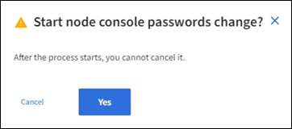

= ノードのコンソールパスワードを変更します
:icons: font
:imagesdir: ../media/

[role="lead"]
グリッド内の各ノードには、一意のノードコンソールパスワードが設定されています。このパスワードを使用してノードにログインする必要があります。次の手順に従って、グリッド内のノードごとに一意のノードコンソールパスワードを変更します。

.必要なもの
* を使用して Grid Manager にサインインします xref:../admin/web-browser-requirements.adoc[サポートされている Web ブラウザ]。
* Maintenance または Root アクセス権限が必要です。
* 現在のプロビジョニングパスフレーズを用意します。

ノードのコンソールパスワードを使用して、 SSH を使用して「 admin 」としてノードにログインするか、または VM/ 物理コンソール接続のルートユーザにログインします。ノードコンソールパスワードの変更プロセスでは、グリッド内の各ノードの新しいパスワードが作成され、リカバリパッケージ内の更新された「 passwords.txt 」ファイルにパスワードが格納されます。パスワードは、 Passwords.txt ファイルの Password 列に表示されます。

NOTE: ノード間の通信に使用する SSH キー用に、個別の SSH アクセスパスワードがあります。SSH アクセスパスワードはこの手順 によって変更されません。

== ウィザードにアクセスします

. * 設定 * > * アクセス制御 * > * Grid パスワード * を選択します。
+
image::../media/grid_password_change_node_console.png[Grid のパスワード]

. [ ノードコンソールパスワードの変更 * ] で [ * 変更 * ] を選択します。

== プロビジョニングパスフレーズを入力します

. プロビジョニングパスフレーズを入力します。
+
image::../media/node-console-provisioning-passphrase.png[プロビジョニングパスフレーズを入力してください]

. 「 * Continue * 」を選択します。

== 現在のリカバリパッケージをダウンロードします

. [ リカバリパッケージのダウンロード ] を選択します。
+
いずれかのノードでパスワードの変更プロセスが失敗した場合は、現在のリカバリパッケージの古いパスワードを使用できます。

+
image::../media/node-console-download-current-recovery-package.png[現在のリカバリパッケージをダウンロードします]

. リカバリパッケージファイル（ .zip ）を、 2 箇所の安全な場所にコピーします。
+

CAUTION: リカバリパッケージファイルには StorageGRID システムからデータを取得するための暗号キーとパスワードが含まれているため、安全に保管する必要があります。

. 「 * Continue * 」を選択します。

== ノードのコンソールパスワードを変更します

. ノードのコンソールパスワードを変更する場合は、「 * Yes 」を選択します。
+

+
「 * Yes 」を選択すると、新しいパスワードを使用して新しいリカバリパッケージが生成されます。新しいパスワードを使用した新しいリカバリパッケージが生成されるまでに数分かかることがあります。

+
「 * キャンセル」を選択すると、前のページに戻ります。

. [ 新しいリカバリパッケージのダウンロード ] を選択します。
+
image::../media/node-console-download-new-recovery-package.png[新しいリカバリサイト package.png をダウンロードします]

. ダウンロードが完了したら、次の手順を実行
+
.. .zip ファイルを開きます。
.. .zip ファイルの内容を展開します。
.. 「 passwords.txt 」ファイルを開き、内容が読み取り可能であることを確認します。

. 新しいリカバリパッケージファイル（ .zip ）を、 2 箇所の安全な場所にコピーします。
+

CAUTION: 古いリカバリパッケージは上書きしないでください。

+
単に「 passwords.txt 」ファイルを表示するか、それが不可能な場合は、リカバリパッケージを別の 2 つのセキュアな場所にコピーする前に、抽出された「 passwords.txt 」ファイルを削除する必要があります。リカバリパッケージファイルには StorageGRID システムからデータを取得するための暗号キーとパスワードが含まれているため、安全に保管する必要があります。

. 新しいリカバリパッケージをダウンロードしてコンテンツを検証したことを示すチェックボックスを選択します。
. ノードコンソールパスワードの変更 * を選択し、すべてのノードパスワードが更新されるまで待ちます。この処理には数分かかることがあります。
+
すべてのノードでパスワードを変更した場合は、成功を示す緑のバナーが表示されます。次の手順に進みます。

+
更新プロセスでエラーが発生した場合は、バナーメッセージにパスワードを変更できなかったノードの数が表示されます。パスワードを変更できなかったノードに対して、処理が自動的に再試行されます。プロセスが終了してもパスワードが変更されていないノードがある場合は、「 * Retry * 」ボタンが表示されます。

+
1 つ以上のノードでパスワードの更新に失敗した場合：

+
.. 表に表示されたエラーメッセージを確認します。
.. 問題を解決します。
.. [* Retry* ] を選択します。
+

NOTE: 再試行すると、前回のパスワード変更で失敗したノード上のノードコンソールパスワードのみが変更されます。

. すべてのノードでノードのコンソールパスワードを変更したら、古いリカバリパッケージを削除します。
. 必要に応じて、 * Recovery パッケージ * リンクを使用して、新しいリカバリパッケージの追加コピーをダウンロードできます。

