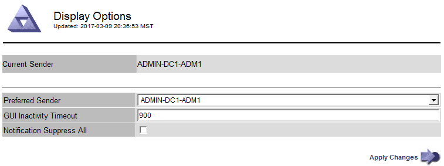

= ブラウザセッションのタイムアウトを変更します
:icons: font
:imagesdir: ../media/

[role="lead"]
Grid Manager ユーザと Tenant Manager ユーザが一定期間非アクティブになった場合にサインアウトするかどうかを制御できます。

.必要なもの
* を使用して Grid Manager にサインインします xref:../admin/web-browser-requirements.adoc[サポートされている Web ブラウザ]。
* 特定のアクセス権限が必要です。

GUI の非アクティブ時のタイムアウトのデフォルト値は 900 秒（ 15 分）です。ユーザのブラウザセッションがこの時間以上アクティブでない場合、セッションはタイムアウトします。

必要に応じて、 GUI の Inactivity Timeout 表示オプションを設定して、タイムアウト時間を増減できます。

シングルサインオン（ SSO ）が有効になっていて、ユーザーのブラウザーセッションがタイムアウトした場合、システムはユーザーが手動で * サインアウト * を選択した場合と同様に動作します。StorageGRID に再度アクセスするには、ユーザが SSO クレデンシャルを再入力する必要があります。を参照してください xref:configuring-sso.adoc[シングルサインオンを設定します]。

[NOTE]
====
ユーザセッションのタイムアウトは、次の方法でも制御できます。

* システムセキュリティ用の、個別の設定不可能な StorageGRID タイマー。デフォルトでは、各ユーザの認証トークンはユーザがサインインしてから 16 時間後に期限切れになります。ユーザの認証が期限切れになると、 GUI の非アクティブ時のタイムアウト値に達していなくても、そのユーザは自動的にサインアウトされます。トークンを更新するには、再度サインインする必要があります。
* SSO が有効になっている StorageGRID では、アイデンティティプロバイダのタイムアウト設定が使用されます。

====
.手順
. * 設定 * > * システム * > * 表示オプション * を選択します。
. * GUI の非アクティブ時のタイムアウト * には、 60 秒以上のタイムアウト時間を入力します。
+
この機能を使用しない場合は、このフィールドを 0 に設定します。ユーザは、サインインしてから 16 時間後、認証トークンが期限切れになった時点でサインアウトされます。

+

. 「 * 変更を適用する * 」を選択します。
+
新しい設定は、現在サインインしているユーザには影響しません。新しいタイムアウト設定を有効にするには、ユーザが再度サインインするか、ブラウザを更新する必要があります。

