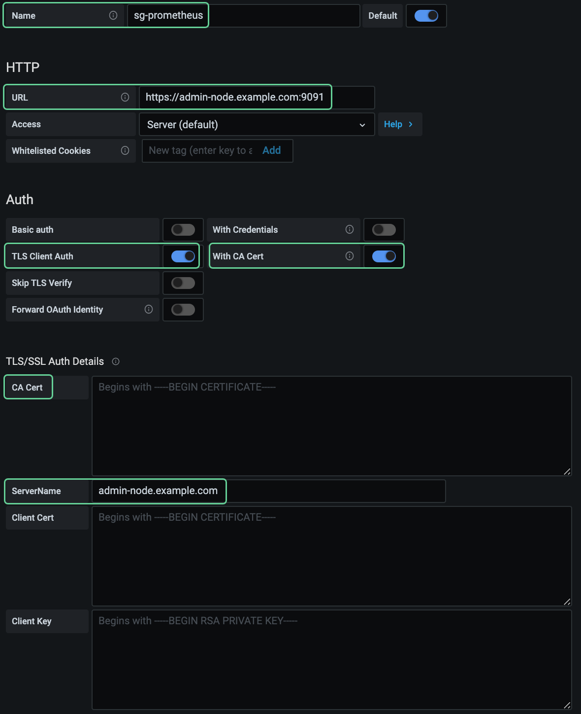

= クライアント証明書を設定
:allow-uri-read: 
:icons: font
:imagesdir: ../media/

[role="lead"]
クライアント証明書を使用すると、許可された外部クライアントから StorageGRID の Prometheus データベースにアクセスして、外部ツールで StorageGRID を監視するための安全な方法を提供できます。

外部の監視ツールを使用して StorageGRID にアクセスする必要がある場合は、 Grid Manager を使用して管理者クライアント証明書をアップロードまたは生成し、証明書情報を外部ツールにコピーする必要があります。

の情報を参照してください xref:using-storagegrid-security-certificates.adoc[一般的なセキュリティ証明書の使用] および xref:configuring-custom-server-certificate-for-grid-manager-tenant-manager.adoc[カスタムサーバ証明書を設定しています]。

NOTE: サーバ証明書の問題によって処理が中断されないようにするために、このサーバ証明書の有効期限が近づくと、「証明書ページで設定されたクライアント証明書の有効期限 * 」アラートがトリガーされます。必要に応じて、 ［ クライアント ］ タブで ［ * 設定 * ］ > ［ * セキュリティ * ］ > ［ * 証明書 * ］ を選択し、クライアント証明書の有効期限を確認することで、現在の証明書の有効期限を確認できます。

NOTE: 特別に設定されたアプライアンスノード上のデータを保護するためにキー管理サーバ（ KMS ）を使用する場合は、についての具体的な情報を参照してください xref:kms-adding.adoc[KMS クライアント証明書をアップロードする]。

.必要なもの
* Root Access 権限が割り当てられている。
* を使用して Grid Manager にサインインします xref:../admin/web-browser-requirements.adoc[サポートされている Web ブラウザ]。
* クライアント証明書を設定するには：
+
** 管理ノードの IP アドレスまたはドメイン名を確認しておきます。
** StorageGRID 管理インターフェイス証明書を設定し、対応するオプションの CA バンドルを用意しておきます。
** 独自の証明書をアップロードするには、証明書の公開鍵と秘密鍵をローカルコンピュータで使用できます。

* クライアント証明書を編集するには：
+
** 管理ノードの IP アドレスまたはドメイン名を確認しておきます。
** 新しい証明書と秘密鍵をアップロードするには、証明書の公開鍵と秘密鍵をローカルコンピュータで使用できます。

== クライアント証明書を追加します

管理者クライアント証明書を追加するには、 Grid Manager を使用して独自の証明書を指定するか、または証明書を生成します。

.手順
. Grid Manager で、 * configuration * > * Security * > * Certificates * を選択し、 * Client * タブを選択します。
. 「 * 追加」を選択します。
. 証明書の名前を 1~32 文字で入力します。
. 外部の監視ツールを使用して Prometheus 指標にアクセスするには、 * Prometheus * を許可するを選択します。
. [ 証明書の種類 ] セクションで、証明書をアップロードまたは生成します。
+
[role="tabbed-block"]
====
.証明書をアップロードする
--
証明書「 .pem 」ファイルをアップロードします。

.. [ 証明書のアップロード ] を選択し、 [ 続行 ] を選択します。
.. クライアント証明書名 (`.pem') をアップロードします
+
クライアント証明書の詳細 * を選択して、証明書メタデータと証明書 PEM を表示します。

+
*** 証明書ファイルを保存するには、 [ 証明書のダウンロード ] を選択します。
+
証明書ファイルの名前とダウンロード先を指定します。ファイルに拡張子「 .pem 」を付けて保存します。

+
例： 'storagegrid_certificate.pem

*** 証明書の内容をコピーして他の場所に貼り付けるには、 * 証明書の PEM をコピー * を選択します。

.. 証明書を Grid Manager に保存するには、 * Create * を選択します。
+
新しい証明書が [ クライアント ] タブに表示されます。

--
.証明書の生成
--
証明書のテキストを生成して他の場所に貼り付けます。

.. [* 証明書の生成 * ] を選択します。
.. 証明書情報を指定します。
+
*** * Domain name * ：証明書に含める 1 つ以上の完全修飾ドメイン名。複数のドメイン名を表すには、ワイルドカードとして * を使用します。
*** *IP* ：証明書に含める 1 つ以上の IP アドレス。
*** * 件名 * ：証明書所有者の X.509 サブジェクトまたは識別名（ DN ）。
*** *days valid*: 証明書の有効期限が切れる作成後の日数

.. [*Generate （生成） ] を選択します
.. クライアント証明書の詳細 * を選択して、証明書メタデータと証明書 PEM を表示します。
+

IMPORTANT: ダイアログを閉じると、証明書の秘密鍵を表示できなくなります。キーを安全な場所にコピーまたはダウンロードします。

+
*** 証明書の内容をコピーして他の場所に貼り付けるには、 * 証明書の PEM をコピー * を選択します。
*** 証明書ファイルを保存するには、 [ 証明書のダウンロード ] を選択します。
+
証明書ファイルの名前とダウンロード先を指定します。ファイルに拡張子「 .pem 」を付けて保存します。

+
例： 'storagegrid_certificate.pem

*** 秘密鍵のコピー * を選択して、証明書の秘密鍵をコピーして別の場所に貼り付けます。
*** 秘密鍵をファイルとして保存するには、 * 秘密鍵のダウンロード * を選択します。
+
秘密鍵ファイルの名前とダウンロード先を指定します。

.. 証明書を Grid Manager に保存するには、 * Create * を選択します。
+
新しい証明書が [ クライアント ] タブに表示されます。

--
====
. Grafana などの外部監視ツールで次の設定を行います。
+
Grafana の例は次のスクリーンショットで示されています。

+

+
.. * 名前 * ：接続の名前を入力します。
+
StorageGRID ではこの情報は必要ありませんが、接続をテストするための名前を指定する必要があります。

.. * URL * ：管理ノードのドメイン名または IP アドレスを入力します。HTTPS とポート 9091 を指定します。
+
たとえば、「 + https://admin-node.example.com:9091+` 」と入力します

.. CA 証明書を使用して、 * TLS クライアント認証 * および * を有効にします。
.. TLS/SSL Auth Details の下で、管理インターフェイス証明書またはオプションの CA バンドルを **CA Cert** にコピーして貼り付けます。
.. * ServerName* ：管理ノードのドメイン名を入力します。
+
servername は、管理インターフェイス証明書に表示されるドメイン名と一致する必要があります。

.. StorageGRID またはローカルファイルからコピーした証明書と秘密鍵を保存してテストします。
+
これで、外部の監視ツールを使用して StorageGRID から Prometheus 指標にアクセスできるようになります。

+
これらの指標の詳細については、を参照してください xref:../monitor/index.adoc[StorageGRID の監視手順]。

== クライアント証明書を編集します

管理者クライアント証明書を編集して、名前を変更したり、 Prometheus アクセスを有効または無効にしたり、現在の証明書の期限が切れたときに新しい証明書をアップロードしたりできます。

.手順
. [* configuration*>] > [* Security] * > [* Certificates*] を選択し、 [* Client*] タブを選択します。
+
証明書の有効期限と Prometheus のアクセス権限を次の表に示します。証明書の有効期限が近づいた場合、またはすでに有効期限が切れた場合は、メッセージが表に表示され、アラートがトリガーされます。

. 編集する証明書を選択します。
. 「 * Edit * 」を選択し、「 * 名前と権限を編集 * 」を選択します
. 証明書の名前を 1~32 文字で入力します。
. 外部の監視ツールを使用して Prometheus 指標にアクセスするには、 * Prometheus * を許可するを選択します。
. 証明書を Grid Manager に保存するには、「 * Continue * 」を選択します。
+
更新された証明書が [ クライアント ] タブに表示されます。

== 新しいクライアント証明書を接続します

現在の証明書の期限が切れたときに新しい証明書をアップロードできます。

.手順
. [* configuration*>] > [* Security] * > [* Certificates*] を選択し、 [* Client*] タブを選択します。
+
証明書の有効期限と Prometheus のアクセス権限を次の表に示します。証明書の有効期限が近づいた場合、またはすでに有効期限が切れた場合は、メッセージが表に表示され、アラートがトリガーされます。

. 編集する証明書を選択します。
. 「 * 編集」を選択し、編集オプションを選択します。
+
[role="tabbed-block"]
====
.証明書をアップロードする
--
証明書のテキストをコピーして別の場所に貼り付けてください。

.. [ 証明書のアップロード ] を選択し、 [ 続行 ] を選択します。
.. クライアント証明書名 (`.pem') をアップロードします
+
クライアント証明書の詳細 * を選択して、証明書メタデータと証明書 PEM を表示します。

+
*** 証明書ファイルを保存するには、 [ 証明書のダウンロード ] を選択します。
+
証明書ファイルの名前とダウンロード先を指定します。ファイルに拡張子「 .pem 」を付けて保存します。

+
例： 'storagegrid_certificate.pem

*** 証明書の内容をコピーして他の場所に貼り付けるには、 * 証明書の PEM をコピー * を選択します。

.. 証明書を Grid Manager に保存するには、 * Create * を選択します。
+
更新された証明書が [ クライアント ] タブに表示されます。

--
.証明書の生成
--
証明書のテキストを生成して他の場所に貼り付けます。

.. [* 証明書の生成 * ] を選択します。
.. 証明書情報を指定します。
+
*** * Domain name * ：証明書に含める 1 つ以上の完全修飾ドメイン名。複数のドメイン名を表すには、ワイルドカードとして * を使用します。
*** *IP* ：証明書に含める 1 つ以上の IP アドレス。
*** * 件名 * ：証明書所有者の X.509 サブジェクトまたは識別名（ DN ）。
*** *days valid*: 証明書の有効期限が切れる作成後の日数

.. [*Generate （生成） ] を選択します
.. クライアント証明書の詳細 * を選択して、証明書メタデータと証明書 PEM を表示します。
+

IMPORTANT: ダイアログを閉じると、証明書の秘密鍵を表示できなくなります。キーを安全な場所にコピーまたはダウンロードします。

+
*** 証明書の内容をコピーして他の場所に貼り付けるには、 * 証明書の PEM をコピー * を選択します。
*** 証明書ファイルを保存するには、 [ 証明書のダウンロード ] を選択します。
+
証明書ファイルの名前とダウンロード先を指定します。ファイルに拡張子「 .pem 」を付けて保存します。

+
例： 'storagegrid_certificate.pem

*** 秘密鍵のコピー * を選択して、証明書の秘密鍵をコピーして別の場所に貼り付けます。
*** 秘密鍵をファイルとして保存するには、 * 秘密鍵のダウンロード * を選択します。
+
秘密鍵ファイルの名前とダウンロード先を指定します。

.. 証明書を Grid Manager に保存するには、 * Create * を選択します。
+
新しい証明書が [ クライアント ] タブに表示されます。

--
====

== クライアント証明書をダウンロードまたはコピーします

クライアント証明書をダウンロードまたはコピーして、他の場所で使用することができます。

.手順
. [* configuration*>] > [* Security] * > [* Certificates*] を選択し、 [* Client*] タブを選択します。
. コピーまたはダウンロードする証明書を選択します。
. 証明書をダウンロードまたはコピーします。
+
[role="tabbed-block"]
====
.証明書ファイルをダウンロードします
--
証明書「 .pem 」ファイルをダウンロードします。

.. [ 証明書のダウンロード ] を選択します。
.. 証明書ファイルの名前とダウンロード先を指定します。ファイルに拡張子「 .pem 」を付けて保存します。
+
例： 'storagegrid_certificate.pem

--
.証明書をコピーします
--
証明書のテキストをコピーして別の場所に貼り付けてください。

.. [* 証明書 PEM のコピー * ] を選択します。
.. コピーした証明書をテキストエディタに貼り付けます。
.. テキスト・ファイルに拡張子「 .pem 」を付けて保存します。
+
例： 'storagegrid_certificate.pem

--
====

== クライアント証明書を削除します

管理者クライアント証明書が不要になった場合は削除できます。

.手順
. [* configuration*>] > [* Security] * > [* Certificates*] を選択し、 [* Client*] タブを選択します。
. 削除する証明書を選択します。
. 「 * 削除」を選択して確定します。

NOTE: 最大 10 個の証明書を削除するには、 [ クライアント ] タブで削除する各証明書を選択し、 [ * アクション * > * 削除 * ] を選択します。

証明書を削除したあと、その証明書を使用していたクライアントは、 StorageGRID Prometheus データベースにアクセスするための新しいクライアント証明書を指定する必要があります。
