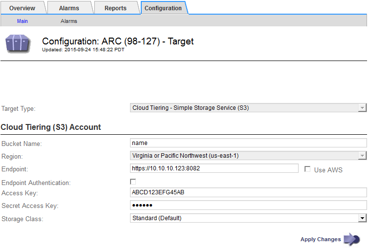

= S3 API の接続設定を行います
:allow-uri-read: 
:icons: font
:imagesdir: ../media/

[role="lead"]
S3 インターフェイスを使用してアーカイブノードに接続する場合は、 S3 API の接続を設定する必要があります。これらの設定が完了するまで ARC サービスは外部アーカイブストレージシステムと通信できないため、 Major アラーム状態のままです。

[IMPORTANT]
====
S3 API を使用してアーカイブノードから外部のアーカイブストレージシステムにオブジェクトを移動する処理は、より多くの機能を提供する ILM Cloud Storage Pools に置き換えられました。Cloud Tiering - Simple Storage Service （ S3 ） * オプションは引き続きサポートされていますが、代わりにクラウドストレージプールの実装を推奨します。

「 Cloud Tiering - Simple Storage Service （ S3 ） * 」オプションを指定してアーカイブノードを現在使用している場合は、クラウドストレージプールへのオブジェクトの移行を検討してください。を参照してください xref:../ilm/index.adoc[ILM を使用してオブジェクトを管理する]。

====
.必要なもの
* を使用して Grid Manager にサインインします xref:../admin/web-browser-requirements.adoc[サポートされている Web ブラウザ]。
* 特定のアクセス権限が必要です。
* ターゲットのアーカイブストレージシステムにバケットを作成しておきます。
+
** このバケットは 1 つのアーカイブノード専用です。他のアーカイブノードやアプリケーションでは使用できません。
** バケットには、ユーザの場所に適したリージョンが選択されています。
** バケットのバージョン管理は一時停止に設定する必要があります。

* オブジェクトのセグメント化が有効で、最大セグメントサイズは 4.5GiB （ 4 、 831 、 838 、 208 バイト）以下になります。S3 が外部アーカイブストレージシステムとして使用されている場合、この値を超える S3 API 要求は失敗します。

.手順
. サポート * > * ツール * > * グリッドトポロジ * を選択します。
. アーカイブノード * > * ARC * > * Target * を選択します。
. * Configuration * > * Main * を選択します。
+

. ターゲットタイプドロップダウンリストから * Cloud Tiering - Simple Storage Service （ S3 ） * を選択します。
+

NOTE: ターゲットタイプを選択するまで、構成設定は使用できません。

. アーカイブノードからターゲットの外部の S3 対応アーカイブストレージシステムへの接続に使用するクラウドの階層化（ S3 ）アカウントを設定します。
+
このページのフィールドのほとんどはわかりやすいもので、説明を必要としません。以下は、説明が必要なフィールドです。

+
** * Region * ： * Use AWS * が選択されている場合にのみ選択できます。バケットのリージョンと同じリージョンを選択する必要があります。
** * Endpoint * および * Use AWS * ： Amazon Web Services （ AWS ）の場合は、「 * Use AWS * 」を選択します。* エンドポイント * には、バケット名属性とリージョン属性に基づいてエンドポイント URL が自動的に入力されます。例：
+
https://bucket.region.amazonaws.com` にアクセスします

+
AWS 以外のターゲットの場合は、ポート番号を含め、バケットをホストしているシステムの URL を入力します。例：

+
https://system.com:1080` にアクセスします

** * エンドポイント認証 *: デフォルトで有効になっています。外部アーカイブストレージシステムへのネットワークが信頼されている場合は、チェックボックスをオフにして、対象の外部アーカイブストレージシステムのエンドポイントの SSL 証明書およびホスト名検証を無効にすることができます。StorageGRID システムの別のインスタンスがターゲットのアーカイブストレージデバイスであり、システムに公開署名された証明書が設定されている場合、このチェックボックスはオンのままでかまいません。
** * ストレージクラス * ：通常のストレージには「 * Standard （デフォルト） * 」を選択します。簡単に再作成できるオブジェクトに対してのみ、「冗長性の低下」を選択します。* 冗長性の低下 * 信頼性の低い低コストのストレージを提供します。ターゲットのアーカイブストレージシステムが StorageGRID システムの別のインスタンスの場合、ストレージクラス * はオブジェクトの取り込み時に実行されるオブジェクトの中間コピー数を、デュアルコミットがオブジェクトの取り込み時に使用される場合にターゲットシステムで制御します。

. 「 * 変更を適用する * 」を選択します。
+
指定した設定が検証され、 StorageGRID システムに適用されます。いったん設定したターゲットは変更できません。

