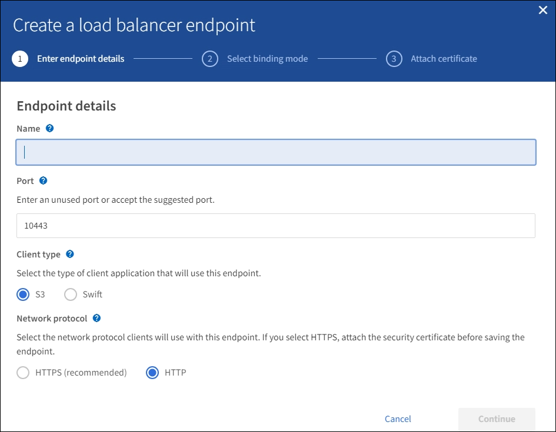
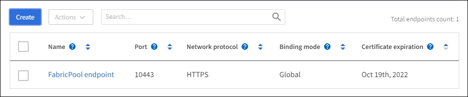

= ロードバランサエンドポイントを設定する
:allow-uri-read: 
:icons: font
:imagesdir: ../media/

[role="lead"]
ゲートウェイノードと管理ノードの StorageGRID ロードバランサに接続する際に使用できるポートとネットワークプロトコル S3 / Swift クライアントは、ロードバランサエンドポイントで決まります。

.必要なもの
* を使用して Grid Manager にサインインします xref:../admin/web-browser-requirements.adoc[サポートされている Web ブラウザ]。
* Root アクセス権限が割り当てられている。
* ロードバランサエンドポイントに使用するポートを再マッピングした場合は、を使用します xref:../maintain/removing-port-remaps.adoc[ポートの再マッピングを削除しました]。
* 使用するハイアベイラビリティ（ HA ）グループを作成しておきます。HA グループを推奨しますが、必須ではありません。を参照してください xref:managing-high-availability-groups.adoc[ハイアベイラビリティグループを管理します]。
* ロードバランサエンドポイントがで使用される場合 xref:../admin/manage-s3-select-for-tenant-accounts.adoc[S3 Select 用の S3 テナント]ベアメタルノードの IP アドレスまたは FQDN を使用しないでください。S3 Select に使用するロードバランサエンドポイントには、 SG100 または SG1000 アプライアンスと VMware ベースのソフトウェアノードのみが許可されます。
* 使用する VLAN インターフェイスを設定しておきます。を参照してください xref:configure-vlan-interfaces.adoc[VLAN インターフェイスを設定します]。
* HTTPS エンドポイントを作成する場合（推奨）は、サーバ証明書の情報が必要です。
+

NOTE: エンドポイント証明書の変更がすべてのノードに適用されるまでに最大 15 分かかることがあります。

+
** 証明書をアップロードするには、サーバ証明書、証明書の秘密鍵、および必要に応じて CA バンドルが必要です。
** 証明書を生成するには、 S3 または Swift クライアントがエンドポイントへのアクセスに使用するすべてのドメイン名と IP アドレスが必要です。また、件名（識別名）も知っている必要があります。
** StorageGRID の S3 および Swift API 証明書（ストレージノードへの直接の接続にも使用できます）を使用する場合は、デフォルトの証明書を外部の認証局によって署名されたカスタム証明書に置き換えておく必要があります。を参照してくださいxref:../admin/configuring-custom-server-certificate-for-storage-node-or-clb.adoc[S3 および Swift API 証明書を設定する]。
+
証明書では、ワイルドカードを使用して、ロードバランササービスを実行しているすべての管理ノードとゲートウェイノードの完全修飾ドメイン名を表すことができます。たとえば '*.storagegrid._example_.com は '*wildcard を使用して 'adm1.storagegrid._example_.com と gn1.storagegrid._example_.com を表しますを参照してください xref:configuring-s3-api-endpoint-domain-names.adoc[S3 API エンドポイントのドメイン名を設定]。

== ロードバランサエンドポイントを作成します

各ロードバランサエンドポイントは、ポート、クライアントタイプ（ S3 または Swift ）、およびネットワークプロトコル（ HTTP または HTTPS ）を指定します。

=== ウィザードにアクセスします

. [ * configuration * > * Network * > * Load Balancer Endpoints * ] を選択します。
. 「 * Create * 」を選択します。

=== エンドポイントの詳細を入力します

. エンドポイントの詳細を入力します。
+

+
[cols="1a,3a"]
|===
| フィールド | 説明 

 a| 
名前
 a| 
エンドポイントのわかりやすい名前。ロードバランサエンドポイントのページのテーブルに表示されます。

 a| 
ポート
 a| 
クライアントが管理ノードおよびゲートウェイノード上のロードバランササービスへの接続に使用するポート。

推奨されるポート番号をそのまま使用するか、別のグリッドサービスで使用されていない外部ポートを入力します。1~65535 の値を入力します。

「 * 80 * 」または「 * 443 * 」と入力すると、エンドポイントはゲートウェイノードにのみ設定されます。これらのポートは管理ノードで予約されています。

を参照してください xref:../network/index.adoc[ネットワークのガイドライン] 外部ポートについては、を参照してください。

 a| 
クライアントタイプ
 a| 
このエンドポイントを使用するクライアントアプリケーションのタイプ。 * S3 * または * Swift * 。

 a| 
ネットワークプロトコル
 a| 
クライアントがこのエンドポイントに接続するときに使用するネットワークプロトコル。

** セキュアな TLS 暗号化通信を実現するには、「 * HTTPS * 」を選択します（推奨）。エンドポイントを保存するには、セキュリティ証明書を接続する必要があります。
** セキュアで暗号化されていない通信を行うには、「 * HTTP 」を選択します非本番環境のグリッドにのみ HTTP を使用してください。

|===
. 「 * Continue * 」を選択します。

=== バインドモードを選択します

. エンドポイントへのアクセス方法を制御するには、エンドポイントのバインディングモードを選択します。
+
[cols="1a,3a"]
|===
| オプション | 説明 

 a| 
グローバル（デフォルト）
 a| 
クライアントは、ネットワーク上の任意の HA グループの完全修飾ドメイン名（ FQDN ）、ゲートウェイノードまたは管理ノードの IP アドレス、または仮想 IP アドレスを使用してエンドポイントにアクセスできます。

このエンドポイントのアクセスを制限する必要がある場合を除き、 * グローバル * 設定（デフォルト）を使用します。

 a| 
ノードインターフェイス
 a| 
クライアントは、選択したノードの IP アドレスとネットワークインターフェイスを使用してこのエンドポイントにアクセスする必要があります。

 a| 
HA グループの仮想 IP
 a| 
クライアントは、 HA グループの仮想 IP アドレスを使用してこのエンドポイントにアクセスする必要があります。

このバインドモードのエンドポイントは、エンドポイントに対して選択した HA グループが重ならないかぎり、すべて同じポート番号を使用できます。

このモードのエンドポイントは、エンドポイントに対して選択したインターフェイスが重ならないかぎり、すべて同じポート番号を使用できます。

|===
+

NOTE: 複数のエンドポイントで同じポートを使用する場合、 HA グループの仮想 IP * モードを使用するエンドポイントは、 * ノードインターフェイス * モードを使用するエンドポイントよりも優先されます。これにより、 * グローバル * モードを使用するエンドポイントは無効になります。

. ノードインターフェイス * を選択した場合は、このエンドポイントに関連付ける管理ノードまたはゲートウェイノードごとに 1 つ以上のノードインターフェイスを選択します。
+
image::../media/load_balancer_endpoint_node_interfaces_binding_mode.png[エンドポイントノードインターフェイスのバインディングモード]

. HA グループの仮想 IP * を選択した場合は、 1 つ以上の HA グループを選択します。
+
image::../media/load_balancer_endpoint_ha_group_vips_binding_mode.png[エンドポイント HA グループ VIP バインドモード]

. HTTP * エンドポイントを作成する場合、証明書を接続する必要はありません。Create * を選択して、新しいロードバランサエンドポイントを追加します。次に、に進みます <<After-you-finish,完了後>>。それ以外の場合は、「 * Continue * 」を選択して証明書を添付します。

=== 証明書を添付します

. * HTTPS * エンドポイントを作成する場合は、エンドポイントに接続するセキュリティ証明書のタイプを選択します。
+
この証明書は、 S3 および Swift クライアントと、管理ノードまたはゲートウェイノード上のロードバランササービスの間の接続を保護します。

+
** * 証明書のアップロード * 。アップロードするカスタム証明書がある場合は、このオプションを選択します。
** * 証明書の生成 * 。カスタム証明書の生成に必要な値がある場合は、このオプションを選択します。
** * StorageGRID S3 および Swift 証明書を使用 * 。グローバルな S3 および Swift API 証明書を使用する場合は、このオプションを選択します。この証明書は、ストレージノードへの直接接続にも使用できます。
+
グリッド CA によって署名されたデフォルトの S3 および Swift API 証明書を、外部の認証局によって署名されたカスタム証明書で置き換えないと、このオプションは選択できません。を参照してくださいxref:../admin/configuring-custom-server-certificate-for-storage-node-or-clb.adoc[S3 および Swift API 証明書を設定する]。

. StorageGRID S3 および Swift 証明書を使用しない場合は、証明書をアップロードまたは生成します。
+
[role="tabbed-block"]
====
.証明書をアップロードする
--
.. [ 証明書のアップロード ] を選択します。
.. 必要なサーバ証明書ファイルをアップロードします。
+
*** * サーバ証明書 * ： PEM エンコードのカスタムサーバ証明書ファイル。
*** *Certificate private key*: カスタムサーバ証明書の秘密鍵ファイル (`.key`) 。
+

NOTE: EC 秘密鍵は 224 ビット以上である必要があります。RSA 秘密鍵は 2048 ビット以上にする必要があります。

*** *CA Bundle* ：各中間発行認証局（ CA ）の証明書を含む単一のオプションファイル。このファイルには、 PEM でエンコードされた各 CA 証明書ファイルが、証明書チェーンの順序で連結して含まれている必要があります。

.. [ * 証明書の詳細 * ] を展開して、アップロードした各証明書のメタデータを表示します。オプションの CA バンドルをアップロードした場合は、各証明書が独自のタブに表示されます。
+
*** 証明書ファイルを保存するには、 * 証明書のダウンロード * を選択します。証明書バンドルを保存するには、 * CA バンドルのダウンロード * を選択します。
+
証明書ファイルの名前とダウンロード先を指定します。ファイルに拡張子「 .pem 」を付けて保存します。

+
例： 'storagegrid_certificate.pem

*** 証明書の内容をコピーして他の場所に貼り付けるには、 * 証明書の PEM のコピー * または * CA バンドル PEM のコピー * を選択してください。

.. 「 * Create * 」を選択します。+ ロードバランサエンドポイントが作成された。カスタム証明書は、 S3 / Swift クライアントとエンドポイントの間の以降のすべての新しい接続に使用されます。

--
.証明書の生成
--
.. [* 証明書の生成 * ] を選択します。
.. 証明書情報を指定します。
+
*** * Domain name * ：証明書に含める 1 つ以上の完全修飾ドメイン名。複数のドメイン名を表すには、ワイルドカードとして * を使用します。
*** *IP* ：証明書に含める 1 つ以上の IP アドレス。
*** * 件名 * ：証明書所有者の X.509 サブジェクトまたは識別名（ DN ）。
*** *days valid*: 証明書の有効期限が切れる作成後の日数

.. [*Generate （生成） ] を選択します
.. 生成された証明書のメタデータを表示するには、 [ 証明書の詳細 ] を選択します。
+
*** 証明書ファイルを保存するには、 [ 証明書のダウンロード ] を選択します。
+
証明書ファイルの名前とダウンロード先を指定します。ファイルに拡張子「 .pem 」を付けて保存します。

+
例： 'storagegrid_certificate.pem

*** 証明書の内容をコピーして他の場所に貼り付けるには、 * 証明書の PEM をコピー * を選択します。

.. 「 * Create * 」を選択します。
+
ロードバランサエンドポイントが作成されます。カスタム証明書は、 S3 / Swift クライアントとこのエンドポイントの間の以降のすべての新しい接続に使用されます。

--
====

=== [終了後]をクリックします

. ドメインネームシステム（ DNS ）を使用する場合は、 DNS に、クライアントが接続に使用する各 IP アドレスに StorageGRID の完全修飾ドメイン名を関連付けるレコードが含まれていることを確認します。
+
DNS レコードに入力する IP アドレスは、負荷分散ノードの HA グループを使用しているかどうかによって異なります。

+
** HAグループを設定した場合、クライアントはそのHAグループの仮想IPアドレスに接続します。
** HAグループを使用しない場合、クライアントはいずれかのゲートウェイノードまたは管理ノードのIPアドレスを使用してStorageGRID ロードバランササービスに接続します。
+
また、 DNS レコードが、ワイルドカード名を含む、必要なすべてのエンドポイントドメイン名を参照していることを確認する必要があります。

. エンドポイントへの接続に必要な情報を S3 クライアントと Swift クライアントに提供します。
+
** ポート番号
** 完全修飾ドメイン名または IP アドレス
** 必要な証明書の詳細

== ロードバランサエンドポイントを表示および編集します

既存のロードバランサエンドポイントの詳細を表示できます。これには、セキュアなエンドポイントの証明書メタデータも含まれます。また、エンドポイントの名前またはバインドモードを変更して、関連付けられている証明書を更新することもできます。

サービスタイプ（ S3 または Swift ）、ポート、またはプロトコル（ HTTP または HTTPS ）を変更することはできません。

* すべてのロードバランサエンドポイントの基本情報を表示するには、 Load Balancer Endpoints ページのテーブルを確認します。
+

* 証明書メタデータを含む、特定のエンドポイントに関するすべての詳細を表示するには、テーブルでエンドポイントの名前を選択します。
+
image::../media/load_balancer_endpoint_details.png[ロードバランサエンドポイントの詳細]

* エンドポイントを編集するには、 [ ロードバランサエンドポイント（ Load Balancer Endpoints ） ] ページの [ * アクション * （ * Actions * ） ] メニューを使用するか、特定のエンドポイントの詳細ページを使用します。
+

IMPORTANT: エンドポイントの編集後、変更がすべてのノードに適用されるまでに最大 15 分かかる場合があります。

+
[cols="1a, 2a,2a"]
|===
| タスク | [ アクション ] メニュー | 詳細ページ 

 a| 
エンドポイント名を編集します
 a| 
.. エンドポイントのチェックボックスを選択します。
.. [ * アクション * > * エンドポイント名の編集 * ] を選択します。
.. 新しい名前を入力します。
.. [ 保存（ Save ） ] を選択します。

 a| 
.. エンドポイント名を選択して詳細を表示します。
.. 編集アイコンを選択します image:../media/icon_edit_tm.png["編集アイコン"]。
.. 新しい名前を入力します。
.. [ 保存（ Save ） ] を選択します。

 a| 
エンドポイントバインドモードを編集します
 a| 
.. エンドポイントのチェックボックスを選択します。
.. [ * アクション * （ Actions * ） ] > [ * エンドポイントバインドモードの編集（ Edit Endpoint binding mode ） ]
.. 必要に応じて、バインドモードを更新します。
.. 「変更を保存」を選択します。

 a| 
.. エンドポイント名を選択して詳細を表示します。
.. 「 * バインドモードを編集」を選択します。
.. 必要に応じて、バインドモードを更新します。
.. 「変更を保存」を選択します。

 a| 
エンドポイント証明書を編集します
 a| 
.. エンドポイントのチェックボックスを選択します。
.. [ * アクション * > * エンドポイント証明書の編集 * ] を選択します。
.. 必要に応じて、新しいカスタム証明書をアップロードまたは生成するか、グローバルな S3 および Swift 証明書の使用を開始します。
.. 「変更を保存」を選択します。

 a| 
.. エンドポイント名を選択して詳細を表示します。
.. [ * 証明書 * ] タブを選択します。
.. [ 証明書の編集 ] を選択します。
.. 必要に応じて、新しいカスタム証明書をアップロードまたは生成するか、グローバルな S3 および Swift 証明書の使用を開始します。
.. 「変更を保存」を選択します。

|===

== ロードバランサエンドポイントを削除する

[* アクション * （ Actions * ） ] メニューを使用して 1 つ以上のエンドポイントを削除するか、または詳細ページから 1 つのエンドポイントを削除できます。

IMPORTANT: クライアントの停止を回避するには、影響を受ける S3 または Swift クライアントアプリケーションを更新してからロードバランサエンドポイントを削除します。各クライアントを更新して、別のロードバランサエンドポイントに割り当てられたポートを使用して接続します。必要な証明書情報も必ず更新してください。

* 1 つ以上のエンドポイントを削除するには、次の手順
+
.. Load Balancer ページで、削除する各エンドポイントのチェックボックスを選択します。
.. * アクション * > * 削除 * を選択します。
.. 「 * OK 」を選択します。

* 詳細ページから 1 つのエンドポイントを削除します。
+
.. Load Balancer （ロードバランサ）ページから。エンドポイント名を選択します。
.. 詳細ページで「 * 削除」を選択します。
.. 「 * OK 」を選択します。

