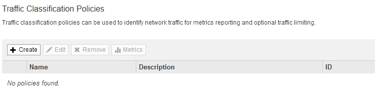

= トラフィック分類ポリシーを作成します
:allow-uri-read: 
:icons: font
:imagesdir: ../media/

[role="lead"]
バケット、テナント、 IP サブネット、またはロードバランサエンドポイントごとにネットワークトラフィックを監視し、必要に応じて制限する場合は、トラフィック分類ポリシーを作成します。必要に応じて、帯域幅、同時要求数、または要求速度に基づいてポリシーの制限を設定できます。

.必要なもの
* を使用して Grid Manager にサインインします xref:../admin/web-browser-requirements.adoc[サポートされている Web ブラウザ]。
* Root アクセス権限が割り当てられている。
* 照合するロードバランサエンドポイントを作成しておきます。
* 該当するテナントを作成しておきます。

.手順
. * configuration * > * Network * > * traffic classification * を選択します。
+
[Traffic Classification Policies] ページが表示されます。

+

. 「 * Create * 」を選択します。
+
Create Traffic Classification Policy ダイアログボックスが表示されます。

+
image::../media/traffic_classification_policy_create.png[トラフィック分類ポリシー - 作成]

. [* 名前 *] フィールドに、ポリシーの名前を入力します。
+
ポリシーを識別できるように、わかりやすい名前を入力します。

. 必要に応じて、 * 概要 * フィールドにポリシーの概要 を追加します。
+
たとえば、このトラフィック分類ポリシー環境 の内容と制限する内容を説明します。

. ポリシーに一致するルールを 1 つ以上作成します。
+
一致ルールは、このトラフィック分類ポリシーの影響を受けるエンティティを制御します。たとえば、このポリシーを特定のテナントのネットワークトラフィックに適用する場合は、テナントを選択します。または、このポリシーを特定のロードバランサエンドポイントのネットワークトラフィックに適用する場合は、 [Endpoint] を選択します。

+
.. [ 一致ルール * （ Matching Rules * ） ] セクションで [ * 作成（ Create ） ] を選択します。
+
[Create Matching Rule] ダイアログボックスが表示されます。

+
image::../media/traffic_classification_policy_create_matching_rule.png[マッチングルールを作成します]

.. [* タイプ *] ドロップダウンから、一致するルールに含めるエンティティのタイプを選択します。
.. [*match value*] フィールドに、選択したエンティティのタイプに基づいて照合値を入力します。
+
*** Bucket ：バケット名を入力します。
*** Bucket Regex ：一連のバケット名と一致するために使用される正規表現を入力します。
+
正規表現は固定されていません。バケット名の先頭にある ｛ キャレット ｝ アンカーを使用し、名前の末尾に $ アンカーを使用します。

*** CIDR ： IPv4 サブネットを CIDR 表記で入力し、目的のサブネットと一致させます。
*** Endpoint ：既存のエンドポイントのリストからエンドポイントを選択します。これは、ロードバランサエンドポイントのページで定義したロードバランサエンドポイントです。を参照してください xref:configuring-load-balancer-endpoints.adoc[ロードバランサエンドポイントを設定する]。
*** テナント：既存のテナントのリストからテナントを選択します。テナントの一致は、アクセス対象のバケットの所有権に基づきます。バケットへの匿名アクセスは、バケットを所有するテナントと一致します。

.. 定義した Type および Match 値と一致するすべての TRAFFER_EXCEPT _Traffic を照合する場合は、 * Inverse * チェックボックスをオンにします。それ以外の場合は、このチェックボックスをオフのままにします。
+
たとえば、このポリシーをいずれかのロードバランサエンドポイントを除くすべてのエンドポイントに適用する場合は、除外するロードバランサエンドポイントを指定し、 * Inverse * を選択します。

+

IMPORTANT: 少なくとも 1 つが逆マッチャーである複数のマッチャーを含むポリシーの場合、すべてのリクエストに一致するポリシーを作成しないように注意してください。

.. * 適用 * を選択します。
+
ルールが作成され、 [Matching Rules] テーブルに表示されます。

+
image::../media/traffic_classification_policy_rules.png[トラフィックポリシーの一致ルール]

.. ポリシーに対して作成するルールごとに上記の手順を繰り返します。
+

NOTE: ルールに一致するトラフィックは、ポリシーによって処理されます。

. 必要に応じて、ポリシーの制限を作成します。
+

NOTE: 制限を作成しない場合でも、ポリシーに一致するネットワークトラフィックを監視できるように StorageGRID で指標が収集されます。

+
.. 「 * 制限 * 」セクションで「 * 作成 * 」を選択します。
+
境界を作成（ Create Limit ）ダイアログボックスが表示されます。

+
image::../media/traffic_classification_policy_create_limit.png[境界を作成します]

.. [* タイプ *] ドロップダウンから、ポリシーに適用する制限のタイプを選択します。
+
次のリストの * in * は S3 または Swift クライアントから StorageGRID ロードバランサへのトラフィックを表し、 * out * はロードバランサから S3 または Swift クライアントへのトラフィックを表しています。

+
*** 総帯域幅
*** 総帯域幅アウト
*** 同時読み取り要求
*** 同時書き込み要求
*** での要求ごとの帯域幅
*** 要求ごとの帯域幅アウト
*** 読み取り要求レート
*** 書き込み要求の速度
+
[NOTE]
====
ポリシーを作成して、アグリゲートの帯域幅を制限したり、要求ごとの帯域幅を制限したりできます。ただし、 StorageGRID では、両方のタイプの帯域幅を同時に制限することはできません。アグリゲートの帯域幅の制限により、制限のないトラフィックにパフォーマンスが若干低下する可能性があります。

====
+
帯域幅の制限については、設定された制限のタイプに最も一致するポリシーが StorageGRID によって適用されます。たとえば、トラフィックを一方向のみに制限するポリシーがある場合、帯域幅制限が設定されている他のポリシーと一致するトラフィックがあっても、反対方向のトラフィックは無制限になります。StorageGRID は、帯域幅制限の「ベスト」マッチを次の順序で実装します。

+
**** 正確な IP アドレス（ /32 マスク）
**** 正確なバケット名
**** バケットの正規表現
**** テナント
**** エンドポイント
**** 正確でない CIDR の一致（ /32 ではない）
**** 逆一致

.. [* 値 *] フィールドに、選択した制限のタイプの数値を入力します。
+
制限を選択すると、想定される単位が表示されます。

.. * 適用 * を選択します。
+
境界が作成され、 [ 境界（ Limits ） ] テーブルにリストされます。

+
image::../media/traffic_classification_policy_limits.png[トラフィックポリシーの制限]

.. ポリシーに追加する上限ごとに、上記の手順を繰り返します。
+
たとえば、 SLA 階層に 40Gbps の帯域幅制限を作成する場合は、制限されたアグリゲート帯域幅と合計帯域幅の制限を作成し、各帯域幅を 40Gbps に設定します。

+

NOTE: 1 秒あたりのメガバイト数をギガビット / 秒に変換するには、 8 倍にします。たとえば、 125 MB/ 秒は 1 、 000 Mbps または 1 Gbps に相当します。

. ルールと制限の作成が完了したら、 * 保存 * を選択します。
+
ポリシーが保存され、 Traffic Classification Policies テーブルにリストされます。

+
image::../media/traffic_classification_policies_main_screen_w_examples.png[トラフィックポリシーの例]

+
S3 および Swift クライアントトラフィックがトラフィック分類ポリシーに従って処理されるようになりました。トラフィックチャートを表示して、ポリシーが想定したトラフィック制限を適用していることを確認できます。を参照してください xref:viewing-network-traffic-metrics.adoc[ネットワークトラフィックの指標を表示します]。

