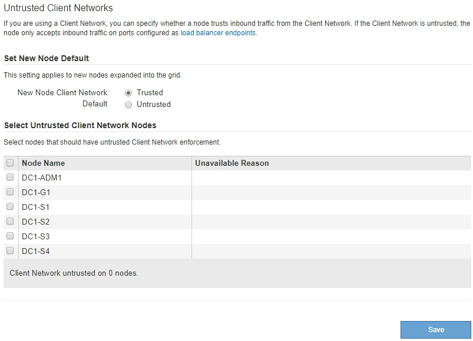

= ノードのクライアントネットワークが信頼されていないことを指定します
:icons: font
:imagesdir: ../media/

[role="lead"]
クライアントネットワークを使用している場合は、各ノードのクライアントネットワークが信頼されているかどうかを指定できます。拡張で追加した新しいノードのデフォルト設定を指定することもできます。

.必要なもの
* を使用して Grid Manager にサインインします xref:../admin/web-browser-requirements.adoc[サポートされている Web ブラウザ]。
* Root アクセス権限が割り当てられている。
* 管理ノードまたはゲートウェイノードが明示的に設定されたエンドポイントでのみインバウンドトラフィックを受け入れるように設定する場合は、ロードバランサエンドポイントを定義しておきます。
+

NOTE: ロードバランサエンドポイントが設定されていないと、既存のクライアント接続が失敗する可能性があります。

.手順
. 「 * configuration * > * Security * > * Untrusted Client Networks * 」を選択します。
+
[Untrusted Client Networks] ページには、 StorageGRID システム内のすべてのノードが表示されます。ノードのクライアントネットワークが信頼されている必要がある場合は、 Unavailable Reason 列にエントリが表示されます。

+

. Set New Node Default * セクションで、拡張手順 で新しいノードをグリッドに追加するときのデフォルト設定を指定します。
+
** * Trusted * ：拡張でノードが追加されるときに、そのクライアントネットワークが信頼されます。
** * Untrusted * ：拡張でノードが追加されるときに、そのクライアントネットワークは信頼されません。必要に応じて、このページに戻って新しいノードの設定を変更できます。

+

NOTE: この設定は、 StorageGRID システム内の既存のノードには影響しません。

. Select Untrusted Client Network Nodes * セクションで、明示的に設定されたロードバランサエンドポイントでのみクライアント接続を許可するノードを選択します。
+
タイトルのチェックボックスをオンまたはオフにすると、すべてのノードを選択または選択解除できます。

. [ 保存（ Save ） ] を選択します。
+
新しいファイアウォールルールがすぐに追加され、適用されます。ロードバランサエンドポイントが設定されていないと、既存のクライアント接続が失敗する可能性があります。

