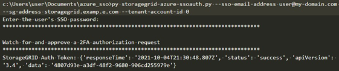

= シングルサインオンが有効な場合（ Azure ）は API を使用
:allow-uri-read: 
:icons: font
:imagesdir: ../media/

[role="lead"]
ある場合 xref:../admin/configuring-sso.adoc[シングルサインオン（ SSO ）の設定と有効化] また、 Azure を SSO プロバイダとして使用している場合は、 2 つのサンプルスクリプトを使用して、グリッド管理 API またはテナント管理 API で有効な認証トークンを取得できます。

== Azure シングルサインオンが有効な場合は、 API にサインインします

以下の手順は、 Azure を SSO アイデンティティプロバイダとして使用する場合に該当します

.必要なもの
* StorageGRID ユーザグループに属するフェデレーテッドユーザの SSO E メールアドレスとパスワードが必要です。
* テナント管理 API にアクセスする場合は、テナントアカウント ID を確認しておきます。

.このタスクについて
認証トークンを取得するには、次のサンプルスクリプトを使用します。

* 「 storagegrid-ssoauth-caz.py 」 Python スクリプト
* 「 storagegrid-ssoauth-azure.js 」スクリプト

どちらのスクリプトも、 StorageGRID インストールファイルディレクトリ (Red Hat Enterprise Linux または CentOS 用の場合は「 ./rpms 」、 Ubuntu または Debian 用の場合は「 ./debs 」、 VMware 用の「 ./vsphere 」 ) にあります。

独自の API 統合を Azure に記述するには、「 storagegrid-ssoauth-azure.py 」スクリプトを参照してください。Python スクリプトは、 StorageGRID に対して 2 つの要求を直接実行し（まず SAMLRequest を取得し、あとで認証トークンを取得するため）、さらに Node.js スクリプトを呼び出して、 SSO 処理を実行します。

SSO 処理は一連の API 要求を使用して実行できますが、実行するのは簡単ではありません。puppeteer Node.js モジュールは、 Azure SSO インターフェイスを破棄するために使用します。

URL エンコーディング問題 を使用している場合は、「 Unsupported SAML version 」というエラーが表示される可能性があります。

.手順
. 必要な依存関係を次のようにインストールします。
+
.. Node.js をインストールします（を参照） https://nodejs.org/en/download/["https://nodejs.org/en/download/"^]）。
.. 必要な Node.js モジュール（ puppeteer および jsdom ）を取り付けます。
+
'NPM install-g <module>`

. Python スクリプトを Python インタープリタに渡して、スクリプトを実行します。
+
Python スクリプトは、対応する Node.js スクリプトを呼び出して、 Azure SSO のインタラクションを実行します。

. プロンプトが表示されたら、次の引数の値を入力します（または、パラメータを使用して渡します）。
+
** Azure へのサインインに使用する SSO E メールアドレス
** StorageGRID のアドレス
** テナント管理 API にアクセスする場合は、テナントアカウント ID

. プロンプトが表示されたら、パスワードを入力し、要求された場合に Azure に対する MFA 認証を提供できるように準備します。
+

+

NOTE: このスクリプトでは、 MFA が Microsoft Authenticator を使用して実行されていることを前提として他の形式の MFA （テキストメッセージで受信したコードの入力など）をサポートするために、スクリプトの変更が必要になる場合があります。

+
StorageGRID 認証トークンが出力に表示されます。SSO を使用していない場合の API の使用方法と同様に、トークンを他の要求に使用できるようになりました。

