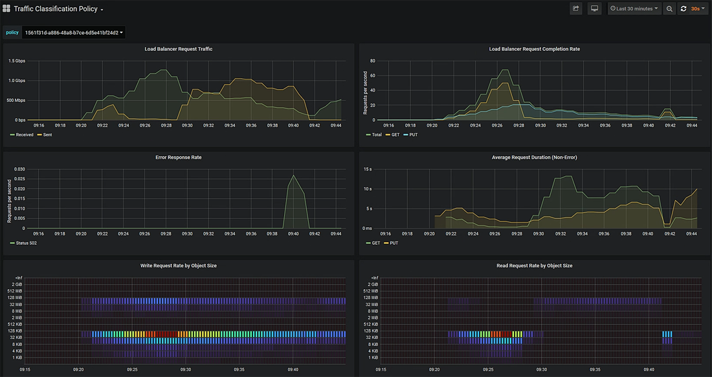
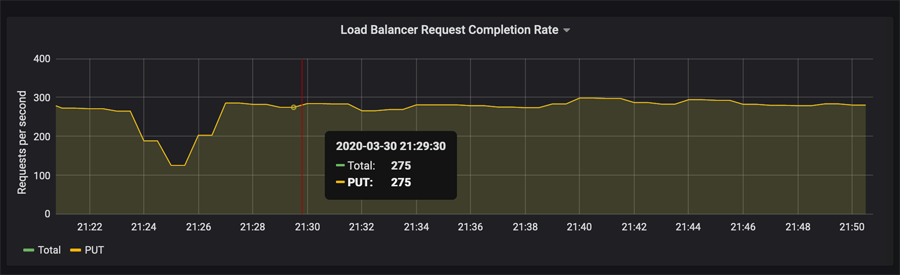

= ネットワークトラフィックの指標を表示します
:allow-uri-read: 
:icons: font
:imagesdir: ../media/

[role="lead"]
Traffic Classification Policies ページから使用可能なグラフを表示することで、ネットワークトラフィックを監視できます。

.必要なもの
* を使用して Grid Manager にサインインします xref:../admin/web-browser-requirements.adoc[サポートされている Web ブラウザ]。
* Root Access 権限または Tenant Accounts 権限が必要です。

.このタスクについて
既存のトラフィック分類ポリシーでは、ロードバランササービスのメトリックを表示して、ポリシーがネットワーク全体のトラフィックを正常に制限しているかどうかを判断できます。グラフ内のデータは、ポリシーの調整が必要かどうかを判断するのに役立ちます。

トラフィック分類ポリシーに制限が設定されていない場合でも、メトリックが収集され、グラフにはトラフィックの傾向を把握するのに役立つ情報が表示されます。

.手順
. * configuration * > * Network * > * traffic classification * を選択します。
+
[Traffic Classification Policies] ページが表示され、既存のポリシーがテーブルにリストされます。

+
image::../media/traffic_classification_policies_main_screen_w_examples.png[グラフのトラフィックポリシーの例]

+

NOTE: テナントアカウント権限があるものの、ルートアクセス権限がない場合は、「 * 作成」、「 * 編集」、「 * 削除」の各ボタンは無効になります。

. 指標を表示するポリシーの左側にあるラジオボタンを選択します。
. [*Metrics*] を選択します。
+
新しいブラウザウィンドウが開き、 Traffic Classification Policy グラフが表示されます。このグラフには、選択したポリシーに一致するトラフィックのメトリックだけが表示されます。

+
その他のポリシーを選択して表示するには、 * policy * プルダウンを使用します。

+

+
Web ページには次のグラフが表示されます。

+
** ロードバランサ要求トラフィック：このグラフは、ロードバランサエンドポイントと要求を送信しているクライアントの間で伝送されるデータのスループットを、 1 秒あたりのビット数で 3 分間の移動平均を提供します。
** ロードバランサの要求完了率：このグラフには、 1 秒あたりの完了済み要求数の 3 分間の移動平均が、要求タイプ（ GET 、 PUT 、 HEAD 、 DELETE ）別に示されます。この値は、新しい要求のヘッダーが検証されると更新されます。
** Error Response Rate ：このグラフには、 1 秒あたりにクライアントに返されたエラー応答数の 3 分間の移動平均が、エラー応答コード別に示されます。
** Average Request Duration （ Non-Error ）：このグラフには、要求期間の 3 分間の移動平均が、要求タイプ（ GET 、 PUT 、 HEAD 、 DELETE ）別に示されます。要求期間は、要求ヘッダーがロードバランササービスによって解析された時点から始まり、完全な応答本文がクライアントに返された時点で終了します。
** オブジェクトサイズ別の書き込み要求速度：このヒートマップは、オブジェクトサイズに基づいて書き込み要求が完了した時点での 3 分間の移動平均を提供します。この場合、書き込み要求は PUT 要求のみを参照します。
** オブジェクトサイズ別の読み取り要求速度：このヒートマップでは、オブジェクトサイズに基づいて読み取り要求が完了した時点での 3 分間の移動平均が提供されます。この場合、読み取り要求は GET 要求のみを参照します。ヒートマップの色は、個々のグラフ内のオブジェクトサイズの相対的な頻度を示します。クーラの色（紫や青など）は相対レートが低いことを示し、暖色の色（オレンジや赤など）は相対レートが高いことを示します。

. 折れ線グラフにカーソルを合わせると、グラフの特定の部分の値がポップアップで表示されます。
+

. ヒートマップにカーソルを合わせると、サンプルの日時、カウントに集約されたオブジェクトサイズ、およびその期間の 1 秒あたりのリクエスト数を示すポップアップが表示されます。
+
image::../media/traffic_classification_policy_heatmap_closeup.png[トラフィックバーグラフのポップアップ値]

. 左上の * Policy * プルダウンを使用して、別のポリシーを選択します。
+
選択したポリシーのグラフが表示されます。

. または、 *support* メニューからグラフにアクセスします。
+
.. [*support*>] 、 [*Tools] 、 [*Metrics] の順に選択します。
.. ページの * Grafana * セクションで、 * Traffic Classification Policy * を選択します。
.. ページ左上のプルダウンからポリシーを選択します。
+
トラフィック分類ポリシーは、その ID によって識別されます。ポリシー ID は、 Traffic Classification Policies ページにリストされます。

. グラフを分析して、ポリシーがトラフィックを制限している頻度と、ポリシーを調整する必要があるかどうかを判断します。

.関連情報
xref:../monitor/index.adoc[監視とトラブルシューティング]
