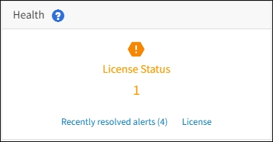

= StorageGRID ライセンス情報を表示します
:allow-uri-read: 
:icons: font
:imagesdir: ../media/

[role="lead"]
グリッドの最大ストレージ容量など、 StorageGRID システムのライセンス情報を必要に応じていつでも表示できます。

.必要なもの
* を使用して Grid Manager にサインインします xref:../admin/web-browser-requirements.adoc[サポートされている Web ブラウザ]。

.このタスクについて
この StorageGRID システムのソフトウェアライセンスを含む問題 がある場合、ダッシュボードのヘルスパネルにはライセンスステータスアイコンと * ライセンス * リンクが表示されます。この数値は、ライセンス関連の問題の数を示しています。

.ステップ
ライセンスを表示するには、次のいずれかを実行します。

* ダッシュボードのヘルスパネルで、ライセンスステータスアイコンまたは * ライセンス * リンクを選択します。このリンクは、ライセンスを持つ問題 が存在する場合にのみ表示されます。
* [* maintenance * （メンテナンス * ） ] > [* System * （システム * ） ] > [* License * （ライセンス *

ライセンスページが表示され、現在のライセンスに関する次の読み取り専用情報が提供されます。

* StorageGRID システム ID 。この StorageGRID インストールの一意の ID 番号です
* ライセンスのシリアル番号
* グリッドのライセンスが付与されているストレージ容量
* ソフトウェアライセンスの終了日
* サポートサービス契約の終了日
* ライセンステキストファイルの内容

NOTE: StorageGRID 10.3 より前に発行されたライセンスの場合、ライセンスで許可されているストレージ容量はライセンスファイルに含まれておらず、値の代わりに「 See License Agreement 」というメッセージが表示されます。
