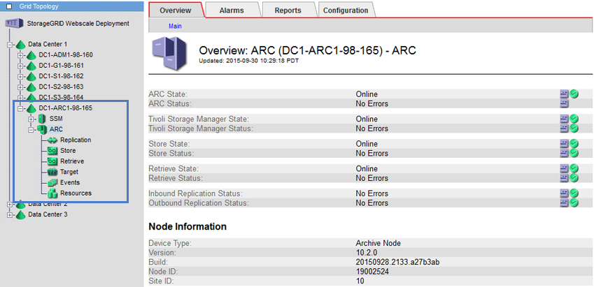

= アーカイブノードとは
:allow-uri-read: 
:icons: font
:imagesdir: ../media/

[role="lead"]
必要に応じて、各 StorageGRID データセンターサイトにアーカイブノードを導入して、 Tivoli Storage Manager （ TSM ）などの外部アーカイブストレージシステムに接続できます。

アーカイブノードは、オブジェクトデータの長期保管用に外部アーカイブストレージシステムをターゲットとするインターフェイスを提供します。また、この接続、および StorageGRID システムとターゲットの外部アーカイブストレージシステム間でのオブジェクトデータ転送も監視します。

外部ターゲットへの接続を設定したあと、 TSM のパフォーマンスを最適化するようにアーカイブノードを設定できます。 TSM サーバの容量が上限に近づいている場合や TSM サーバを使用できない場合は、アーカイブノードをオフラインにできます。また、レプリケーションと読み出しを設定できます。アーカイブノードにカスタムアラームを設定することもできます。

削除はできないが定期的にはアクセスされないオブジェクトデータは、ストレージノードの回転式ディスクから、クラウドやテープなどの外部アーカイブストレージにいつでも移動できます。オブジェクトデータをこのようにアーカイブするには、データセンターサイトのアーカイブノードを設定し、次にこのアーカイブノードをコンテンツ配置手順の「ターゲット」として選択した ILM ルールを設定します。アーカイブノードは、アーカイブされたオブジェクトデータ自体の管理は行いません。これは外部アーカイブデバイスによって行われます。

NOTE: オブジェクトメタデータはアーカイブされず、ストレージノードに残ります。

== ARC サービスとは

アーカイブノード上の Archive （ ARC ）サービスは、 TSM ミドルウェア経由のテープなど、外部アーカイブストレージへの接続を設定できる管理インターフェイスです。

ARC サービスは、外部のアーカイブストレージシステムと連携することにより、ニアラインストレージ用にオブジェクトデータを送信し、クライアントアプリケーションがアーカイブされたオブジェクトを要求したときに読み出しを実行します。クライアントアプリケーションがアーカイブされたオブジェクトを要求すると、ストレージノードは ARC サービスからオブジェクトデータを要求します。ARC サービスは外部のアーカイブストレージシステムに要求を送信し、アーカイブストレージシステムは要求されたオブジェクトデータを読み出して ARC サービスに送信します。ARC サービスはオブジェクトデータを検証してストレージノードに転送し、ストレージノードは要求元のクライアントアプリケーションにオブジェクトを返します。

TSM ミドルウェア経由でテープにアーカイブされたオブジェクトデータに対する要求は、読み出し効率が向上するように管理されます。要求は、テープに格納されているオブジェクトの順番と同じになるように順序が調整されたうえで、ストレージデバイスへの送信用のキューに登録されます。アーカイブデバイスによっては、異なるボリューム上のオブジェクトに対する複数の要求を同時に処理できます。
