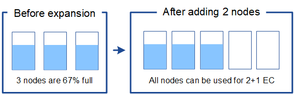

= イレイジャーコーディングオブジェクトのストレージ容量を追加します
:allow-uri-read: 
:icons: font
:imagesdir: ../media/

[role="lead"]
イレイジャーコーディングコピーを作成するルールが ILM ポリシーに含まれている場合は、新しいストレージの追加場所と新しいストレージを追加するタイミングを計画する必要があります。追加するストレージの量や追加のタイミングによって、グリッドの使用可能なストレージ容量が左右される場合があります。

ストレージ拡張を計画するための最初の手順は、イレイジャーコーディングオブジェクトを作成する ILM ポリシーのルールを調べることです。StorageGRID はイレイジャーコーディングされた各オブジェクト用に _k+m_fragments を作成して各フラグメントを別のストレージノードに格納するため、拡張後にイレイジャーコーディングされた新しいデータ用のスペースを少なくとも -k +m_Storage ノードに確保する必要があります。イレイジャーコーディングプロファイルでサイト障害から保護されている場合は、各サイトにストレージを追加する必要があります。を参照してください xref:../ilm/index.adoc[ILM を使用してオブジェクトを管理する]。

追加する必要があるノードの数は、拡張を実施する時点での既存のノードの使用状況によっても異なります。

== イレイジャーコーディングオブジェクト用のストレージ容量の追加に関する一般的な推奨事項

詳細な計算を行わない場合は、既存のストレージノードの容量が 70% に達した時点で各サイトに 2 つのストレージノードを追加できます。

この一般的な推奨事項は、単一サイトのグリッドとイレイジャーコーディングによってサイト障害から保護されるグリッドの両方で、広範なイレイジャーコーディングスキームに渡って合理的な結果を提供します。

この推奨事項につながる要因を理解したり、サイトのより正確な計画を作成したりするには、次のセクションを参照してください。状況に応じて最適化されたカスタムの推奨事項については、ネットアップの営業担当者にお問い合わせください。

== イレイジャーコーディングオブジェクト用に追加する拡張ストレージノードの数を計算します

イレイジャーコーディングオブジェクトを格納する環境の拡張方法を最適化するには、次の多くの要素を考慮する必要があります。

* イレイジャーコーディングスキームを使用中です
* イレイジャーコーディングに使用されるストレージプールの特徴。各サイトのノードの数と各ノードの空きスペースの量など
* グリッドが以前に拡張されたかどうか（ストレージノードあたりの空きスペースがすべてのノードでほぼ同じでない場合があるため）
* ILM ポリシーの正確な内容。 ILM ルールがレプリケートオブジェクトとイレイジャーコーディングオブジェクトの両方を作成するかどうかなど

次の例は、イレイジャーコーディングスキームによる影響、ストレージプール内のノードの数、各ノードの空きスペースの量を把握するのに役立ちます。

同様の考慮事項は、レプリケートデータとイレイジャーコーディングデータの両方を格納する ILM ポリシーの計算、および以前に拡張されたグリッドの計算に影響します。

IMPORTANT: ここでは、 StorageGRID システムにストレージ容量を追加する場合のベストプラクティスを紹介します。推奨さ手順 れる数のノードを追加できない場合は、 EC のリバランシングを実行して、イレイジャーコーディングオブジェクトを追加で格納できるようにする必要があります。を参照してください xref:considerations-for-rebalancing-erasure-coded-data.adoc[イレイジャーコーディングデータのリバランシング]。

== 例 1 ： 2+1 のイレイジャーコーディングを使用する 1 サイトのグリッドを拡張する

この例は、ストレージノードが 3 つだけのシンプルなグリッドを拡張する方法を示しています。

NOTE: この例では、簡易化のためにストレージノードを 3 つだけ使用していますただし、使用するストレージノードは 3 つだけにすることは推奨されません。実際の本番環境のグリッドでは、冗長性を確保するために最低でも _k+m_+1 のストレージノードを使用する必要があります。この例では 4 つのストレージノード（ 2+1 ）に相当します。

以下を想定しています。

* すべてのデータは 2+1 イレイジャーコーディングスキームを使用して格納されます。2+1 イレイジャーコーディングスキームでは、すべてのオブジェクトが 3 つのフラグメントとして格納され、各フラグメントが別々のストレージノードに保存されます。
* 1 つのサイトに 3 つのストレージノードがあります。各ストレージノードの総容量は 100TB です。
* 新しい 100TB のストレージノードを追加して拡張します。
* 最終的には、イレイジャーコーディングされたデータを古いノードと新しいノードに分散したい。

拡張を実施する際のストレージノードの使用状況に応じて、いくつかのオプションがあります。

* * 既存のノードが 100% 使用されている場合は、 100TB のストレージノードを 3 つ追加します *
+
この例では、既存のノードが 100% フルであることを示します。空き容量がないため、すぐに 3 つのノードを追加して 2+1 イレイジャーコーディングを続行する必要があります。

+
拡張の完了後、オブジェクトがイレイジャーコーディングされると、すべてのフラグメントが新しいノードに配置されます。

+
image::../media/used_space_after_3_node_expansion.png[3 ノード拡張後の使用済みスペース]

+

NOTE: この拡張により、 -k + m_nodes が追加されます。冗長性を確保するために、ノードを 4 つ追加することを推奨既存のノードが 100% フルのときに追加するストレージノードが _ k + m_expansion であると、すべての新しいオブジェクトが拡張ノードに格納されます。一時的にでも使用できなくなった新しいノードがあると、 StorageGRID は ILM 要件を満たすことができません。

* * 既存のストレージノードの使用率が 67% になったら、 2 つの 100TB のストレージノードを追加します *
+
この例では、既存のノードの使用率は 67% です。既存のノードに 100TB の空き容量がある（ノードあたり 33TB ）ため、拡張を実施する場合は、ノードを 2 つ追加するだけで済みます。

+
200TB の容量を追加することで、 2+1 のイレイジャーコーディングを継続し、最終的にはすべてのノード間でイレイジャーコーディングデータのバランスを取ることができます。

+

* * 既存のストレージノードの使用率が 33% に達した場合は、 100TB のストレージノードを 1 つ追加してください *
+
この例では、既存のノードの使用率は 33% です。既存のノードに 200TB の空き容量（各ノードに 67TB ）があるため、拡張を実施する場合、ノードを 1 つ追加するだけで済みます。

+
100TB の容量を追加することで、 2+1 のイレイジャーコーディングを続行し、最終的にはイレイジャーコーディングされたデータをすべてのノードに分散させることができます。

+
image::../media/node_expansion_example_33_percent.png[ノード拡張の例 1 33%]

== 例 2 ： 6+3 のイレイジャーコーディングを使用する 3 サイトグリッドを拡張する

この例は、フラグメント数が多いイレイジャーコーディングスキームを含むマルチサイトグリッドの拡張計画を作成する方法を示しています。これらの例の違いにもかかわらず、推奨される拡張計画は非常に似ています。

以下を想定しています。

* すべてのデータは 6+3 イレイジャーコーディングスキームを使用して格納されます。6+3 イレイジャーコーディングスキームでは、すべてのオブジェクトが 9 個のフラグメントとして格納され、各フラグメントが別々のストレージノードに保存されます。
* サイトが 3 つあり、各サイトにストレージノードが 4 つ（合計 12 ノード）ある。各ノードの合計容量は 100TB です。
* 新しい 100TB のストレージノードを追加して拡張します。
* 最終的には、イレイジャーコーディングされたデータを古いノードと新しいノードに分散したい。

拡張を実施する際のストレージノードの使用状況に応じて、いくつかのオプションがあります。

* * 既存のノードが 100% フルの場合は、 100TB のストレージノードを 9 つ（サイトごとに 3 つ）追加します *
+
この例では、 12 個の既存ノードが 100% フルであることを確認します。空き容量がないため、 6 + 3 のイレイジャーコーディングを続行するには、すぐに 9 つのノード（追加の容量 900 TB ）を追加する必要があります。

+
拡張の完了後、オブジェクトがイレイジャーコーディングされると、すべてのフラグメントが新しいノードに配置されます。

+

NOTE: この拡張により、 -k + m_nodes が追加されます。冗長性を確保するために、ノードを 12 個（サイトごとに 4 個）追加することを推奨します。既存のノードが 100% フルのときに追加するストレージノードが _ k + m_expansion であると、すべての新しいオブジェクトが拡張ノードに格納されます。一時的にでも使用できなくなった新しいノードがあると、 StorageGRID は ILM 要件を満たすことができません。

* * 既存のノードが 75% フルの場合、 6 つの 100TB のストレージノード（サイトごとに 2 つ）を追加します *
+
この例では、 12 個の既存ノードが 75% 使用されています。300TB の空き容量（ノードあたり 25TB ）があるため、拡張を実施する場合は、 6 つのノードを追加するだけで済みます。3 つのサイトにそれぞれ 2 つのノードを追加します。

+
600TB のストレージ容量を追加することで、 6+3 のイレイジャーコーディングを続行して、最終的にイレイジャーコーディングされたデータをすべてのノードに分散させることができます。

* * 既存のノードが 50% 使用されている場合は、 100TB のストレージノードを 3 つ（サイトごとに 1 つ）追加します *
+
この例では、 12 個の既存ノードが 50% 使用されています。600TB の空き容量（ノードあたり 50TB ）があるため、拡張を実施する場合は、ノードを 3 つ追加するだけで済みます。3 つのサイトのそれぞれに 1 つのノードを追加します。

+
300TB のストレージ容量を追加することで、 6+3 のイレイジャーコーディングを続行して、イレイジャーコーディングされたデータをすべてのノードに分散できるようになります。

