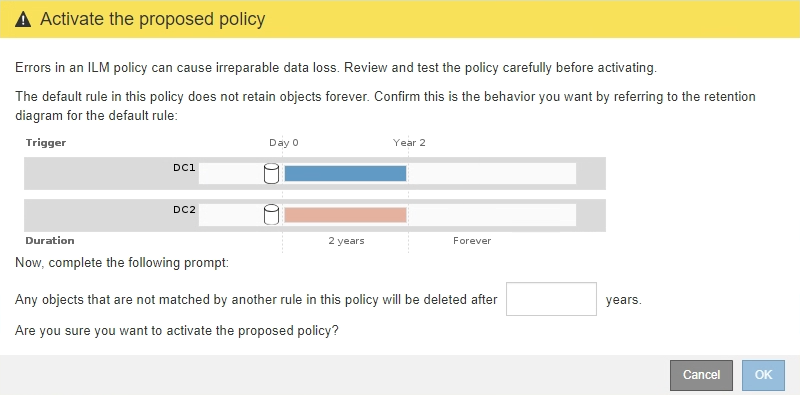

= ILM ポリシーをアクティブ化する
:allow-uri-read: 
:icons: font
:imagesdir: ../media/

[role="lead"]
ドラフトの ILM ポリシーに ILM ルールを追加してポリシーをシミュレートし、ポリシーが想定どおりに動作することを確認したら、ドラフトポリシーをアクティブ化できます。

.必要なもの
* を使用して Grid Manager にサインインします xref:../admin/web-browser-requirements.adoc[サポートされている Web ブラウザ]。
* 特定のアクセス権限が必要です。
* ドラフトの ILM ポリシーを保存し、シミュレートしておく必要があります。

CAUTION: 原因 ポリシーにエラーがあると、回復不能なデータ損失が発生する可能性があります。ポリシーをアクティブ化する前によく確認およびシミュレートし、想定どおりに機能することを確認してください。

CAUTION: 新しい ILM ポリシーをアクティブ化すると、 StorageGRID は、そのポリシーを使用して、既存のオブジェクトと新たに取り込まれたオブジェクトを含むすべてのオブジェクトを管理します。新しい ILM ポリシーをアクティブ化する前に、既存のレプリケートオブジェクトとイレイジャーコーディングオブジェクトの配置に対する変更を確認してください。既存のオブジェクトの場所を変更すると、新しい配置が評価されて実装される際に一時的なリソースの問題が発生する可能性があります。

.このタスクについて
ILM ポリシーをアクティブ化すると、システムは新しいポリシーをすべてのノードに配布します。ただし、すべてのグリッドノードが新しいアクティブポリシーを受信できるようになるまで、新しいポリシーが実際には有効にならない場合があります。グリッドオブジェクトが誤って削除されないように、システムが新しいアクティブポリシーの実装を待機する場合もあります。

* データの冗長性や耐久性を向上させる変更をポリシーに加えた場合、変更内容はすぐに実装されます。たとえば、 2 コピーのルールではなく 3 コピーのルールを含む新しいポリシーをアクティブ化した場合、そのポリシーはすぐに実装されます。これは、データの冗長性が向上するためです。
* データの冗長性や耐久性を低下させる可能性のある変更をポリシーに加えた場合、変更内容はすべてのグリッドノードが使用可能になるまで実装されません。たとえば、 3 コピーのルールではなく 2 コピーのルールを使用する新しいポリシーをアクティブ化すると、新しいポリシーは「 Active 」とマークされますが、すべてのノードがオンラインで使用可能になるまで有効になりません。

.手順
. ドラフトポリシーをアクティブ化する準備ができたら、 ILM ポリシーページでポリシーを選択し、 * アクティブ化 * を選択します。
+
警告メッセージが表示され、ドラフトポリシーをアクティブ化するかどうかの確認を求められます。

+
image::../media/ilm_policy_activate_warning.gif[ポリシーがアクティブ化される前に表示される警告]

+
ポリシーのデフォルトルールがオブジェクトを無期限に保持しない場合は、警告メッセージにプロンプトが表示されます。この例の保持図では、デフォルトルールによって 2 年後にオブジェクトが削除されることが示されています。テキストボックスに「 * 2 * 」と入力して、ポリシー内の別のルールに一致しないオブジェクトが 2 年後に StorageGRID から削除されることを確認する必要があります。

+

. 「 * OK 」を選択します。

.結果
新しい ILM ポリシーがアクティブ化されると次のようになります。

* ポリシーのポリシーの状態がアクティブと表示されます。[ 開始日 ] エントリには、ポリシーがアクティブ化された日時が表示されます。
+
image::../media/ilm_policies_active_and_historical.gif[ILM ポリシー - アクティブと履歴]

* 以前にアクティブだったポリシーが、ポリシーの状態が Historical と表示されます。[ 開始日 ] と [ 終了日 ] のエントリは、ポリシーがアクティブになった日時と、ポリシーが有効でなくなった日時を示します。

.関連情報
xref:example-6-changing-ilm-policy.adoc[例 6 ： ILM ポリシーを変更する]
