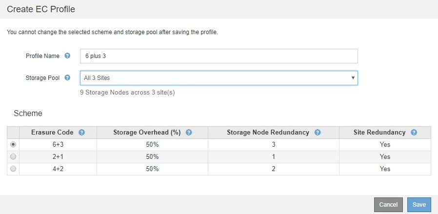

= イレイジャーコーディングプロファイルを作成
:icons: font
:imagesdir: ../media/

[role="lead"]
イレイジャーコーディングプロファイルを作成するには、ストレージノードを含むストレージプールをイレイジャーコーディングスキームに関連付けます。この関連付けにより、作成されるデータフラグメントおよびパリティフラグメントの数と、各フラグメントをどこに分散配置するかが決まります。

.必要なもの
* を使用して Grid Manager にサインインします xref:../admin/web-browser-requirements.adoc[サポートされている Web ブラウザ]。
* 特定のアクセス権限が必要です。
* サイトを 1 つだけ含むストレージプール、または 3 つ以上のサイトを含むストレージプールを作成しておきます。サイトが 2 つだけのストレージプールではイレイジャーコーディングスキームを使用できません。

イレイジャーコーディングプロファイルで使用するストレージプールには、サイトが 1 つだけ、または 3 つ以上含まれている必要があります。サイトの冗長性を確保するには、ストレージプールにサイトが少なくとも 3 つ必要です。

NOTE: ストレージノードを含むストレージプールを選択する必要があります。イレイジャーコーディングデータ用にアーカイブノードを使用することはできません。

.手順
. ILM * > * イレイジャーコーディング * を選択します。
+
イレイジャーコーディングのプロファイルページが表示されます。

+
image::../media/ec_profiles_page.png[イレイジャーコーディングのプロファイルページ]

. 「 * Create * 」を選択します。
+
EC プロファイルの作成ダイアログボックスが表示されます。

+
image::../media/create_ec_profile_page.png[Create EC Profile （ EC プロファイルの作成）ページ]

. イレイジャーコーディングプロファイルの一意の名前を入力します。
+
イレイジャーコーディングプロファイル名は一意である必要があります。既存のプロファイルの名前を使用すると、そのプロファイルが非アクティブ化されていても、検証エラーが発生します。

+

NOTE: ILM ルールの配置手順で、イレイジャーコーディングプロファイル名がストレージプール名に追加されます。

+
image::../media/storage_pool_and_erasure_coding_profile.png[ストレージプールと EC プロファイルの名前]

. このイレイジャーコーディングプロファイル用に作成したストレージプールを選択します。
+

NOTE: グリッドにサイトが 1 つしかない場合、デフォルトのストレージプール、すべてのストレージノード、またはデフォルトサイトであるすべてのサイトを含むストレージプールは使用できません。これにより、 2 つ目のサイトが追加された場合にイレイジャーコーディングプロファイルが無効になるのを防ぐことができます。

+

NOTE: ストレージプールにサイトが 2 つだけ含まれている場合、そのストレージプールをイレイジャーコーディングに使用することはできません。2 つのサイトを含むストレージプールではイレイジャーコーディングスキームを使用できません。

+
ストレージプールを選択すると、プール内のストレージノードとサイトの数に基づいて、使用可能なイレイジャーコーディングスキームのリストが表示されます。

+

+
使用可能な各イレイジャーコーディングスキームについて次の情報が表示されます。

+
** * イレイジャーコーディングコード * ：イレイジャーコーディングスキームの名前。データフラグメント + パリティフラグメントの形式で表されます。
** * ストレージオーバーヘッド（ % ） * ：オブジェクトのデータサイズを基準とした、パリティフラグメントに必要な追加のストレージ。ストレージオーバーヘッド = パリティフラグメントの総数 / データフラグメントの総数。
** * ストレージノードの冗長性 * ：オブジェクトデータの読み出しが可能な状態で、損失が許容されるストレージノードの数。
** * Site Redundancy * ：選択したイレイジャーコーディングで、サイトが 1 つ失われてもオブジェクトデータの読み出しが可能かどうかを示します。
+
サイトの冗長化を確保するには、選択したストレージプールに複数のサイトが含まれていて、どのサイトが失われても十分な数のストレージノードが各サイトに配置されている必要があります。たとえば、 6+3 のイレイジャーコーディングスキームを使用してサイトの冗長化を確保するためには、選択したストレージプールにサイトが 3 つ以上含まれていて、各サイトにストレージノードが 3 つ以上含まれている必要があります。

+
メッセージは次の場合に表示されます。

+
** 選択したストレージプールではサイトの冗長性が確保されません。選択したストレージプールに含まれているサイトが 1 つだけの場合は、次のメッセージが表示されます。ノードを障害から保護する場合は、 ILM ルールでこのイレイジャーコーディングプロファイルを使用できます。
+
image::../media/create_ec_profile_no_site_redundancy.png[EC プロファイルを作成してサイトの冗長性を確保しない]

** 選択したストレージプールがイレイジャーコーディングスキームの要件を満たしていません。たとえば、選択したストレージプールに含まれているサイトが 2 つだけの場合は、次のメッセージが表示されます。イレイジャーコーディングを使用してオブジェクトデータを保護する場合は、サイトが 1 つだけ、または 3 つ以上のストレージプールを選択する必要があります。
+
image::../media/ec_profile_error.png[イレイジャーコーディングプロファイルエラー]

** グリッドに含まれるサイトが 1 つだけで、デフォルトのストレージプールかすべてのストレージノード、またはデフォルトサイトであるすべてのサイトを含むストレージプールを選択した場合。
+
image::../media/ilm_ec_profile_all_storage_nodes_warning.png[ILM EC プロファイルすべてのストレージノードに関する警告]

** 選択したイレイジャーコーディングスキームとストレージプールが、別のイレイジャーコーディングプロファイルと重複しています。
+
image::../media/ilm_ec_profile_ec_scheme_warning.png[ILM EC プロファイルのイレイジャーコーディングスキームの警告]

+
この例では、別のイレイジャーコーディングプロファイルで 2+1 スキームを使用しており、他のプロファイルのストレージプールでも All 3 Sites ストレージプールのいずれかのサイトを使用しているため、警告メッセージが表示されます。

+
この新しいプロファイルを作成することはできませんが、 ILM ポリシーでプロファイルの使用を開始する際は十分に注意する必要があります。この新しいプロファイルを他のプロファイルですでに保護されている既存のイレイジャーコーディングオブジェクトに適用すると、 StorageGRID によって完全に新しいオブジェクトフラグメントのセットが作成されます。既存の 2+1 フラグメントは再利用されない。イレイジャーコーディングスキームが同じであっても、あるイレイジャーコーディングプロファイルから別のプロファイルに移行すると、リソースの問題が発生する可能性があります。

. 複数のイレイジャーコーディングスキームが表示される場合は、使用するスキームを 1 つ選択します。
+
どのイレイジャーコーディングスキームを使用するかを決めるにあたっては、フォールトトレランス（パリティセグメントの数が多いほど高くなる）と修復に必要なネットワークトラフィック（フラグメントの数が多いほどネットワークトラフィックも増加する）のバランスを考慮する必要があります。たとえば、 4+2 と 6+3 のどちらかのスキームを選ぶ場合、パリティを増やしてフォールトトレランスを向上させる必要がある場合は 6+3 のスキームを選択します。ノード修復時のネットワーク使用量を削減するためにネットワークリソースが制限されている場合は、 4+2 のスキームを選択します。

. [ 保存（ Save ） ] を選択します。

