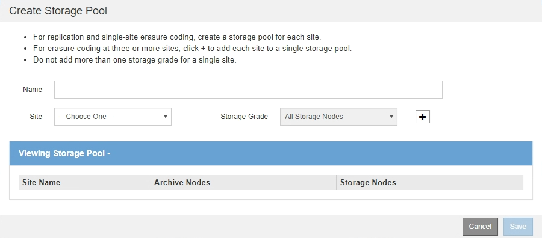

= ストレージプールを作成します
:allow-uri-read: 
:icons: font
:imagesdir: ../media/

[role="lead"]
ストレージプールを作成することで、 StorageGRID システムがオブジェクトデータを格納する場所と、使用するストレージのタイプを決定します。各ストレージプールには、サイトとストレージグレードがそれぞれ 1 つ以上含まれています。

.必要なもの
* を使用して Grid Manager にサインインします xref:../admin/web-browser-requirements.adoc[サポートされている Web ブラウザ]。
* 特定のアクセス権限が必要です。
* ストレージプールの作成に関するガイドラインを確認しておく必要があります。

ストレージプールは、オブジェクトデータの格納場所を決定します。必要なストレージプールの数は、グリッド内のサイトの数と、レプリケートコピーまたはイレイジャーコーディングコピーのタイプによって異なります。

* レプリケーションおよび単一サイトのイレイジャーコーディングの場合は、サイトごとにストレージプールを作成します。たとえば、レプリケートオブジェクトコピーを 3 つのサイトに格納する場合は、ストレージプールを 3 つ作成します。
* 3 つ以上のサイトでイレイジャーコーディングする場合は、サイトごとに 1 つのエントリを含むストレージプールを 1 つ作成します。たとえば、 3 つのサイトにまたがるオブジェクトをイレイジャーコーディングする場合は、ストレージプールを 1 つ作成します。プラスアイコンを選択します image:../media/icon_plus_sign_black_on_white.gif["[ 挿入 ] アイコン"] をクリックして、各サイトのエントリを追加します。
+

IMPORTANT: イレイジャーコーディングプロファイルで使用されるストレージプールには、デフォルトの All Sites サイトを含めないでください。代わりに、イレイジャーコーディングデータを格納するサイトごとにストレージプールにエントリを追加します。を参照してください <<entries,この手順を実行します>> たとえば、のように指定します。

* ストレージグレードが複数ある場合は、 1 つのサイトに異なるストレージグレードを含むストレージプールを作成しないでください。を参照してください xref:guidelines-for-creating-storage-pools.adoc[ストレージプールの作成に関するガイドラインを次に示します]。

.手順
. ILM * > * Storage pools * を選択します
+
Storage Pools （ストレージプール）ページが表示され、定義済みのすべてのストレージプールがリストされます。

+
image::../media/storage_pools_page.png[ストレージプールページ]

+
リストには、システムデフォルトのストレージプール、システムデフォルトサイトのすべてのサイトを使用するすべてのストレージノード、およびデフォルトのストレージグレードであるすべてのストレージノードが含まれます。

+

IMPORTANT: All Storage Nodes ストレージプールは、新しいデータセンターサイトを追加するたびに自動的に更新されるため、 ILM ルールでこのストレージプールを使用することは推奨されません。

. 新しいストレージプールを作成するには、「 * 作成」を選択します。
+
Create Storage Pool （ストレージプールの作成）ダイアログボックスが表示されます。

+

. ストレージプールの一意の名前を入力します。
+
イレイジャーコーディングプロファイルと ILM ルールを設定するときに識別しやすい名前を使用してください。

. [*Site *] ドロップダウン・リストから ' このストレージ・プールのサイトを選択します
+
サイトを選択すると、表内のストレージノードとアーカイブノードの数が自動的に更新されます。

+
通常は、どのストレージプールにもデフォルトの「すべてのサイト」サイトを使用しないでください。All Sites ストレージプールを使用する ILM ルールでは、オブジェクトを任意の使用可能なサイトに配置することで、オブジェクトの配置をより細かく制御できます。また、 All Sites ストレージプールは、新しいサイトのストレージノードを即座に使用しますが、これは想定どおりの動作ではない場合があります。

. ストレージグレード * ドロップダウンリストから、 ILM ルールでこのストレージプールを使用する場合に使用するストレージのタイプを選択します。
+
デフォルトの All Storage Nodes ストレージグレードには、選択したサイトのすべてのストレージノードが含まれます。Default Archive Nodes ストレージグレードには、選択したサイトのすべてのアーカイブノードが含まれます。グリッド内のストレージノード用にストレージグレードを追加で作成している場合、そのグレードもドロップダウンに表示されます。

. [[entries] ]] マルチサイトイレイジャーコーディングプロファイルでストレージプールを使用する場合は、を選択します image:../media/icon_plus_sign_black_on_white.gif["[ 挿入 ] アイコン"] をクリックして、各サイトのエントリをストレージプールに追加します。
+
image::../media/storage_pools_all_3_sites_for_ec.png[EC に関連する 3 つのサイトすべてのストレージプール]

+
[NOTE]
====
重複するエントリを作成したり、 * アーカイブノード * ストレージグレードとストレージノードを含むストレージグレードの両方を含むストレージプールを作成したりすることはできません。

サイトに複数のエントリを追加しても、ストレージグレードが異なる場合は警告が表示されます。

====
+
エントリを削除するには、を選択します image:../media/icon_nms_delete_new.gif["削除アイコン"]。

. 選択に問題がなければ、 * 保存 * を選択します。
+
新しいストレージプールがリストに追加されます。

