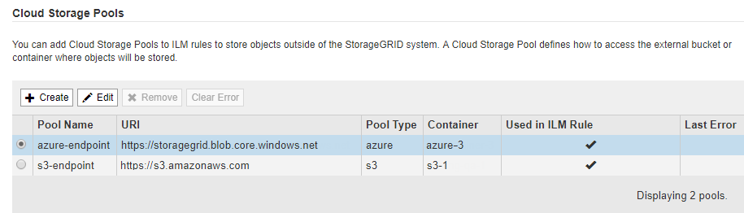

= クラウドストレージプールを編集します
:icons: font
:imagesdir: ../media/

[role="lead"]
クラウドストレージプールを編集して、名前、サービスエンドポイント、またはその他の詳細を変更できます。ただし、クラウドストレージプールの S3 バケットまたは Azure コンテナを変更することはできません。

.必要なもの
* を使用して Grid Manager にサインインします xref:../admin/web-browser-requirements.adoc[サポートされている Web ブラウザ]。
* 特定のアクセス権限が必要です。
* を確認しておきます xref:considerations-for-cloud-storage-pools.adoc[クラウドストレージプールに関する考慮事項]。

.手順
. ILM * > * Storage pools * を選択します
+
Storage Pools （ストレージプール）ページが表示されます。Cloud Storage Pools テーブルには、既存のクラウドストレージプールが表示されます。

+

. 編集するクラウドストレージプールのラジオボタンを選択します。
. 「 * 編集 * 」を選択します。
. 必要に応じて、表示名、サービスエンドポイント、認証クレデンシャル、または証明書の検証方法を変更します。
+

IMPORTANT: クラウドストレージプールのプロバイダタイプ、 S3 バケット、 Azure コンテナを変更することはできません。

+
以前にサーバ証明書またはクライアント証明書をアップロードした場合は、現在使用中の証明書を確認するために [ 現在の証明書を表示 ] を選択できます。

. [ 保存（ Save ） ] を選択します。
+
クラウドストレージプールを保存すると、バケットまたはコンテナとサービスエンドポイントが存在し、指定したクレデンシャルでそれらにアクセスできることが StorageGRID によって検証されます。

+
クラウドストレージプールの検証が失敗すると、エラーメッセージが表示されます。たとえば、証明書エラーが発生した場合はエラーが報告されます。

+
の手順を参照してください xref:troubleshooting-cloud-storage-pools.adoc[クラウドストレージプールのトラブルシューティング]をクリックし、問題 を解決してから、クラウドストレージプールの保存を再度実行してください。

