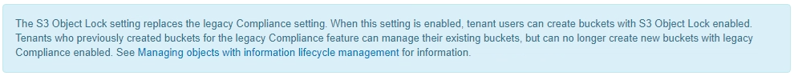

= S3 オブジェクトのロックをグローバルに有効にします
:allow-uri-read: 
:icons: font
:imagesdir: ../media/

[role="lead"]
オブジェクトデータの保存時に S3 テナントアカウントが規制要件に準拠する必要がある場合は、 StorageGRID システム全体で S3 オブジェクトのロックを有効にする必要があります。グローバルな S3 オブジェクトのロック設定を有効にすると、 S3 テナントユーザは S3 オブジェクトのロックでバケットとオブジェクトを作成および管理できるようになります。

.必要なもの
* Root アクセス権限が割り当てられている。
* を使用して Grid Manager にサインインします xref:../admin/web-browser-requirements.adoc[サポートされている Web ブラウザ]。
* S3 オブジェクトロックのワークフローを確認し、考慮事項を把握しておく必要があります。
* アクティブな ILM ポリシーのデフォルトルールは準拠ルールです。
+
** xref:creating-default-ilm-rule.adoc[デフォルトの ILM ルールを作成します]
** xref:creating-ilm-policy.adoc[ILM ポリシーを作成する]

テナントユーザが S3 オブジェクトのロックを有効にした新しいバケットを作成できるようにするには、グリッド管理者がグローバルな S3 オブジェクトロック設定を有効にする必要があります。この設定を有効にすると、あとで無効にすることはできません。

NOTE: 以前のバージョンの StorageGRID を使用してグローバル準拠設定を有効にした場合、 StorageGRID 11.6 で S3 オブジェクトロック設定が有効になります。既存の準拠バケットの設定の管理には引き続き StorageGRID を使用できますが、新しい準拠バケットを作成することはできません。を参照してください https://kb.netapp.com/Advice_and_Troubleshooting/Hybrid_Cloud_Infrastructure/StorageGRID/How_to_manage_legacy_Compliant_buckets_in_StorageGRID_11.5["ネットアップのナレッジベース： StorageGRID 11.5 でレガシー準拠バケットを管理する方法"^]。

.手順
. 設定 * > * System * > * S3 Object Lock * を選択します。
+
S3 Object Lock Settings （ S3 オブジェクトロック設定）ページが表示されます。

+
image::../media/s3_object_lock_global_setting.png[S3 オブジェクトのロックのグローバル設定]

+
以前のバージョンの StorageGRID を使用してグローバル準拠設定を有効にした場合、ページには次の注が表示されます。

+

. S3 オブジェクトロックを有効にする * を選択します。
. * 適用 * を選択します。
+
確認のダイアログボックスが表示され、有効にした S3 オブジェクトのロックを無効にできないことを通知するメッセージが表示されます。

+
image::../media/s3_object_lock_global_setting_confirm.png[S3 オブジェクトのロックグローバル設定の確認]

. システム全体に対して S3 オブジェクトロックを永続的に有効にしてもよろしいですか？ * OK * を選択します。
+
「 * OK * 」を選択した場合：

+
** アクティブな ILM ポリシーのデフォルトルールが準拠している場合は、グリッド全体で S3 オブジェクトのロックが有効になり、無効にすることはできません。
** デフォルトルールが準拠していない場合は、準拠ルールをデフォルトルールとして含む新しい ILM ポリシーを作成してアクティブ化する必要があることを示すエラーメッセージが表示されます。「 * OK 」を選択し、新しいドラフトポリシーを作成してシミュレートし、アクティブ化します。
+
image::../media/s3_object_lock_global_setting_error.gif[S3 オブジェクトロックグローバル設定エラー]

グローバルな S3 オブジェクトのロック設定を有効にしたあとで、が必要になる場合があります xref:../ilm/creating-default-ilm-rule.adoc[デフォルトルールを作成します] それは準拠およびです xref:creating-ilm-policy-after-s3-object-lock-is-enabled.adoc[ILM ポリシーを作成する] それは準拠です。設定を有効にすると、 ILM ポリシーに、準拠デフォルトルールと非準拠デフォルトルールの両方をオプションで含めることができます。たとえば、 S3 オブジェクトロックが有効になっていないバケット内のオブジェクトに対してフィルタが適用されていない非準拠ルールを使用できます。

.関連情報
* xref:managing-objects-with-s3-object-lock.adoc#comparing-s3-object-lock-to-legacy-compliance[S3 オブジェクトロックと従来の準拠を比較します]

