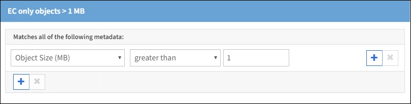
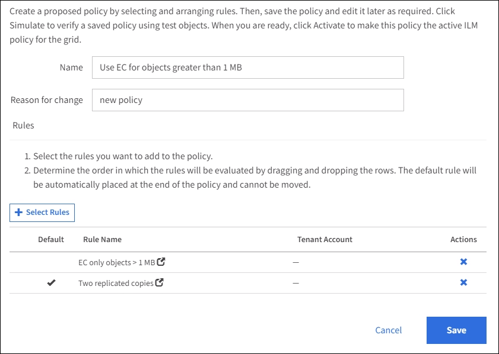

= 例 2 ： EC オブジェクトサイズのフィルタリング用の ILM ルールとポリシー
:icons: font
:imagesdir: ../media/

[role="lead"]
以下に記載するサンプルルールとポリシーをベースに、オブジェクトサイズでフィルタリングして EC の推奨要件を満たす ILM ポリシーを定義できます。

CAUTION: 以下の ILM ルールとポリシーは一例にすぎません。ILM ルールを設定する方法は多数あります。新しいポリシーをアクティブ化する前に、ドラフトポリシーをシミュレートして、コンテンツの損失を防ぐためにドラフトポリシーが想定どおりに機能することを確認してください。

== 例 2 の ILM ルール 1 ： 1MB を超えるオブジェクトに EC を使用します

この ILM ルールの例では、 1MB を超えるオブジェクトをイレイジャーコーディングします。

IMPORTANT: イレイジャーコーディングは 1MB を超えるオブジェクトに適しています。200KB 未満のオブジェクトにはイレイジャーコーディングを使用しないでください。イレイジャーコーディングされた非常に小さなフラグメントを管理するオーバーヘッドは発生しません。

[cols="1a,2a"]
|===
| ルール定義 | 値の例 

 a| 
ルール名
 a| 
EC のみのオブジェクト > 1MB

 a| 
参照時間
 a| 
取り込み時間

 a| 
オブジェクトサイズの高度なフィルタリング
 a| 
オブジェクトサイズ（ MB ）が 1 より大きい

 a| 
コンテンツ配置
 a| 
3 つのサイトを使用して 2+1 のイレイジャーコーディングコピーを作成

|===

== 例 2 の ILM ルール 2 ：レプリケートされたコピーを 2 つ

この ILM ルールの例では、レプリケートコピーを 2 つ作成し、オブジェクトサイズではフィルタリングしません。このルールはポリシーのデフォルトルールです。最初のルールでは 1MB を超えるすべてのオブジェクトがフィルタリングされるため、このルールで使用できるのは 1MB 以下の環境 オブジェクトのみです。

[cols="1a,2a"]
|===
| ルール定義 | 値の例 

 a| 
ルール名
 a| 
2 つのレプリケートコピー

 a| 
参照時間
 a| 
取り込み時間

 a| 
オブジェクトサイズの高度なフィルタリング
 a| 
なし

 a| 
コンテンツ配置
 a| 
レプリケートコピーを 2 つ作成して、 DC1 と DC2 の 2 つのデータセンターに保存します

|===

== 例 2 の ILM ポリシー： 1MB を超えるオブジェクトに EC を使用します

この例の ILM ポリシーには 2 つの ILM ルールが含まれています。

* 最初のルールでは、 1MB を超えるすべてのオブジェクトをイレイジャーコーディングします。
* 2 つ目の（デフォルトの） ILM ルールによって、レプリケートコピーが 2 つ作成されます。1MB を超えるオブジェクトはルール 1 でフィルタリングされているため、ルール 2 では 1MB 以下の環境 オブジェクトのみが除外されます。
+

