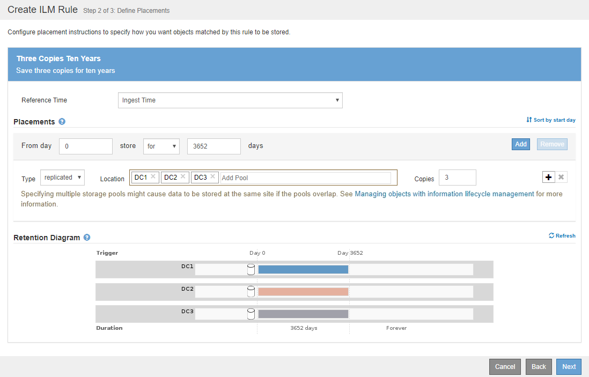

= 例 4 ： S3 バージョン管理オブジェクトの ILM ルールとポリシー
:allow-uri-read: 
:icons: font
:imagesdir: ../media/

[role="lead"]
バージョン管理が有効になっている S3 バケットがある場合は、参照時間として * noncurrent time * を使用する ILM ポリシーにルールを含めることで、最新でないオブジェクトバージョンを管理できます。

この例に示すように、バージョン管理オブジェクトで使用されるストレージの量を制御するには、最新でないオブジェクトバージョンに別々の配置手順を使用します。

CAUTION: 以下の ILM ルールとポリシーは一例にすぎません。ILM ルールを設定する方法は多数あります。新しいポリシーをアクティブ化する前に、ドラフトポリシーをシミュレートして、コンテンツの損失を防ぐためにドラフトポリシーが想定どおりに機能することを確認してください。

NOTE: 最新でないオブジェクトバージョンを管理するための ILM ポリシーを作成する場合は、ポリシーをシミュレートするためにオブジェクトバージョンの UUID または CBID が必要です。オブジェクトの UUID と CBID を確認するには、オブジェクトが最新の間にオブジェクトメタデータを検索します。を参照してください xref:verifying-ilm-policy-with-object-metadata-lookup.adoc[オブジェクトメタデータの検索による ILM ポリシーの検証]。

.関連情報
* xref:how-objects-are-deleted.adoc[オブジェクトの削除方法]

== 例 4 の ILM ルール 1 ：コピーを 3 つ、 10 年間保存します

この例では、 3 つのデータセンターに各オブジェクトのコピーを 10 年間格納します。

このルールは、オブジェクトがバージョン管理されているかどうかに関係なく、すべてのオブジェクトを環境 します。

[cols="1a,2a"]
|===
| ルール定義 | 値の例 

 a| 
ストレージプール
 a| 
別々のデータセンターにある 3 つのストレージプール、 DC1 、 DC2 、 DC3 。

 a| 
ルール名
 a| 
3 つのコピー 10 年

 a| 
参照時間
 a| 
取り込み時間

 a| 
コンテンツ配置
 a| 
0 日目から、 3 つのレプリケートコピーを 10 年間（ 3 、 652 日）格納（ DC1 、 DC2 、 DC3 に 1 つずつ）。10 年後にオブジェクトのコピーをすべて削除する。

|===

== 例 4 の ILM ルール 2 ：最新でないバージョンのコピーを 2 つ、 2 年間保存します

この例では、最新でないバージョンの S3 バージョン管理オブジェクトのコピーを 2 つ、 2 年間格納します。

ILM ルール 1 ではすべてのバージョンのオブジェクトが環境 されるため、最新でないバージョンをすべて除外する別のルールを作成する必要があります。このルールでは、参照時間に * noncurrent Time * オプションを使用します。

この例では、最新でないバージョンのコピーが 2 つだけ格納され、その期間は 2 年間です。

[cols="1a,2a"]
|===
| ルール定義 | 値の例 

 a| 
ストレージプール
 a| 
別々のデータセンターにある 2 つのストレージプール、 DC1 および DC2

 a| 
ルール名
 a| 
最新でないバージョン： 2 コピー 2 年

 a| 
参照時間
 a| 
最新でなくなった時間

 a| 
コンテンツ配置
 a| 
0 日目から最新でない時間（オブジェクトバージョンが最新でないバージョンになる日から）を基準に、最新でないオブジェクトバージョンのレプリケートコピーを 2 つ（ 730 日）保持し、 DC1 と DC2 に 1 つずつ保持します。2 年後に最新でないバージョンを削除します。

|===
image::../media/ilm_rule_2_example_4.png[例 4 の ILM ルール 2 ：最新でないオブジェクトバージョンを 2 年間保存します]

== 例 4 の ILM ポリシー： S3 バージョン管理オブジェクト

最新バージョンとは異なる古いバージョンのオブジェクトを管理する場合は、現在のオブジェクトバージョンに適用されるルールを開始する前に、参照時間として * noncurrent Time * を使用するルールを ILM ポリシーに含める必要があります。

S3 バージョン管理オブジェクトの ILM ポリシーには、次のような ILM ルールが含まれます。

* 古い（最新でない）バージョンの各オブジェクトを、そのバージョンが最新でなくなった日から 2 年間保持します。
+

NOTE: 最新でない時間ルールは、現在のオブジェクトバージョンに適用されるルールより前にポリシーに表示される必要があります。それ以外の場合、最新でないオブジェクトバージョンは noncurrent Time ルールに一致しません。

* 取り込み時に、レプリケートコピーを 3 つ作成して、 3 つのデータセンターに 1 つずつ格納します。最新のオブジェクトバージョンのコピーを 10 年間保持します。

image::../media/ilm_policy_example_4.png[例 4 の ILM ポリシー]

この例のポリシーをシミュレートすると、テストオブジェクトは次のように評価されます。

* 最新でないオブジェクトバージョンがすべて最初のルールに一致します。最新でないオブジェクトバージョンが 2 年以上経過している場合は、 ILM によって完全に削除されます（最新でないバージョンのコピーがすべてグリッドから削除されます）。
+

NOTE: 最新でないオブジェクトバージョンをシミュレートするには、そのバージョンの UUID または CBID を使用する必要があります。オブジェクトが最新の間であれば、 Object Metadata Lookup を使用して UUID と CBID を検索できます。

* 現在のオブジェクトバージョンが 2 つ目のルールに一致します。最新のオブジェクトバージョンが 10 年間保存されると 'ILM プロセスはオブジェクトの最新バージョンとして削除マーカーを追加し ' 以前のオブジェクトバージョンを「 noncurrent 」にします 次回の ILM 評価では、この最新でないバージョンは最初のルールに一致します。その結果、 DC3 にあるコピーがパージされ、 DC1 と DC2 にある 2 つのコピーがさらに 2 年間格納されます。

