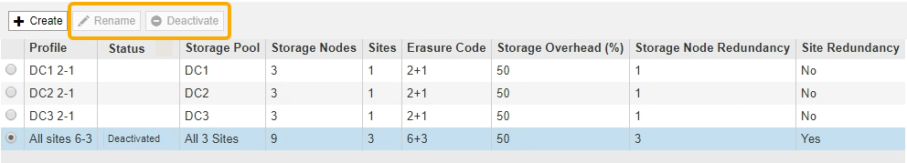

= イレイジャーコーディングプロファイルの名前を変更する
:allow-uri-read: 
:icons: font
:imagesdir: ../media/

[role="lead"]
イレイジャーコーディングプロファイルの名前を変更して、プロファイルの内容をより明確にすることができます。

.必要なもの
* を使用して Grid Manager にサインインします xref:../admin/web-browser-requirements.adoc[サポートされている Web ブラウザ]。
* 特定のアクセス権限が必要です。

.手順
. ILM * > * イレイジャーコーディング * を選択します。
+
イレイジャーコーディングのプロファイルページが表示されます。[ 名前の変更 * （ Rename * ） ] ボタンと [ 非活動化 * （ Deactivate * ） ] ボタンの両方が無効

+

. 名前を変更するプロファイルを選択します。
+
[ 名前の変更 * （ Rename * ） ] ボタンと [ 非活動化 * （ Deactivate * ） ] ボタンが有効

. [ 名前の変更 *] を選択します。
+
EC プロファイルの名前変更ダイアログボックスが表示されます。

+
image::../media/ec_profile_rename.png[イレイジャーコーディングプロファイルの名前変更]

. イレイジャーコーディングプロファイルの一意の名前を入力します。
+
ILM ルールの配置手順で、イレイジャーコーディングプロファイル名がストレージプール名に追加されます。

+
image::../media/storage_pool_and_erasure_coding_profile.png[ストレージプールと EC プロファイルの名前]

+

NOTE: イレイジャーコーディングプロファイル名は一意である必要があります。既存のプロファイルの名前を使用すると、そのプロファイルが非アクティブ化されていても、検証エラーが発生します。

. [ 保存（ Save ） ] を選択します。

