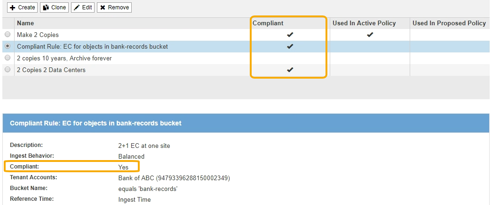

= S3 オブジェクトのロックの要件
:icons: font
:imagesdir: ../media/

[role="lead"]
グローバルな S3 オブジェクトのロック設定を有効にするための要件、準拠 ILM ルールおよび ILM ポリシーを作成するための要件、および StorageGRID が S3 オブジェクトロックを使用するバケットとオブジェクトに適用する制限事項を確認しておく必要があります。

== グローバルな S3 オブジェクトロック設定を使用するための要件

* S3 テナントが S3 オブジェクトロックを有効にしてバケットを作成できるようにするには、 Grid Manager またはグリッド管理 API を使用してグローバルな S3 オブジェクトロック設定を有効にする必要があります。
* グローバルな S3 オブジェクトのロック設定を有効にすると、すべての S3 テナントアカウントで S3 オブジェクトのロックを有効にしてバケットを作成できるようになります。
* グローバルな S3 オブジェクトのロック設定を有効にしたあとに、設定を無効にすることはできません。
* アクティブな ILM ポリシーのデフォルトルールが _Compliant _ （つまり、デフォルトルールが S3 オブジェクトロックが有効になっているバケットの要件を満たす必要がある）以外は、グローバルな S3 オブジェクトロックを有効にすることはできません。
* グローバルな S3 オブジェクトのロック設定が有効になっている場合、ポリシーのデフォルトルールが準拠していないと、ドラフトの ILM ポリシーを新規作成したり、既存のドラフトの ILM ポリシーをアクティブ化したりすることはできません。グローバルな S3 オブジェクトのロック設定を有効にすると、 ILM ルールおよび ILM ポリシーのページに、準拠している ILM ルールが表示されます。
+
次の例では、 ILM ルールページに、 S3 オブジェクトのロックが有効になっているバケットに準拠した 3 つのルールが表示されています。

+

== 準拠 ILM ルールの要件

グローバルな S3 オブジェクトのロック設定を有効にする場合は、アクティブな ILM ポリシーのデフォルトルールが準拠していることを確認する必要があります。準拠ルールは、 S3 オブジェクトのロックが有効になっているバケットと従来の準拠が有効になっている既存のバケットの両方の要件を満たします。

* 2 つ以上のレプリケートオブジェクトコピーまたは 1 つのイレイジャーコーディングコピーを作成する。
* これらのコピーが、配置手順の各ラインの間、ストレージノード上に存在している必要があります。
* オブジェクトコピーをクラウドストレージプールに保存することはできません。
* オブジェクトコピーをアーカイブノードに保存することはできません。
* 配置手順の 1 行以上が、参照時間として * 取り込み時間 * を使用して 0 日目から開始されている必要があります。
* 配置手順の少なくとも 1 行は「無期限」である必要があります。

たとえば、次のルールは S3 オブジェクトのロックを有効にしたバケットの要件を満たしています。2 つの複製オブジェクト・コピーを取り込み時（ 0 日目）から「無期限」に格納します。 オブジェクトは 2 つのデータセンターのストレージノードに格納されます。

image::../media/compliant_rule_two_copies_forever.png[準拠ルール 2 の無期限コピーの例]

== アクティブな ILM ポリシーとドラフトの ILM ポリシーの要件

グローバルな S3 オブジェクトのロック設定が有効になっている場合は、アクティブな ILM ポリシーとドラフトの ILM ポリシーに、準拠ルールと非準拠ルールの両方を含めることができます。

* アクティブな ILM ポリシーまたはドラフトの ILM ポリシーのデフォルトルールは、準拠ルールである必要があります。
* 非準拠ルールは、 S3 オブジェクトロックが有効になっていないバケット内のオブジェクト、または従来の準拠機能が有効になっていないオブジェクトのみに適用されます。
* 準拠ルールは任意のバケット内のオブジェクトに適用できます。 S3 オブジェクトのロックや従来の準拠を有効にする必要はありません。

準拠 ILM ポリシーには、次の 3 つのルールが含まれる場合があります。

. S3 オブジェクトのロックが有効な特定のバケット内にオブジェクトのイレイジャーコーディングコピーを作成する準拠ルール。EC コピーは、 0 日目から無期限にストレージノードに格納されます。
. 2 つのレプリケートオブジェクトコピーを作成してストレージノードに 1 年間保存したあと、 1 つのオブジェクトコピーをアーカイブノードに移動して無期限に格納する非準拠ルール。このルールでは、 S3 オブジェクトロックまたはレガシー準拠が有効になっていない環境 バケットのみが無期限に格納され、アーカイブノードを使用するため、バケットのみが有効になります。
. 2 つのレプリケートオブジェクトコピーを 0 日目からストレージノードに無期限に作成するデフォルトの準拠ルール。このルールは、最初の 2 つのルールでフィルタリングされなかったすべてのバケットのオブジェクトを環境 します。

== S3 オブジェクトのロックを有効にした場合のバケットの要件

* StorageGRID システムでグローバルな S3 オブジェクトロック設定が有効になっている場合は、テナントマネージャ、テナント管理 API 、または S3 REST API を使用して、 S3 オブジェクトロックを有効にしたバケットを作成できます。
+
次の Tenant Manager の例では、 S3 オブジェクトのロックが有効になっているバケットを示しています。

+
image::../media/compliant_bucket.png[準拠バケットの例]

* S3 オブジェクトのロックを使用する場合は、バケットの作成時に S3 オブジェクトのロックを有効にする必要があります。既存のバケットに対して S3 オブジェクトロックを有効にすることはできません。
* S3 オブジェクトロックでは、バケットのバージョン管理が必要です。バケットで S3 オブジェクトのロックが有効になっている場合は、そのバケットのバージョン管理が StorageGRID で自動的に有効になります。
* S3 オブジェクトのロックを有効にしてバケットを作成したあとに、そのバケットの S3 オブジェクトのロックを無効にしたりバージョン管理を一時停止したりすることはできません。
* 必要に応じて、バケットにデフォルトの保持を設定できます。オブジェクトのバージョンがアップロードされると、デフォルトの保持設定がオブジェクトのバージョンに適用されます。バケットのデフォルト設定を上書きするには、オブジェクトバージョンのアップロード要求で保持モードと retain-date を指定します。
* バケットライフサイクル設定は S3 オブジェクトライフサイクルバケットでサポートされます。
* CloudMirror レプリケーションは、 S3 オブジェクトロックが有効になっているバケットではサポートされません。

== S3 オブジェクトのロックが有効になっているバケット内のオブジェクトの要件

* オブジェクトバージョンを保護するためには、 S3 クライアントアプリケーションでバケットのデフォルト保持を設定するか、各アップロード要求で保持設定を指定する必要があります。
* オブジェクトバージョンの retain-until date は増やすことができますが、この値を減らすことはできません。
* 係争中の訴訟や規制上の調査に関する通知があった場合、オブジェクトバージョンをリーガルホールドの対象にすることで関連情報を保持できます。オブジェクトバージョンがリーガルホールドの対象になっている場合は、それが retain-until 日に達しても、そのオブジェクトを StorageGRID から削除することはできません。リーガルホールドを解除すると、それまで保持期限に達した場合にオブジェクトバージョンを削除できるようになります。
* S3 オブジェクトロックにはバージョン管理されたバケットを使用する必要があります。保持設定はオブジェクトのバージョンごとに適用されます。オブジェクトバージョンには、 retain-until date 設定とリーガルホールド設定の両方を設定できます。ただし、オブジェクトバージョンを保持することはできません。また、どちらも保持することはできません。オブジェクトの retain-une-date 設定またはリーガルホールド設定を指定すると、要求で指定されたバージョンのみが保護されます。オブジェクトの以前のバージョンはロックされたまま、オブジェクトの新しいバージョンを作成できます。

== S3 オブジェクトのロックが有効なバケット内のオブジェクトのライフサイクル

S3 オブジェクトのロックが有効になっているバケットに保存された各オブジェクトは、次の 3 つの段階を経て処理されます。

. * オブジェクトの取り込み *
+
** S3 オブジェクトのロックが有効になっているバケットにオブジェクトのバージョンを追加すると、 S3 クライアントアプリケーションではデフォルトのバケット保持設定を使用できるほか、必要に応じてオブジェクトの保持設定を指定することもできます（ retain-une-date 、リーガルホールド、またはその両方）。StorageGRID は、そのオブジェクトのメタデータを生成します。これには、一意のオブジェクト ID （ UUID ）と取り込み日時が含まれます。
** 保持設定のあるオブジェクトのバージョンが取り込まれたあとに、そのデータと S3 ユーザ定義メタデータを変更することはできません。
** StorageGRID は、オブジェクトメタデータをオブジェクトデータとは別に格納します。各サイトですべてのオブジェクトメタデータのコピーを 3 つ保持します。

. * オブジェクト保持 *
+
** オブジェクトの複数のコピーが StorageGRID によって格納される。コピーの正確な数、タイプ、格納場所は、アクティブな ILM ポリシーの準拠ルールによって決まります。

. * オブジェクトの削除 *
+
** オブジェクトは、 retain-until - date に到達したときに削除できます。
** リーガルホールドの対象になっているオブジェクトは削除できません。

.関連情報
* xref:../tenant/index.adoc[テナントアカウントを使用する]
* xref:../s3/index.adoc[S3 を使用する]
* xref:managing-objects-with-s3-object-lock.adoc#comparing-s3-object-lock-to-legacy-compliance[S3 オブジェクトロックと従来の準拠の比較]
* xref:example-7-compliant-ilm-policy-for-s3-object-lock.adoc[例 7 ： S3 オブジェクトロックの準拠 ILM ポリシー]
* xref:../audit/index.adoc[監査ログを確認します]
* xref:../s3/operations-on-buckets.adoc#using-s3-object-lock-default-bucket-retention[S3 オブジェクトロックのデフォルトバケット保持を使用する]。

