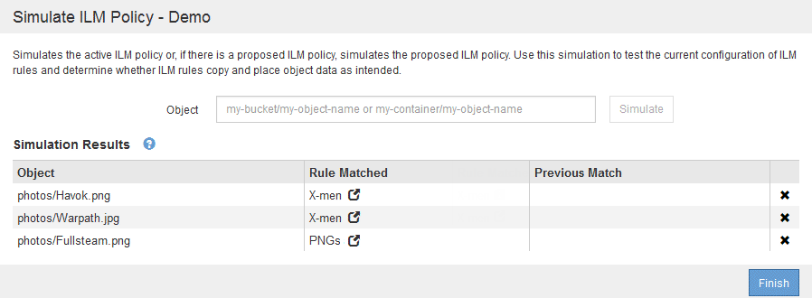

= ILM ポリシーをシミュレートします
:icons: font
:imagesdir: ../media/

[role="lead"]
ポリシーをアクティブ化して本番環境のデータに適用する前に、テストオブジェクトでドラフトポリシーをシミュレートする必要があります。シミュレーション期間は、アクティブ化して本番環境のデータに適用する前にポリシーを安全にテストするための、スタンドアロン環境を提供します。

.必要なもの
* を使用して Grid Manager にサインインします xref:../admin/web-browser-requirements.adoc[サポートされている Web ブラウザ]。
* 特定のアクセス権限が必要です。
* テストする各オブジェクトの S3 バケット / オブジェクトキーまたは Swift コンテナ / オブジェクト名を確認しておき、それらのオブジェクトを取り込んでおく必要があります。

ドラフトポリシーをテストするオブジェクトは慎重に選択する必要があります。ポリシーを確実にシミュレートするには、各ルールのフィルタごとに少なくとも 1 つのオブジェクトをテストする必要があります。

たとえば、バケット A のオブジェクトに一致するルールとバケット B のオブジェクトに一致するルールを含むポリシーを確実にテストするためには、少なくともバケット A から 1 つとバケット B から 1 つオブジェクトを選択する必要があります。デフォルトルールをテストするには、別のバケットから少なくとも 1 つのオブジェクトを選択する必要もあります。

ポリシーをシミュレートする場合は、次の点を考慮します。

* ポリシーを変更したら、ドラフトポリシーを保存します。次に、保存したドラフトポリシーの動作をシミュレートします。
* ポリシーをシミュレートするとポリシー内の ILM ルールがテストオブジェクトをフィルタリングするため、各オブジェクトにどのルールが適用されたかを確認できます。ただし、オブジェクトのコピーは作成されず、配置もされません。シミュレーションを実行しても、データ、ルール、ポリシーはいっさい変更されません。
* シミュレーションページでは、 ILM ポリシーページを閉じるか別のページに移動するか更新するまで、テストしたオブジェクトが保持されます。
* シミュレーションは、一致したルールの名前を返します。どのストレージプールまたはイレイジャーコーディングプロファイルが有効かを確認するには、ルール名または詳細アイコンを選択して Retention Diagram を表示します image:../media/icon_nms_more_details.gif["詳細アイコン"]。
* S3 のバージョン管理が有効な場合、ポリシーはオブジェクトの現在のバージョンに対してのみシミュレートされます。

.手順
. ルールを選択して配置し、ドラフトポリシーを保存します。
+
この例のポリシーには 3 つのルールがあります。

+
[cols="1a,1a,1a,1a"]
|===
| ルール名 | フィルタ | コピーのタイプ | 保持 

 a| 
男性用
 a| 
** テナント A
** ユーザメタデータ（シリーズ = x-men ）

 a| 
2 つのデータセンターに 2 つのコピーを保持
 a| 
2 年

 a| 
PNGs
 a| 
キーの末尾は .png です
 a| 
2 つのデータセンターに 2 つのコピーを保持
 a| 
5 年

 a| 
2 つのコピーで 2 つのデータセンターを構成し
 a| 
_ なし _
 a| 
2 つのデータセンターに 2 つのコピーを保持
 a| 
永遠に

|===
+
image::../media/ilm_policies_viewing_proposed.png[ドラフトの ILM ポリシーを表示中]

. S3 / Swift クライアントまたはを使用する xref:../tenant/use-s3-console.adoc[Experimental S3 Console の略]テナントごとに Tenant Manager で使用できるように、各ルールのテストに必要なオブジェクトを取り込みます。
. 「 * Simulate * 」を選択します。
+
Simulation ILM Policy （シミュレーション ILM ポリシー）ダイアログボックスが表示されます。

. * Object * フィールドに、テストオブジェクトの S3 バケット / オブジェクトキーまたは Swift コンテナ / オブジェクト名を入力し、 * Simulate * を選択します。
+
[NOTE]
====
取り込まれていないオブジェクトを指定するとメッセージが表示されます。

image::../media/object_not_available_for_simulation.gif[欠落オブジェクトを指定した場合に表示されるメッセージです]

====
. [ * シミュレーション結果 * （ Simulation Results ） ] で、各オブジェクトが正しいルールに一致していることを確認します。
+
この例では 'Havok.png' オブジェクトと Warpath.jpg` オブジェクトが 'X-men ルールに正しく一致しました。「 series = x - men 」ユーザメタデータを含まない「 Fullsteam .png 」オブジェクトは「 X-men 」ルールには一致しませんでしたが、「 PNGs 」ルールに正しく一致しました。3 つのオブジェクトがすべて他のルールに一致したため、デフォルトルールは使用されませんでした。

+

== 例 1 ：ドラフトの ILM ポリシーをシミュレートしてルールを確認する

この例は、ドラフトポリシーをシミュレートしてルールを確認する方法を示しています。

この例では、 2 つのバケットに取り込まれたオブジェクトに対して * サンプルの ILM ポリシー * をシミュレートします。このポリシーには、次の 3 つのルールが含まれています。

* 最初のルール「 * 2 copies 、 buckets-a * 」の 2 年間は、 bucket-a のオブジェクトにのみ適用されます
* 2 番目のルール「 * EC objects > 1 MB * 、環境 all buckets] は 1MB を超えるオブジェクトをフィルタリングします。
* 3 つ目のルール「 * 2 つのコピー、 2 つのデータセンター」はデフォルトルールです。フィルタは含まれず、参照時間を noncurrent に指定したものは使用しません。

image::../media/saved_policy_for_simulation.png[シミュレーションの保存済みポリシー]

.手順
. ルールを追加してポリシーを保存したら、 * Simulate * を選択します。
+
Simulate ILM Policy ダイアログボックスが表示されます。

. * Object * フィールドに、テストオブジェクトの S3 バケット / オブジェクトキーまたは Swift コンテナ / オブジェクト名を入力し、 * Simulate * を選択します。
+
シミュレーション結果が表示され、ポリシー内のどのルールがテストした各オブジェクトに一致したかが示されます。

+
image::../media/simulate_policy_screen.png[［ ポリシーのシミュレート ］ 画面]

. 各オブジェクトが正しいルールに一致したことを確認します。
+
次の例では、

+
.. 「 bucket-a/buckets-a object.pdf 」は、「 bucket-a` のオブジェクトでフィルタリングする最初のルールに正しく一致しました。
.. 「 bucket-b/ test object greater than 1 MB.pdf 」は「 bucket-b」 にあるため、最初のルールと一致しませんでした。代わりに、 1MB を超えるオブジェクトをフィルタリングする 2 つ目のルールに正しく一致しました。
.. 「 bucket-b/ test object less than 1 MB.pdf 」は最初の 2 つのルールのフィルタに一致していないため、フィルタを含まないデフォルトルールによって配置されます。

== 例 2 ：ドラフトの ILM ポリシーをシミュレートする際にルールの順序を変更する

この例では、ポリシーをシミュレートする際に、ルールの順序を変更して結果を変更する方法を示します。

この例では、 * Demo * ポリシーをシミュレートします。このポリシーの目的は次の 3 つのルールで、 series = x -men ユーザメタデータを含むオブジェクトを検索することです。

* 最初のルール「 *PNGs * 」は、「 .png` 」で終わるキー名に対してフィルタを適用します。
* 2 番目のルール「 * X-men * 」はテナント A のオブジェクトにのみ適用され、「 series = x - men 」ユーザメタデータに対してフィルタを適用します。
* 最後のルール「 * 2 Copies 2 data centers * 」はデフォルトルールで、最初の 2 つのルールに一致しないオブジェクトに一致します。

image::../media/simulate_reorder_rules_pngs_rule.png[例 2 ：ドラフトの ILM ポリシーをシミュレートする際にルールの順序を変更する]

.手順
. ルールを追加してポリシーを保存したら、 * Simulate * を選択します。
. * Object * フィールドに、テストオブジェクトの S3 バケット / オブジェクトキーまたは Swift コンテナ / オブジェクト名を入力し、 * Simulate * を選択します。
+
シミュレーション結果が表示され、「 Havok.png 」オブジェクトが * PNGs * ルールに一致したことが示されます。

+
image::../media/simulate_reorder_rules_pngs_result.gif[例 2 ：ドラフトの ILM ポリシーをシミュレートする際にルールの順序を変更する]

+
しかし 'Havok.png' オブジェクトがテスト対象としたルールは *X-men * ルールでした。

. 問題 を解決するには、ルールの順序を変更します。
+
.. 「 * Finish 」を選択して、 Simulate ILM Policy ページを閉じます。
.. 「 * Edit * 」を選択して、ポリシーを編集します。
.. 「 * X-men 」ルールをリストの先頭にドラッグします。
+
image::../media/simulate_reorder_rules_correct_rule.png[シミュレーション - ルールの順序変更 - 正しいルール]

.. [ 保存（ Save ） ] を選択します。

. 「 * Simulate * 」を選択します。
+
以前にテストしたオブジェクトが更新したポリシーに照らして再評価され、新しいシミュレーション結果が表示されます。この例では、 Rule Matched 列に、「 Havok.png 」オブジェクトが想定どおりに「 X-men 」メタデータルールに一致していることが示されています。以前の一致列には、 PNGs ルールが以前のシミュレーションでオブジェクトに一致したことが示されます。

+
image::../media/simulate_reorder_rules_correct_result.gif[例 2 ：ドラフトの ILM ポリシーをシミュレートする際にルールの順序を変更する]

+

NOTE: [ ポリシーの設定 ] ページを開いたままにしておくと、テストオブジェクトの名前を再入力しなくても、変更後にポリシーを再シミュレートできます。

== 例 3 ：ドラフトの ILM ポリシーをシミュレートしてルールを修正する

この例では、ポリシーをシミュレートしてポリシー内のルールを修正し、シミュレーションを続行する方法を示します。

この例では、 * Demo * ポリシーをシミュレートします。このポリシーの目的は 's-series=x-men' ユーザ・メタデータを持つオブジェクトを検索することですしかし ' このポリシーを Beast.jpg` オブジェクトに対してシミュレートすると ' 予期しない結果が発生しましたオブジェクトが「 X-men 」メタデータルールではなくデフォルトルールに一致しましたが、 2 つのデータセンターがコピーされています。

image::../media/simulate_results_for_object_wrong_metadata.png[例 3 ：ドラフトの ILM ポリシーをシミュレートする際にルールを修正する]

テストオブジェクトがポリシー内の想定したルールに一致しない場合は、ポリシー内の各ルールを調べてエラーを修正する必要があります。

.手順
. ポリシー内のルールごとに、ルール名または詳細アイコンを選択してルール設定を確認します image:../media/icon_nms_more_details.gif["詳細アイコン"] をクリックします。
. ルールのテナントアカウント、参照時間、およびフィルタ条件を確認します。
+
この例では、「 X-men 」ルールのメタデータにエラーがあります。メタデータ値は「 x-men. 」ではなく「 x-men1 」として入力されました。

+
image::../media/simulate_rules_select_rule_popup_with_wrong_metadata.png[例 3 ：ドラフトの ILM ポリシーをシミュレートする際にルールを修正する]

. このエラーを解決するには、次のようにルールを修正します。
+
** ルールがドラフトポリシーに含まれている場合は、ルールをクローニングするか、ポリシーから削除してポリシーを編集できます。
** ルールがアクティブポリシーに含まれている場合は、ルールをクローニングする必要があります。アクティブポリシーのルールは編集または削除できません。
+
[cols="1a,3a"]
|===
| オプション | 説明 

 a| 
ルールのクローンを作成します
 a| 
... [* ILM*>* Rules] を選択します。
... 不正なルールを選択し、 * Clone * を選択します。
... 誤った情報を変更して、「 * 保存 * 」を選択します。
... 「 * ILM * > * Policies * 」を選択します。
... ドラフトポリシーを選択し、 * Edit * を選択します。
... [ * ルールの選択 * ] を選択します。
... 新しいルールのチェックボックスをオンにし、元のルールのチェックボックスをオフにして、 * 適用 * を選択します。
... [ 保存（ Save ） ] を選択します。

 a| 
ルールを編集します
 a| 
... ドラフトポリシーを選択し、 * Edit * を選択します。
... 削除アイコンを選択します image:../media/icon_nms_delete_new.gif["削除アイコン"] 誤ったルールを削除するには、 * 保存 * を選択します。
... [* ILM*>* Rules] を選択します。
... 不正なルールを選択し、 * 編集 * を選択します。
... 誤った情報を変更して、「 * 保存 * 」を選択します。
... 「 * ILM * > * Policies * 」を選択します。
... ドラフトポリシーを選択し、 * Edit * を選択します。
... 補正されたルールを選択し、 * 適用 * を選択して、 * 保存 * を選択します。

|===

. もう一度シミュレーションを実行します。
+

NOTE: ILM ポリシーページから移動してルールを編集したため、以前にシミュレーションで入力したオブジェクトは表示されなくなりました。オブジェクトの名前を再入力する必要があります。

+
この例では、修正された「 X-men 」ルールが「 series = x -men 」ユーザメタデータに基づいて「 Beast.jpg` 」オブジェクトに一致するようになりました。

+
image::../media/simulate_results_for_object_corrected_metadata.gif[例 3 ：ドラフトの ILM ポリシーをシミュレートする際にルールを修正する]

