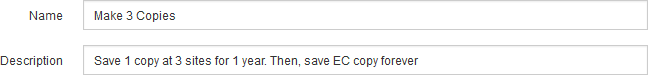

= ステップ 1/3 ：基本事項を定義します
:allow-uri-read: 
:icons: font
:imagesdir: ../media/

[role="lead"]
Create ILM Rule ウィザードのステップ 1 （ Define Basics ）では、ルールの基本フィルタと高度なフィルタを定義できます。

.このタスクについて
StorageGRID は、 ILM ルールに照らしてオブジェクトを評価する際に、オブジェクトメタデータをルールのフィルタと比較します。オブジェクトメタデータがすべてのフィルタに一致した場合、 StorageGRID はルールを使用してオブジェクトを配置します。すべてのオブジェクトに適用するルールを設計したり、 1 つ以上のテナントアカウントやバケット名などの基本的なフィルタや、オブジェクトのサイズやユーザメタデータなどの高度なフィルタを指定したりできます。

image::../media/ilm_create_ilm_rule_wizard_1.png[Create ILM Rule ウィザードのステップ 1 / 3 を実行します]

.手順
. [* 名前 *] フィールドに、ルールの一意の名前を入力します。
+
1~64 文字で指定する必要があります。

. 必要に応じて、ルールの短い概要 を * 概要 * フィールドに入力します。
+
あとから識別しやすいように、ルールの目的や機能を指定してください。

+

. 必要に応じて、このルールを適用する S3 または Swift テナントアカウントを 1 つ以上選択します。このルールですべてのテナントを環境 に設定する場合は、このフィールドを空白のままにします。
+
Root Access 権限または Tenant accounts 権限がない場合は、リストからテナントを選択できません。代わりに、テナント ID を入力するか、複数の ID をカンマで区切って入力します。

. 必要に応じて、このルールを適用する S3 バケットまたは Swift コンテナを指定します。
+
「 * matches all * 」が選択されている場合（デフォルト）、「環境 all S3 bucketes 」または「 Swift containers 」というルールが適用されます。

. 必要に応じて、 ［ * 高度なフィルタリング * ］ を選択し、追加のフィルタを指定します。
+
高度なフィルタを設定しない場合は、基本フィルタに一致するすべてのオブジェクトを環境 ルールに追加します。

+
このルールでイレイジャーコーディングコピーを作成する場合は、高度なフィルタ「 * Object Size （ MB ） * 」を追加し、「 * greater than 1 * 」に設定します。サイズフィルタを使用すると、 1MB 以下のオブジェクトはイレイジャーコーディングされません。

+

IMPORTANT: イレイジャーコーディングは 1MB を超えるオブジェクトに適しています。200KB 未満のオブジェクトにはイレイジャーコーディングを使用しないでください。イレイジャーコーディングされた非常に小さなフラグメントを管理するオーバーヘッドは発生しません。

. 「 * 次へ * 」を選択します。
+
ステップ 2 （配置を定義）が表示されます。

.関連情報
* xref:what-ilm-rule-is.adoc[ILM ルールとは]
* xref:using-advanced-filters-in-ilm-rules.adoc[ILM ルールで高度なフィルタを使用します]
* xref:step-2-of-3-define-placements.adoc[ステップ 2 / 3 ：配置を定義する]

