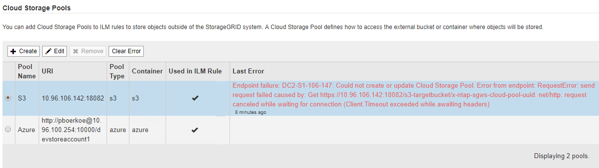
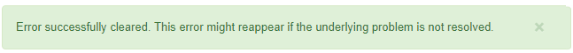

= クラウドストレージプールのトラブルシューティング
:icons: font
:imagesdir: ../media/

[role="lead"]
クラウドストレージプールの作成、編集、削除時にエラーが発生した場合は、以下のトラブルシューティング手順を使用して問題 を解決してください。

== エラーが発生したかどうかを確認します

StorageGRID では、すべてのクラウドストレージプールの健全性チェックを 1 分に 1 回実行して、クラウドストレージプールにアクセスできること、およびプールが正常に機能していることを確認します。健全性チェックで問題 が検出されると、ストレージプールページのクラウドストレージプールテーブルの前回のエラー列にメッセージが表示されます。

次の表は、各クラウドストレージプールで検出された最新のエラーと、エラーが発生してからの時間を示しています。

また、過去 5 分以内に新しいクラウドストレージプールのエラーが発生したことが健全性チェックで検出されると、 * クラウドストレージプール接続エラー * アラートがトリガーされます。このアラートに関する E メール通知を受信した場合は、ストレージプールのページ（ * ILM * > * ストレージプール * を選択）に移動し、 Last Error 列のエラーメッセージを確認して、以下のトラブルシューティングのガイドラインを参照してください。

== エラーが解決されたかどうかを確認します

エラーの原因となっている問題を解決したら、エラーが解決されたかどうかを確認できます。Cloud Storage Pool ページで、エンドポイントのオプションボタンを選択し、 * Clear Error * を選択します。StorageGRID がクラウドストレージプールのエラーをクリアしたことを示す確認メッセージが表示されます。

原因となっている問題が解決されると、エラーメッセージは表示されなくなります。ただし、根本的な問題が修正されていない場合（または別のエラーが発生した場合）は、数分以内に Last Error 列にエラーメッセージが表示されます。

== エラー：このクラウドストレージプールには予期しないコンテンツが含まれています

クラウドストレージプールを作成、編集、または削除しようとすると、このエラーが発生する場合があります。このエラーは、バケットまたはコンテナに「 x-ntap-sgws-cloud-pool-uuid 」マーカーファイルが含まれていて、想定される UUID がファイルにない場合に発生します。

通常、このエラーが表示されるのは、新しいクラウドストレージプールを作成していて、 StorageGRID の別のインスタンスがすでに同じクラウドストレージプールを使用している場合のみです。

問題 を修正するには、次の手順を実行します。

* 組織内のユーザがこのクラウドストレージプールを使用していないことを確認します。
* 「 x-ntap-sgws-cloud-pool-uuid 」ファイルを削除して、クラウドストレージプールの設定をやり直してください。

== エラー：クラウドストレージプールを作成または更新できませんでした。エンドポイントからのエラーです

クラウドストレージプールを作成または編集しようとすると、このエラーが発生する場合があります。このエラーは、何らかの接続または構成の問題 が原因で StorageGRID がクラウドストレージプールに書き込めないことを示しています。

問題 を修正するには、エンドポイントからのエラーメッセージを確認します。

* エラーメッセージに「 Get_URL_EOF: 」が含まれている場合は、クラウドストレージプールに使用されているサービスエンドポイントが、 HTTPS を必要とするコンテナまたはバケットに HTTP プロトコルを使用していないことを確認してください。
* エラーメッセージに「 Get_url_:net/http: request canceled while waiting for connection' 」が含まれている場合は、ストレージノードがクラウドストレージプールに使用されるサービスエンドポイントにアクセスできるようにネットワーク構成を設定することを確認してください。
* その他のすべてのエンドポイントエラーメッセージについては、次のいずれか、または複数の操作を試してください。
+
** クラウドストレージプール用に入力した名前と同じ名前の外部コンテナまたはバケットを作成して、新しいクラウドストレージプールを再度保存します。
** クラウドストレージプール用に指定したコンテナまたはバケット名を修正して、新しいクラウドストレージプールを再度保存します。

== エラー： CA 証明書を解析できませんでした

クラウドストレージプールを作成または編集しようとすると、このエラーが発生する場合があります。このエラーは、クラウドストレージプールの設定時に入力した証明書を StorageGRID が解析できなかった場合に発生します。

問題 を修正するには、指定した CA 証明書に問題がないかどうかを確認します。

== エラー：この ID のクラウドストレージプールが見つかりませんでした

クラウドストレージプールを編集または削除しようとすると、このエラーが発生する場合があります。このエラーは、次のいずれかの理由でエンドポイントが 404 応答を返した場合に発生します。

* クラウドストレージプールに使用されたクレデンシャルに、バケットの読み取り権限がありません。
* クラウド・ストレージ・プールに使用されるバケットには 'x-ntap-sgws -cloud-pool-uuid' マーカー・ファイルは含まれていません

問題 を修正するには、次の手順をいくつか実行します。

* 設定したアクセスキーに関連付けられているユーザに必要な権限があることを確認します。
* 必要な権限があるクレデンシャルを使用してクラウドストレージプールを編集します。
* 権限が正しい場合は、サポートにお問い合わせください。

== エラー：クラウドストレージプールの内容を確認できませんでした。エンドポイントからのエラーです

クラウドストレージプールを削除しようとすると、このエラーが発生する場合があります。このエラーは、何らかの接続または設定問題 が原因で、 StorageGRID がクラウドストレージプールバケットのコンテンツを読み取れないことを示しています。

問題 を修正するには、エンドポイントからのエラーメッセージを確認します。

== エラー： Objects have already been placed in this bucket

クラウドストレージプールを削除しようとすると、このエラーが発生する場合があります。ILM によって移動されたデータ、クラウドストレージプールの設定前にバケットに配置されていたデータ、またはクラウドストレージプールの作成後に他のソースによってバケットに配置されたデータが含まれているクラウドストレージプールは削除できません。

問題 を修正するには、次の手順をいくつか実行します。

* 「クラウドストレージプールオブジェクトのライフサイクル」の手順に従って、オブジェクトを StorageGRID に戻します。
* 残りのオブジェクトが ILM によってクラウドストレージプールに配置されていないことが確実な場合は、バケットからオブジェクトを手動で削除します。
+

NOTE: ILM によって配置された可能性のあるクラウドストレージプールからは、オブジェクトを手動で削除しないでください。手動で削除したオブジェクトにあとで StorageGRID からアクセスしようとしても、削除したオブジェクトは見つかりません。

== エラー：クラウドストレージプールにアクセスしようとして、プロキシで外部エラーが発生しました

ストレージノードとクラウドストレージプールに使用する外部の S3 エンドポイントの間に非透過型ストレージプロキシを設定した場合に、このエラーが発生する可能性があります。このエラーは、外部プロキシサーバがクラウドストレージプールのエンドポイントに到達できない場合に発生します。たとえば、 DNS サーバがホスト名を解決できない場合や、外部ネットワークの問題 が存在する場合があります。

問題 を修正するには、次の手順をいくつか実行します。

* クラウドストレージプール（ * ILM * > * ストレージプール * ）の設定を確認します。
* ストレージプロキシサーバのネットワーク設定を確認します。

xref:lifecycle-of-cloud-storage-pool-object.adoc[クラウドストレージプールオブジェクトのライフサイクル]
