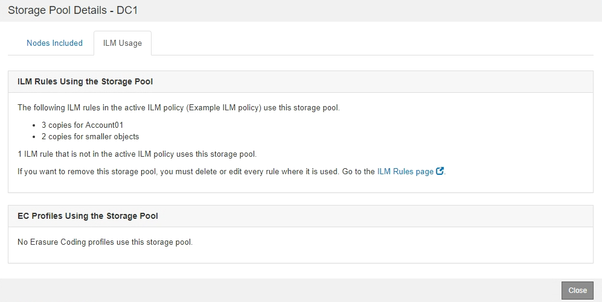

= ストレージプールの詳細を表示します
:allow-uri-read: 
:icons: font
:imagesdir: ../media/

[role="lead"]
ストレージプールの詳細を表示して、ストレージプールの使用場所を確認したり、含まれているノードやストレージグレードを確認したりできます。

.必要なもの
* を使用して Grid Manager にサインインします xref:../admin/web-browser-requirements.adoc[サポートされている Web ブラウザ]。
* 特定のアクセス権限が必要です。

.手順
. ILM * > * Storage pools * を選択します
+
Storage Pools （ストレージプール）ページが表示されます。このページには、定義済みのストレージプールがすべて表示されます。

+
image::../media/storage_pools_page_with_pools.png[Pools.png の Storage Pools ページ]

+
この表には、ストレージノードを含む各ストレージプールに関する次の情報が含まれています。

+
** * Name * ：ストレージプールの一意の表示名。
** * Used Space * ：ストレージプールにオブジェクトを格納するために現在使用されているスペースの量。
** * Free Space * ：ストレージプールにオブジェクトを格納するために使用可能な残りのスペース。
** * Total Capacity * ：ストレージプールのサイズ。ストレージプール内のすべてのノードのオブジェクトデータに使用可能なスペースの合計に相当します。
** * ILM Usage * ：ストレージプールの現在の使用状況。ストレージプールは、使用されていない場合や、 1 つ以上の ILM ルール、イレイジャーコーディングプロファイル、またはその両方で使用されている場合があります。
+

NOTE: 使用中のストレージプールは削除できません。

. 特定のストレージプールの詳細を表示するには、そのラジオボタンを選択し、「 * 詳細を表示 * 」を選択します。
+
Storage Pool Details モーダルが表示されます。

. 「 Nodes included * 」タブを表示して、ストレージプールに含まれるストレージノードまたはアーカイブノードについて確認します。
+
image::../media/storage_pools_details_nodes.png[ストレージプールの詳細ノード]

+
この表には、ノードごとに次の情報が記載されています。

+
** ノード名
** サイト名
** 使用済み（ % ）：ストレージノードの場合、オブジェクトデータに使用されている合計使用可能スペースの割合。この値にはオブジェクトメタデータは含まれません。
+

NOTE: 各ストレージノードの Storage Used - Object Data チャートにも同じ使用済み（ % ）値が表示されます（ * nodes * > * _Storage Node_* > * Storage * を選択）。

. 「 * ILM Usage * 」タブを選択して、ストレージプールが現在 ILM ルールやイレイジャーコーディングプロファイルで使用されているかどうかを確認します。
+
この例では、 DC1 ストレージプールは、アクティブな ILM ポリシーに含まれる 2 つのルールとアクティブなポリシーに含まれない 1 つのルールという 3 つの ILM ルールで使用されます。

+

+

NOTE: ILM ルールで使用されているストレージプールは削除できません。

+
この例では、 All 3 Sites ストレージプールがイレイジャーコーディングプロファイルで使用されています。そのイレイジャーコーディングプロファイルは、アクティブな ILM ポリシー内の 1 つの ILM ルールによって使用されます。

+
image::../media/storage_pools_details_ilm_ec.png[ストレージプールの詳細 ILM EC]

+

NOTE: イレイジャーコーディングプロファイルで使用されているストレージプールは削除できません。

. 必要に応じて、 * ILM Rules ページ * に移動し、ストレージプールを使用するルールの確認と管理を行います。
+
ILM ルールの操作手順を参照してください。

. ストレージプールの詳細の表示が完了したら、「 * 閉じる * 」を選択します。

xref:working-with-ilm-rules-and-ilm-policies.adoc[ILM ルールおよび ILM ポリシーの操作]
