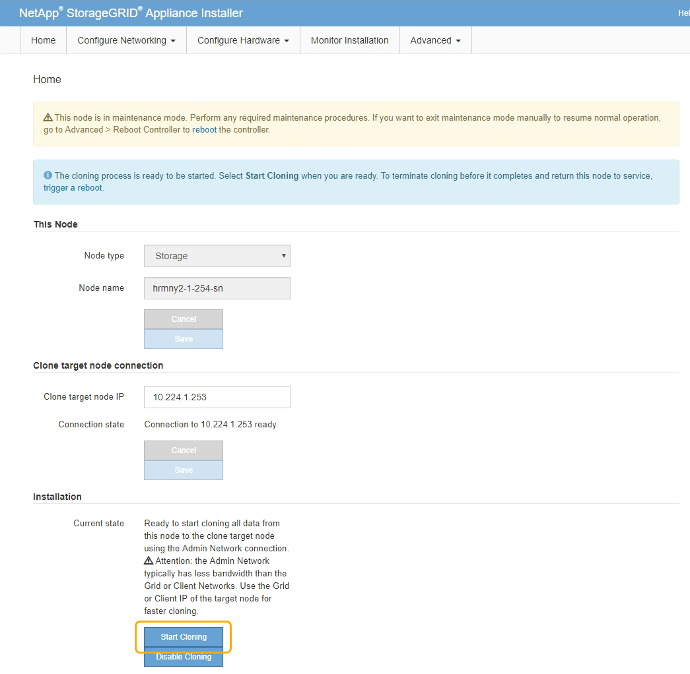

= アプライアンスノードをクローニングする
:icons: font
:imagesdir: ../media/

[role="lead"]
ソースノード（交換するアプライアンス）とターゲット（新規）アプライアンスの間でデータを転送するには、クローニングプロセスに数日かかることがあります。

.必要なもの
* 互換性のあるターゲットアプライアンスをキャビネットまたはラックに設置し、すべてのケーブルを接続し、電源を投入しておきます。
* 交換用アプライアンスの StorageGRID アプライアンスインストーラのバージョンが StorageGRID システムのソフトウェアバージョンと同じであることを確認し、必要に応じて StorageGRID アプライアンスインストーラファームウェアをアップグレードしておきます。
* StorageGRID 接続、 SANtricity System Manager （ストレージアプライアンスのみ）、 BMC インターフェイスの設定を含めて、ターゲットアプライアンスを設定しておきます。
+
** StorageGRID 接続を設定する場合は、一時的な IP アドレスを使用します。
** ネットワークリンクを設定する場合は、最終的なリンク設定を使用します。

NOTE: ターゲットアプライアンスの初期構成が完了したあとは、 StorageGRID アプライアンスインストーラを開いたままにしておきます。ノードのクローニングプロセスを開始したあとに、ターゲットアプライアンスのインストーラページに戻ります。

* ターゲットアプライアンスのノード暗号化を必要に応じて有効にしておきます。
* 必要に応じて、ターゲットアプライアンスの RAID モードを設定します（ストレージアプライアンスのみ）。
* xref:considerations-and-requirements-for-appliance-node-cloning.adoc[アプライアンスノードのクローニングに関する考慮事項と要件]
+
xref:../sg100-1000/index.adoc[SG100 および SG1000 サービスアプライアンス]

+
xref:../sg5600/index.adoc[SG5600 ストレージアプライアンス]

+
xref:../sg5700/index.adoc[SG5700 ストレージアプライアンス]

+
xref:../sg6000/index.adoc[SG6000 ストレージアプライアンス]

StorageGRID ネットワークのパフォーマンスとデータの可用性を維持するために、クローニングするアプライアンスノードは一度に 1 つだけにしてください。

.手順
. xref:placing-appliance-into-maintenance-mode.adoc[クローニングするソースノードをメンテナンスモードにします]。
. ソースノードの StorageGRID アプライアンスインストーラのホームページの ［ インストール ］ セクションで、 ［ * クローン作成を有効にする * ］ を選択します。
+
image::../media/enable_node_cloning.png[ソースノードでクローニングを有効にします]

+
Primary Admin Node connection セクションが Clone target node connection セクションに置き換えられました。

+
image::../media/clone_peer_node_connection_section.png[ターゲットノードの接続セクションをクローニングする]

. 「 * クローンターゲットノード IP * 」には、クローンデータ転送トラフィックに使用するネットワークのターゲットノードに割り当てられた一時的な IP アドレスを入力し、「 * 保存 * 」を選択します。
+
通常はグリッドネットワークの IP アドレスを入力しますが、データ転送トラフィックのクローニングに別のネットワークを使用する必要がある場合は、そのネットワークのターゲットノードの IP アドレスを入力します。

+

NOTE: 1GbE 管理ネットワークを使用したクローニングでデータ転送を行うと、クローニングに時間がかかります。

+
ターゲットアプライアンスの設定と検証が完了すると、インストールセクションのソースノードで * クローニングの開始 * が有効になります。

+

+
クローニングを妨げる問題が存在する場合は、 * クローニングの開始 * が有効になっておらず、解決が必要な問題が * 接続状態 * として表示されます。これらの問題は、ソースノードとターゲットアプライアンスの両方の StorageGRID アプライアンスインストーラのホームページに記載されています。一度に表示される問題 は 1 つだけで、条件の変化に応じて状態が自動的に更新されます。クローニングの開始 * を有効にするために、すべてのクローニングの問題を解決してください。

+
クローニングの開始 * が有効になっている場合、 * 現在の状態 * は、トラフィックのクローニングに選択された StorageGRID ネットワークと、そのネットワーク接続の使用に関する情報を示します。

+
xref:considerations-and-requirements-for-appliance-node-cloning.adoc[アプライアンスノードのクローニングに関する考慮事項と要件]

. ソースノードで * クローニングを開始 * を選択します。
. ソースノードまたはターゲットノードで StorageGRID アプライアンスインストーラを使用して、クローニングの進行状況を監視します。
+
ソースノードとターゲットノードの両方で StorageGRID アプライアンスインストーラのステータスが同じであることを確認します。

+
image::../media/cloning_progress.png[クローニングの進捗状況]

+
クローニングの監視ページでは、クローニングプロセスの各ステージについて詳細な進捗状況を確認できます。

+
** * クローンピア関係の確立 * に、クローニングのセットアップと設定の進捗状況が表示されます。
** * このノードから別のノードをクローニングする * と、データ転送の進捗状況が表示されます。（クローニング処理のこの処理は、完了までに数日かかることがあります）。
** * クローンノードをアクティブ化してこのノードをオフラインのままにする * は、データ転送が完了したあとに、ターゲットノードに制御を移行してインストール前の状態に移行する処理の進捗状況を示します。

. クローニングが完了する前にクローニングプロセスを終了してソースノードをサービスに戻す必要がある場合は、ソースノードで StorageGRID アプライアンスインストーラのホームページに移動し、 * アドバンスト * > * コントローラのリブート * を選択して、 * StorageGRID * でリブートするを選択します。
+
クローニングプロセスが終了した場合は、次の手順を実行し

+
** ソースノードがメンテナンスモードを終了し、 StorageGRID に再び参加します。
** ターゲットノードはインストール前の状態のままになります。ソースノードのクローニングを再開するには、手順 1 からクローニングプロセスを再開します。

クローニングが正常に完了した場合：

* ソースノードとターゲットノードで IP アドレスが入れ替わります。
+
** これで、ターゲットノードで、グリッドネットワーク、管理ネットワーク、クライアントネットワークのソースノードに割り当てられていた IP アドレスが使用されるようになります。
** ソースノードで、最初にターゲットノードに割り当てられた一時的な IP アドレスが使用されるようになります。

* ターゲットノードはメンテナンスモードを終了し、ソースノードに代わって StorageGRID に参加します。
* ソースアプライアンスは、以前と同様に事前にインストールされた状態になります xref:preparing-appliance-for-reinstallation-platform-replacement-only.adoc[再インストールのための準備をした]。

NOTE: アプライアンスがグリッドに再参加しない場合は、ソースノードの StorageGRID アプライアンスインストーラのホームページで * アドバンスト * > * コントローラのリブート * を選択し、 * メンテナンスモードでリブート * を選択します。ソースノードが保守モードでリブートしたら、手順 のクローニングを繰り返します。

ターゲットノードで想定外の問題 が発生した場合、ユーザデータはリカバリオプションとしてソースアプライアンスに残ります。ターゲットノードが StorageGRID に正常に再参加すると、ソースアプライアンスのユーザデータは古くなり、不要になります。必要に応じて、 StorageGRID サポートにソースアプライアンスのクリアを依頼して、このデータを削除してください。

可能です

* 追加のクローニング処理では、ソースアプライアンスをターゲットとして使用します。追加の設定は必要ありません。このアプライアンスには、最初のクローンターゲット用に指定された一時的な IP アドレスがすでに割り当てられています。
* ソースアプライアンスを新しいアプライアンスノードとして設置し、セットアップする。
* ソースアプライアンスが StorageGRID で使用されなくなった場合は、破棄します。

