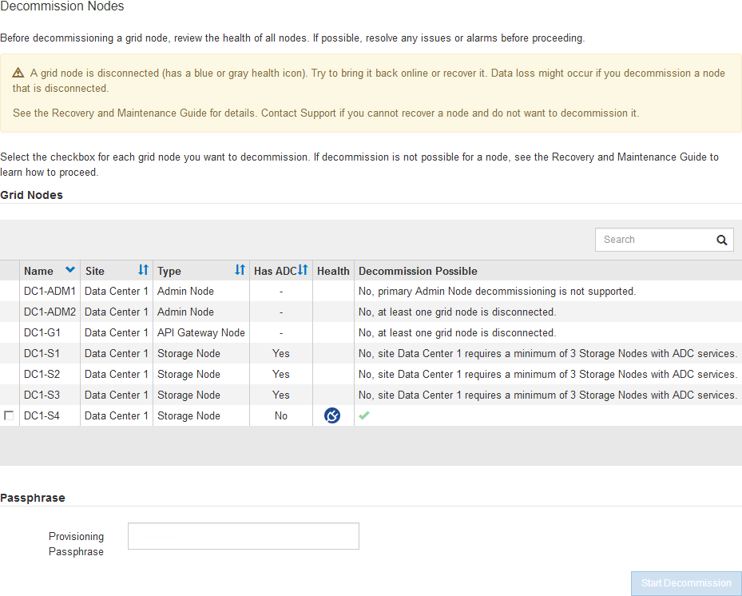

= 切断されているグリッドノードの運用を停止
:allow-uri-read: 
:icons: font
:imagesdir: ../media/

[role="lead"]
グリッドに現在接続されていないノード（「 Health 」が「 Unknown 」または「 Administratively Down 」のノード）の運用を停止することが必要になる場合があります。

.必要なもの
* 要件とを理解しておきます xref:considerations-for-decommissioning-grid-nodes.adoc[グリッドノードの運用停止に関する考慮事項]。
* 前提条件となる項目をすべて用意しておきます。
* アクティブなデータ修復ジョブがないことを確認しておきます。を参照してください xref:checking-data-repair-jobs.adoc[データ修復ジョブを確認します]。
* グリッド内でストレージノードのリカバリが実行中でないことを確認します。実行中の場合は、リカバリの一環として実行される Cassandra の再構築が完了するまで待機する必要があります。そのあとで運用停止を続行できます。
* ノード運用停止手順 が一時停止されていないかぎり、ノード手順 の運用停止中に他のメンテナンス手順が実行されないようにしておきます。
* 運用停止するノードの * 運用停止可能な * 列には、緑のチェックマークが表示されます。
* プロビジョニングパスフレーズが必要です。

.このタスクについて
切断されているノードは、「 * Health * 」列で「 Unknown 」（青）または「 Administratively Down 」（グレー）のアイコンで特定できます。この例では、 DC1-S4 という名前のストレージノードが接続解除されており、他のすべてのノードが接続されています。

切断されているノードの運用を停止する前に、次の点に注意して

* この手順 は、主に切断されている 1 つのノードを削除することを目的としています。グリッド内に切断されているノードが複数ある場合は、それらのノードをすべて同時に運用停止する必要があるため、予期しない結果になる可能性があります。
+

IMPORTANT: 切断されている複数のグリッドノードを一度に運用停止する場合は、特に複数の切断されているストレージノードを選択する場合は注意が必要です。

* 切断されているノードを削除できない場合（ ADC クォーラムに必要なストレージノードなど）は、切断されている他のノードを削除できません。

切断されている * ストレージノード * の運用を停止する前に、次の点に注意してください

* 切断されているストレージノードの運用を停止するのは、オンラインに戻したりリカバリしたりすることができないことが確実な場合だけにしてください。
+

IMPORTANT: この場合もオブジェクトデータをノードからリカバリできると考えられる場合は、この手順 を実行しないでください。代わりに、テクニカルサポートに問い合わせて、ノードのリカバリが可能かどうかを確認してください。

* 切断されている複数のストレージノードの運用を停止すると、データが失われる可能性があります。十分な数のオブジェクトコピー、イレイジャーコーディングフラグメント、またはオブジェクトメタデータが残っていると、システムがデータを再構築できない場合があります。
+

IMPORTANT: 切断されていてリカバリできない複数のストレージノードがある場合は、テクニカルサポートに問い合わせて、最適な対処方法を確認してください。

* 切断されているストレージノードの運用を停止すると、 StorageGRID は運用停止手順の終了時にデータ修復ジョブを開始します。これらのジョブは、切断されているノードに格納されていたオブジェクトデータとメタデータの再構築を試みます。
* 切断されているストレージノードの運用を停止する場合、手順 の運用停止は比較的短時間で完了します。ただし、データ修復ジョブは実行に数日から数週間かかることがあり、運用停止手順 によって監視されません。これらのジョブは手動で監視し、必要に応じて再開してください。を参照してください xref:checking-data-repair-jobs.adoc[データ修復ジョブを確認します]。
* オブジェクトの唯一のコピーを含む切断されているストレージノードの運用を停止すると、そのオブジェクトは失われます。データ修復ジョブは、現在接続されているストレージノードに、 1 つ以上のレプリケートコピーまたは十分なイレイジャーコーディングフラグメントが含まれている場合のみ、オブジェクトを再構築してリカバリできます。

切断されている * 管理ノード * または * ゲートウェイノード * の運用を停止する前に、次の点に注意してください。

* 切断されている管理ノードの運用を停止すると、そのノードの監査ログが失われますが、これらのログはプライマリ管理ノードにも存在している必要があります。
* 切断されているゲートウェイノードは安全に運用停止できます。

.手順
. 切断されているグリッドノードのオンラインへの復帰またはリカバリを試行します。
+
手順については、リカバリ手順を参照してください。

. 切断されているグリッドノードをリカバリできず、そのノードを切断状態のまま運用を停止する場合は、そのノードのチェックボックスを選択します。
+

NOTE: グリッド内に切断されているノードが複数ある場合は、それらのノードをすべて同時に運用停止する必要があるため、予期しない結果になる可能性があります。

+

IMPORTANT: 切断されている複数のグリッドノード、特に複数のストレージノードの運用を停止する場合は、特に注意が必要です。切断されていてリカバリできない複数のストレージノードがある場合は、テクニカルサポートに問い合わせて、最適な対処方法を確認してください。

. プロビジョニングパスフレーズを入力します。
+
[ * 分解を開始 * （ Start Decommission * ） ] ボタンが有効になります。

. * 分解を開始 * をクリックします。
+
切断されているノードが選択されていることと、そのノードにオブジェクトの唯一のコピーが含まれている場合はオブジェクトデータが失われることを示す警告が表示されます。

+
image::../media/decommission_warning.gif[運用停止の警告メッセージのスクリーンショット]

. ノードのリストを確認し、 * OK * をクリックします。
+
運用停止手順 が開始され、ノードごとの進行状況が表示されます。手順 の実行中に、グリッド設定の変更を含む新しいリカバリパッケージが生成されます。

+
image::../media/decommission_nodes_procedure_in_progress_disconnected.png[実行中のノードの運用停止のスクリーンショット]

. 新しいリカバリパッケージが利用可能になったら、リンクをクリックするか、 * maintenance * > * System * > * Recovery パッケージ * を選択して、リカバリパッケージのページにアクセスします。次に '.zip ファイルをダウンロードします
+
の手順を参照してください xref:downloading-recovery-package.adoc[リカバリパッケージをダウンロードしています]。

+

NOTE: 手順 の運用停止中に問題が発生した場合にグリッドをリカバリできるよう、できるだけ早くリカバリパッケージをダウンロードしてください。

+

IMPORTANT: リカバリパッケージファイルには StorageGRID システムからデータを取得するための暗号キーとパスワードが含まれているため、安全に保管する必要があります。

. 運用停止ページを定期的に監視して、選択したすべてのノードの運用が正常に停止されることを確認してください。
+
ストレージノードの運用停止には、数日から数週間かかることがあります。すべてのタスクが完了すると、成功メッセージとともにノード選択リストが再表示されます。切断されているストレージノードの運用を停止した場合は、修復ジョブが開始されたことを示す情報メッセージが表示されます。

+
image::../media/decommission_nodes_data_repair.png[修復ジョブが開始されたことを示すスクリーンショット]

. 運用停止手順 の一環としてノードが自動的にシャットダウンされたら、運用停止したノードに関連付けられている残りの仮想マシンやその他のリソースをすべて削除します。
+

IMPORTANT: この手順は、ノードが自動的にシャットダウンするまでは実行しないでください。

. ストレージノードの運用を停止する場合は、運用停止プロセス中に自動的に開始される * Replicated data * および * erasoded （ EC ） data * repair ジョブのステータスを監視します。

[role="tabbed-block"]
====
.レプリケートデータ
--
* 修理が完了しているかどうかを確認するには、次
+
.. ノードを選択 * > * _ 修復中のストレージノード _ * > * ILM * を選択します。
.. 「評価」セクションの属性を確認します。修理が完了すると、 *Awaiting - All * 属性は 0 個のオブジェクトを示します。

* 修理を詳細に監視するには、次の手順を実行します。
+
.. サポート * > * ツール * > * グリッドトポロジ * を選択します。
.. 「 * _grid_* > * _ Storage Node being repaired _ * > * LDR * > * Data Store * 」を選択します。
.. 次の属性を組み合わせて、レプリケートデータの修復が完了したかどうかを可能なかぎり判別します。
+

NOTE: Cassandra に不整合が生じている可能性があり、また、失敗した修復は追跡されません。

+
*** * Repairs Attempted （ XRPA ） * ：レプリケートデータの修復の進行状況を追跡します。この属性は、ストレージノードがハイリスクオブジェクトの修復を試みるたびに値が増分します。この属性の値が現在のスキャン期間（ * Scan Period - - Estimated * 属性で指定）よりも長い期間にわたって上昇しない場合、 ILM スキャンはすべてのノードで修復が必要なハイリスクオブジェクトを検出していません。
+

NOTE: ハイリスクオブジェクトとは、完全に失われる危険があるオブジェクトです。ILM 設定を満たしていないオブジェクトは含まれません。

*** * スキャン期間 - 推定（ XSCM ） * ：この属性を使用して、以前に取り込まれたオブジェクトにポリシー変更が適用されるタイミングを見積もります。「 * Repairs Attempted * 」属性が現在のスキャン期間よりも長くなっていない場合は、複製修復が実行されている可能性があります。スキャン期間は変わる可能性があるので注意してください。* Scan Period - - Estimated （ XSCM ） * 属性は、グリッド全体の環境 を示します。これは、すべてのノードのスキャン期間の最大値です。グリッドの * Scan Period - - Estimated * 属性履歴を照会して、適切な期間を判断できます。

* オプションで、レプリケートされた修復の完了率を推定するには、 repair-data コマンドに「 showReplicated-repair-status 」オプションを追加します。
+
「 repair-data show-replicated-repair-status 」

+

IMPORTANT: StorageGRID 11.6 では、「 show -replicated-repair-status 」オプションをテクニカルプレビューで利用できます。この機能は開発中であり、返される値が正しくないか遅れている可能性があります。修理が完了したかどうかを確認するには、 * Awaiting – All * 、 * Repairs Attempted （ XRPA ） * 、 * Scan Period - Estimated （ XSCM ） * （ * スキャン期間 - 推定（ XSCM ）））を使用します（を参照） xref:..//maintain/restoring-object-data-to-storage-volume-where-system-drive-is-intact.adoc[修理を監視する]。

--
.イレイジャーコーディング（ EC ）データ
--
イレイジャーコーディングデータの修復を監視し、失敗した可能性のある要求を再試行するには、次の手順を実行します。

. イレイジャーコーディングデータの修復ステータスを確認します。
+
** サポート * > * Tools * > * Metrics * を選択して、現在のジョブの完了までの推定時間と完了率を表示します。次に、 Grafana のセクションで * EC Overview * を選択します。グリッド EC ジョブの完了予想時間 * ダッシュボードと * グリッド EC ジョブの完了率 * ダッシュボードを確認します。
** 特定の「 repair-data 」処理のステータスを表示するには、次のコマンドを使用します。
+
「 repair-data show-ec-repair-status -- repair-id repair ID` 」

** すべての修復処理を表示するには、次のコマンドを使用します
+
「 repair-data show-ec-repair-status 」です

+
出力には ' 修復 ID' を含む ' 以前に実行中のすべての修復に関する情報が表示されます

. 出力に修復操作が失敗したことが示された場合は、「 --repair-id 」オプションを使用して修復を再試行します。
+
このコマンドは、修復 ID 6949309319275667690 を使用して、障害が発生したノードの修復を再試行します。

+
「 repair-data start-ec-node-repair -- repair-id 6949309319275667690 」

+
このコマンドは、修復 ID 6949309319275667690 を使用して、障害が発生したボリュームの修復を再試行します。

+
「 repair-data start-ec-volume-repair -- repair-id 6949309319275667690` 」

--
====
.完了後
切断されているノードが運用停止され、すべてのデータ修復ジョブが完了したら、必要に応じて、接続されているグリッドノードの運用を停止できます。

その後、手順 の運用停止が完了したら、次の手順を実行します。

* 運用停止したグリッドノードのドライブを確実に消去します。市販のデータ消去ツールまたはデータ消去サービスを使用して、ドライブからデータを完全かつ安全に削除します。
* アプライアンスノードの運用を停止し、ノード暗号化を使用してアプライアンスのデータが保護されていた場合は、 StorageGRID アプライアンスインストーラを使用してキー管理サーバ設定（ Clear KMS ）をクリアします。アプライアンスを別のグリッドに追加する場合は、 KMS の設定をクリアする必要があります。
+
** xref:../sg100-1000/index.adoc[SG100 および SG1000 サービスアプライアンス]
** xref:../sg5600/index.adoc[SG5600 ストレージアプライアンス]
** xref:../sg5700/index.adoc[SG5700 ストレージアプライアンス]
** xref:../sg6000/index.adoc[SG6000 ストレージアプライアンス]

.関連情報
xref:grid-node-recovery-procedures.adoc[グリッドノードのリカバリ手順]
