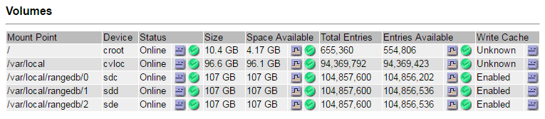

= 障害ストレージボリュームを特定してアンマウントします
:icons: font
:imagesdir: ../media/

[role="lead"]
ストレージボリュームに障害が発生したストレージノードをリカバリする場合は、障害ボリュームを特定し、アンマウントする必要があります。障害ストレージボリュームのみがリカバリ手順 で再フォーマットされることを確認する必要があります。

を使用して Grid Manager にサインインする必要があります xref:../admin/web-browser-requirements.adoc[サポートされている Web ブラウザ]。

障害が発生したストレージボリュームはできるだけ早くリカバリする必要があります。

まず最初に、接続解除されたボリューム、アンマウントが必要なボリューム、または I/O エラーが発生しているボリュームを検出します。障害ボリュームがランダムに破損したファイルシステムを含んでいる状態で接続されている場合は、ディスクの未使用部分または未割り当て部分の破損をシステムが検出できないことがあります。

NOTE: ディスクの追加や再接続、ノードの停止、ノードの開始、リブートなど、ボリュームをリカバリするための手動手順を実行する前に、この手順 を完了しておく必要があります。そうしないと 'reformat_storage_block_devices.rb スクリプトを実行したときに ' ファイルシステムエラーが発生してスクリプトがハングしたり失敗したりする場合があります

NOTE: 再起動コマンドを実行する前に ' ハードウェアを修復し ' ディスクを適切に接続します

CAUTION: 障害ストレージボリュームは慎重に特定してください。この情報を使用して、再フォーマットが必要なボリュームを確認します。ボリュームを再フォーマットすると、そのボリュームのデータはリカバリできません。

障害ストレージボリュームを正しくリカバリするには、障害ストレージボリュームのデバイス名とそのボリューム ID の両方を把握しておく必要があります。

インストール時に、各ストレージデバイスにはファイルシステムの Universal Unique Identifier （ UUID ）が割り当てられ、その UUID を使用してストレージノードの rangedb ディレクトリにマウントされます。ファイル・システムの UUID と rangedb ・ディレクトリは '/etc/fstab ファイルにリストされていますデバイス名、 rangedb ディレクトリ、およびマウントされたボリュームのサイズは、 Grid Manager に表示されます。

以下の例では、デバイス「 /dev/sdc 」のボリュームサイズは 4 TB で、デバイス名「 /dev/disk/by-uuuuuue/822b0547-3b2b-472e-ad5e-e1cf1809faba 」を /etc/fstab ファイルの「 /etc/fstab 」に使用して「 /var/local/rangedb/0 」にマウントされています。

image::../media/mounting_storage_devices.gif[ボリュームサイズのサンプル]

.手順
. 次の手順を実行して、障害ストレージボリュームとそのデバイス名を記録します。
+
.. サポート * > * ツール * > * グリッドトポロジ * を選択します。
.. サイト * > * 障害ストレージノード * > * LDR * > * Storage * > * Overview * > * Main * を選択し、アラームのあるオブジェクトストアを検索します。
+
image::../media/ldr_storage_object_stores.gif[オブジェクトストアセクション]

.. サイト * > * failed Storage Node * > * SSM * > * Resources * > * Overview * > * Main * を選択します。前の手順で特定した各障害ストレージボリュームのマウントポイントとボリュームサイズを確認します。
+
オブジェクトストアには、 16 進表記の番号が付けられています。たとえば、 0000 は最初のボリューム、 000F は 16 番目のボリュームです。この例では、 ID が 0000 のオブジェクトストアは、デバイス名が sdc でサイズが 107GB の「 /var/local/rangedb/0 」に対応しています。

+

. 障害が発生したストレージノードにログインします。
+
.. 次のコマンドを入力します。 ssh admin@_grid_node_name
.. 「 passwords.txt 」ファイルに記載されたパスワードを入力します。
.. root に切り替えるには、次のコマンドを入力します
.. 「 passwords.txt 」ファイルに記載されたパスワードを入力します。

+
root としてログインすると、プロンプトは「 $` 」から「 #」 に変わります。

. 次のスクリプトを実行してストレージサービスを停止し、障害ストレージボリュームをアンマウントします。
+
sn-unmount -volume object_store_id' のように表示されます

+
「 object_store_Id 」は、障害が発生したストレージ・ボリュームの ID です。たとえば、 ID が 0000 のオブジェクトストアのコマンドで「 0 」を指定します。

. プロンプトが表示されたら、 * y * を押してストレージノード上のストレージサービスを停止します。
+

NOTE: ストレージサービスがすでに停止している場合は、プロンプトは表示されません。Cassandra サービスは、ボリューム 0 に対してのみ停止します。

+
image::../media/unmount_failed_storage_volume.png[障害ストレージボリュームをアンマウントします]

+
数秒後にストレージサービスが停止し、ボリュームがアンマウントされます。プロセスの各ステップを示すメッセージが表示されます。最後のメッセージは、ボリュームがアンマウントされたことを示しています。

