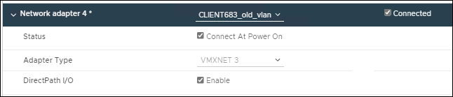

= VMware ：ノードにトランクインターフェイスまたはアクセスインターフェイスを追加します
:allow-uri-read: 
:experimental: 
:icons: font
:imagesdir: ../media/

[role="lead"]
ノードのインストールが完了したら、 VM ノードにトランクインターフェイスまたはアクセスインターフェイスを追加できます。追加したインターフェイスは、 VLAN インターフェイスのページと HA グループのページに表示されます。

.必要なもの
* VMware プラットフォームへの StorageGRID のインストール手順を参照できるようにしておきます。

xref:../vmware/index.adoc[VMware をインストールする]

* StorageGRID 11.6 を設定しておきます。
* 管理ノードとゲートウェイノードの VMware 仮想マシンが必要です。
* グリッドネットワーク、管理ネットワーク、またはクライアントネットワークとして使用されていないネットワークサブネットがある。
* 「 passwords.txt 」ファイルがあります。
* 特定のアクセス権限が必要です。

IMPORTANT: ソフトウェアのアップグレード、リカバリ手順 、または拡張手順 がアクティブな間は、ノードにインターフェイスを追加しないでください。

ノードのインストール後に VMware ノードに 1 つ以上のインターフェイスを追加するには、次の手順を実行します。たとえば、管理ノードまたはゲートウェイノードにトランクインターフェイスを追加して、 VLAN インターフェイスを使用して複数のアプリケーションまたはテナントに属するトラフィックを分離できます。ハイアベイラビリティ（ HA ）グループで使用するアクセスインターフェイスを追加することもできます。

トランクインターフェイスを追加する場合は、 StorageGRID で VLAN インターフェイスを設定する必要があります。アクセスインターフェイスを追加する場合は、 HA グループに直接追加できます。 VLAN インターフェイスを設定する必要はありません。

インターフェイスを追加するときに、ノードを一時的に使用できなくなることがあります。

.手順
. vCenter で、新しいネットワークアダプタ（ VMXNET3 タイプ）を管理ノードとゲートウェイノード VM に追加します。[ 電源オン時に接続 * （ Connected * ） ] および [ 接続 * （ Connect at Power On * ） ] チェックボックスをオンに
+

. SSH を使用して管理ノードまたはゲートウェイノードにログインします。
. 新しいネットワーク・インターフェイス ens256 が検出されたことを確認するには 'ip link show' を使用します

[listing]
----
ip link show
1: lo: <LOOPBACK,UP,LOWER_UP> mtu 65536 qdisc noqueue state UNKNOWN mode DEFAULT group default qlen 1000
    link/loopback 00:00:00:00:00:00 brd 00:00:00:00:00:00
2: eth0: <BROADCAST,MULTICAST,UP,LOWER_UP> mtu 1400 qdisc mq state UP mode DEFAULT group default qlen 1000
    link/ether 00:50:56:a0:4e:5b brd ff:ff:ff:ff:ff:ff
3: eth1: <BROADCAST,MULTICAST> mtu 1500 qdisc noop state DOWN mode DEFAULT group default qlen 1000
    link/ether 00:50:56:a0:fa:ce brd ff:ff:ff:ff:ff:ff
4: eth2: <BROADCAST,MULTICAST,UP,LOWER_UP> mtu 1400 qdisc mq state UP mode DEFAULT group default qlen 1000
    link/ether 00:50:56:a0:d6:87 brd ff:ff:ff:ff:ff:ff
5: ens256: <BROADCAST,MULTICAST,UP,LOWER_UP> mtu 1500 qdisc mq master ens256vrf state UP mode DEFAULT group default qlen 1000
    link/ether 00:50:56:a0:ea:88 brd ff:ff:ff:ff:ff:ff
----
.完了後
* トランクインターフェイスを追加した場合は、に進みます xref:../admin/configure-vlan-interfaces.html[VLAN インターフェイスを設定します] 新しい親インターフェイスごとに 1 つ以上の VLAN インターフェイスを設定します。
* アクセスインターフェイスを追加した場合は、に進みます xref:../admin/configure-high-availability-group.html[ハイアベイラビリティグループを設定する] 新しいインターフェイスを HA グループに直接追加する場合。

