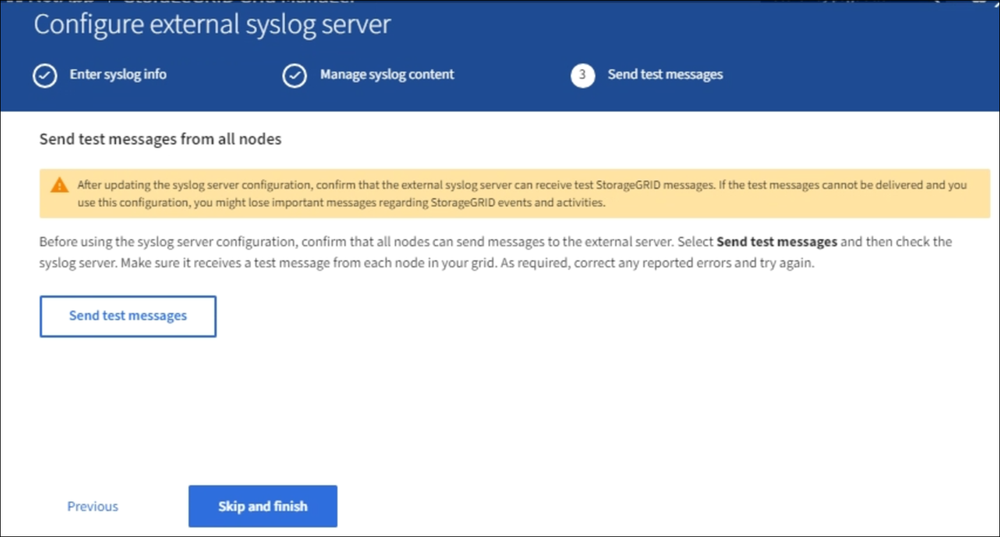

= 外部 syslog サーバを設定します
:icons: font
:imagesdir: ../media/

[role="lead"]
監査ログ、アプリケーションログ、およびセキュリティイベントログをグリッド以外の場所に保存する場合は、この手順 を使用して外部 syslog サーバを設定します。

.必要なもの
* を使用して Grid Manager にサインインします xref:../admin/web-browser-requirements.adoc[サポートされている Web ブラウザ]。
* Maintenance または Root アクセス権限が必要です。
* ログファイルを受信して保存する容量を持つ syslog サーバを用意しておきます。詳細については、を参照してください xref:../monitor/considerations-for-external-syslog-server.adoc[外部 syslog サーバに関する考慮事項]。
* TLS または RELP/TLS を使用する場合は、適切なサーバおよびクライアントの認定資格を取得している必要があります。

外部の syslog サーバに監査情報を送信する場合は、先に外部サーバを設定する必要があります。

外部 syslog サーバに監査情報を送信すると、次のことが可能になります。

* 監査メッセージ、アプリケーションログ、セキュリティイベントなどの監査情報をより効率的に収集および管理できます
* 管理ノードを経由することなくさまざまなストレージノードから外部 syslog サーバに監査情報が直接転送されるため、管理ノードのネットワークトラフィックが軽減されます
+

CAUTION: 外部 syslog サーバにログを送信する場合、外部 syslog サーバの実装で共通の制限に準拠するために、メッセージの末尾に 8192 バイトを超える単一のログが切り捨てられます。

+

NOTE: 外部 syslog サーバに障害が発生した場合にデータを完全にリカバリできるようにするために、各ノードに最大 20GB の監査レコード（ localaudit.log ）が保持されます。

+

NOTE: この手順 で使用可能な設定オプションが要件を満たすだけの柔軟性を備えていない場合は、プライベート API の「監査先」エンドポイントを使用して追加の設定オプションを適用できます。たとえば、ノードのグループごとに異なる syslog サーバを使用できます。

== syslog サーバ設定ウィザードにアクセスします

.手順
. * configuration * > * Monitoring * > * Audit and syslog server * を選択します。
+
image::../media/audit-messages-main-page.png[監査メッセージのメインページ]

. 監査および syslog サーバページで、 * 外部 syslog サーバの設定 * を選択します。以前に外部 syslog サーバを設定している場合は、 * 外部 syslog サーバの編集 * を選択します。

=== syslog 情報を入力します

image::../media/enter-syslog-info.png[syslog 情報を入力します]

. 有効な完全修飾ドメイン名、または外部 syslog サーバの IPv4 アドレスまたは IPv6 アドレスを * Host * フィールドに入力します。
. 外部 syslog サーバのデスティネーションポートを入力します（ 1~65535 の整数で指定する必要があります）。デフォルトポートは 514 です。
. 外部 syslog サーバへの監査情報の送信に使用するプロトコルを選択します。
+
TLS または RELP/TLS を推奨します。これらのいずれかのオプションを使用するには、サーバ証明書をアップロードする必要があります。

+
証明書を使用して、グリッドと外部 syslog サーバの間の接続を保護できます。詳細については、を参照してください xref:../admin/using-storagegrid-security-certificates.adoc[StorageGRID セキュリティ証明書を使用する]。

+
すべてのプロトコルオプションで、外部 syslog サーバによるサポートおよび設定が必要です。外部 syslog サーバと互換性のあるオプションを選択する必要があります。

+

NOTE: Reliable Event Logging Protocol (RELP) は、 syslog プロトコルの機能を拡張し、信頼性の高いイベントメッセージ配信を実現します。RELP を使用すると、外部 syslog サーバを再起動する必要がある場合に監査情報が失われないようにすることができます。

. 「 * Continue * 」を選択します。
. [[attach-certificate] ]TLS * または * RELP/TLS * を選択した場合は、次の証明書をアップロードします。
+
** * Server CA certificates* ：外部 syslog サーバを検証するための信頼された CA 証明書（ PEM エンコーディング）。省略すると、デフォルトの Grid CA 証明書が使用されます。ここでアップロードするファイルは CA バンドルである可能性があります。
** * クライアント証明書 * ：外部 syslog サーバへの認証用のクライアント証明書（ PEM エンコード）。
** * クライアント秘密鍵 * ：クライアント証明書の秘密鍵（ PEM エンコーディング）。
+

NOTE: クライアント証明書を使用する場合は、クライアント秘密鍵も使用する必要があります。暗号化された秘密鍵を指定する場合は、パスフレーズも指定する必要があります。暗号化された秘密鍵を使用した場合、セキュリティ上の大きなメリットはありません。これは、鍵とパスフレーズを格納する必要があるためです。暗号化されていない秘密鍵を使用することを推奨します（使用可能な場合）。

+
... 使用する証明書またはキーの [* 参照 ] を選択します。
... 証明書ファイルまたはキーファイルを選択します。
... ファイルをアップロードするには、 * 開く * を選択します。

+
証明書またはキーファイル名の横に緑のチェックマークが表示され、正常にアップロードされたことを通知します。

. 「 * Continue * 」を選択します。

=== syslog の内容を管理します

image::../media/manage-syslog-content.png[syslog の内容を管理します]

. 外部 syslog サーバに送信する監査情報のタイプをそれぞれ選択します。
+
** * 監査ログの送信 *: StorageGRID イベントおよびシステムアクティビティ
** * セキュリティイベントを送信 *: 権限のないユーザーがサインインしようとしたときや、ユーザーが root としてサインインしたときなどのセキュリティイベント
** * アプリケーションログの送信 *: 次のようなトラブルシューティングに役立つログファイル
+
*** bycast-err.log
*** bycast.log
*** jaeger.log
*** nms.log （管理ノードのみ）
*** prometheus.log
*** raft.log
*** hagroups.log

. ドロップダウンメニューを使用して、送信する監査情報のカテゴリの重大度とファシリティ（メッセージのタイプ）を選択します。
+
重大度とファシリティに *Passthrough * を選択すると、リモート syslog サーバに送信される情報の重大度とファシリティは、ノードにローカルにログインしたときと同じになります。ファシリティと重大度を設定すると、カスタマイズ可能な方法でログを集約し、分析を容易にすることができます。

+

NOTE: StorageGRID ソフトウェアログの詳細については、を参照してください xref:../monitor/storagegrid-software-logs.adoc#[StorageGRID ソフトウェアのログ]。

+
.. 各メッセージを外部 syslog に送信する際に、ローカル syslog の場合と同じ重大度値を使用する場合は、 [*Severity] に [*Passthrough*] を選択します。
+
監査ログの場合、 * Passthrough * を選択すると、重大度は「 info 」になります。

+
セキュリティ・イベントの場合、 *Passthrough* を選択すると、ノード上の Linux ディストリビューションによって重大度の値が生成されます。

+
アプリケーション・ログの場合、 *Passthrough * を選択すると、問題 の内容によって、重大度は「 info 」と「 notice 」の間で異なります。たとえば、 NTP サーバを追加して HA グループを設定すると、 SSM サービスまたは RSM サービスを意図的に停止しているときに「 notice 」という値が表示されます。

.. パススルー値を使用しない場合は、重大度の値を 0 ～ 7 の範囲で選択します。
+
選択した値は、このタイプのすべてのメッセージに適用されます。重大度を固定の値で上書きすることを選択すると、それぞれの情報が失われます。

+
[cols="1a,3a"]
|===
| 重大度 | 説明 

 a| 
0
 a| 
EMERGENCY ：システムが使用できない

 a| 
1.
 a| 
ALERT ：早急に対処が必要です

 a| 
2.
 a| 
Critical ：クリティカルな状態です

 a| 
3.
 a| 
Error ：エラー状態

 a| 
4.
 a| 
Warning ：警告状態です

 a| 
5.
 a| 
通知：通常の状態だが重要な状態

 a| 
6.
 a| 
INFORMATIONAL ：情報メッセージです

 a| 
7.
 a| 
DEBUG ：デバッグレベルのメッセージ

|===
.. * Facility * の場合、各メッセージを外部 syslog に送信する際に、ローカル syslog の場合と同じファシリティ値を使用するには、 *Passthrough* を選択します。
+
監査ログの場合、 * Passthrough * を選択すると、外部 syslog サーバに送信されるファシリティは「 local7 」になります。

+
セキュリティ・イベントの場合は、 *Passthrough * を選択すると、ノード上の Linux ディストリビューションによってファシリティ値が生成されます。

+
アプリケーション・ログの場合、 *Passthrough * を選択すると、外部 syslog サーバに送信されるアプリケーション・ログには、次のファシリティ値が設定されます。

+
[cols="1a,2a"]
|===
| アプリケーションログ | パススルー値 

 a| 
bycast.log
 a| 
ユーザまたはデーモン

 a| 
bycast-err.log
 a| 
user 、 daemon 、 local3 、または local4

 a| 
jaeger.log
 a| 
local2

 a| 
nms.log
 a| 
ローカル 3

 a| 
prometheus.log
 a| 
「 LOCAL4 」

 a| 
raft.log
 a| 
local5

 a| 
hagroups.log
 a| 
local6

|===
.. パススルー値を使用しない場合は、 0~23 のファシリティ値を選択します。
+
選択した値は、このタイプのすべてのメッセージに適用されます。施設を固定値でオーバーライドすることを選択すると、さまざまな施設に関する情報が失われます。

+
[cols="1a,3a"]
|===
| ファシリティ | 説明 

 a| 
0
 a| 
kern （カーネルメッセージ）

 a| 
1.
 a| 
ユーザ（ユーザレベルのメッセージ）

 a| 
2.
 a| 
メール

 a| 
3.
 a| 
デーモン（システムデーモン）

 a| 
4.
 a| 
AUTH （セキュリティ / 認証メッセージ）

 a| 
5.
 a| 
syslog （ syslogd で内部的に生成されるメッセージ）

 a| 
6.
 a| 
LPR （ラインプリンタサブシステム）

 a| 
7.
 a| 
News （ネットワークニュースサブシステム）

 a| 
8.
 a| 
UUCP

 a| 
9.
 a| 
cron クロックデーモン

 a| 
10.
 a| 
セキュリティ（セキュリティ / 認可メッセージ）

 a| 
11.
 a| 
FTP

 a| 
12.
 a| 
NTP

 a| 
13
 a| 
logaudit （ログ監査）

 a| 
14
 a| 
logalert （ログアラート）

 a| 
15
 a| 
clock （ clock デーモン）

 a| 
16
 a| 
local0

 a| 
17
 a| 
local1

 a| 
18
 a| 
local2

 a| 
19
 a| 
ローカル 3

 a| 
20
 a| 
「 LOCAL4 」

 a| 
21
 a| 
local5

 a| 
22
 a| 
local6

 a| 
23
 a| 
local7

|===

. 「 * Continue * 」を選択します。

=== テストメッセージを送信します

外部 syslog サーバの使用を開始する前に、グリッド内のすべてのノードが外部 syslog サーバにテストメッセージを送信するように要求する必要があります。外部 syslog サーバへのデータ送信にコミットする前に、これらのテストメッセージを使用してログ収集インフラ全体を検証する必要があります。

CAUTION: 外部 syslog サーバの設定は、グリッド内の各ノードから外部 syslog サーバがテストメッセージを受信し、メッセージが想定どおりに処理されたことを確認するまで使用しないでください。

. テストメッセージを送信しない場合で、外部 syslog サーバが正しく設定されており、グリッド内のすべてのノードから監査情報を受信できることが確実である場合は、「 * Skip and Finish * 」を選択します。
+
設定が正常に保存されたことを示す緑のバナーが表示されます。

. それ以外の場合は、 [ テストメッセージを送信する *] を選択します。
+
テスト結果は、テストを停止するまでページに継続的に表示されます。テストの実行中も、以前に設定した送信先に監査メッセージが引き続き送信されます。

. エラーが発生した場合は、修正して、もう一度 [ テストメッセージを送信する *] を選択します。を参照してください xref:../monitor/troubleshooting-syslog-server.adoc[外部 syslog サーバのトラブルシューティング] エラーの解決に役立ちます。

. すべてのノードがテストに合格したことを示す緑のバナーが表示されるまで待ちます。
. syslog サーバを調べて、テストメッセージが正常に受信および処理されているかどうかを確認します。
+

IMPORTANT: UDP を使用している場合は、ログ収集インフラストラクチャ全体を確認します。UDP プロトコルでは、他のプロトコルと同様に厳しいエラー検出はできません。

. 「 * ストップ & フィニッシュ * 」を選択します。
+
監査および syslog サーバ * ページに戻ります。syslog サーバの設定が正常に保存されたことを示す緑のバナーが表示されます。

+

NOTE: 外部 syslog サーバを含む送信先を選択するまで、 StorageGRID 監査情報は外部 syslog サーバに送信されません。

== 監査情報の送信先を選択します

セキュリティイベントログ、アプリケーションログ、および監査メッセージログの送信先を指定できます。

NOTE: StorageGRID ソフトウェアログの詳細については、を参照してください xref:../monitor/storagegrid-software-logs.adoc#[StorageGRID ソフトウェアのログ]。

. Audit and syslog server ページで、表示されたオプションから監査情報の宛先を選択します。
+
[cols="1a,2a"]
|===
| オプション | 説明 

 a| 
デフォルト（管理ノード / ローカルノード）
 a| 
監査メッセージは管理ノードの監査ログ（「 audit.log 」）に送信され、セキュリティイベントログとアプリケーションログは生成されたノード（「ローカルノード」とも呼ばれる）に格納されます。

 a| 
外部 syslog サーバ
 a| 
監査情報が外部 syslog サーバに送信され、ローカルノードに保存されます。送信される情報の種類は、外部 syslog サーバの設定方法によって異なります。このオプションは、外部 syslog サーバを設定した場合にのみ有効になります。

 a| 
管理ノードと外部 syslog サーバ
 a| 
監査メッセージは管理ノードの監査ログ（「 audit.log 」）に送信され、監査情報は外部 syslog サーバに送信されてローカルノードに保存されます。送信される情報の種類は、外部 syslog サーバの設定方法によって異なります。このオプションは、外部 syslog サーバを設定した場合にのみ有効になります。

 a| 
ローカルノードのみ
 a| 
管理ノードまたはリモート syslog サーバには監査情報は送信されません。監査情報は、生成したノードにのみ保存されます。

* 注： StorageGRID は、定期的にこれらのローカルログをローテーションから削除して、スペースを解放します。ノードのログファイルが 1GB に達すると、既存のファイルが保存され、新しいログファイルが開始されます。ログのローテーションの上限は 21 ファイルです。ログファイルの 22 番目のバージョンが作成されると、最も古いログファイルが削除されます。各ノードには平均約 20GB のログデータが格納されます。

|===

NOTE: すべてのローカル・ノードで生成された監査情報は '/var/local/log/localaudit.log に保存されます

. [ 保存（ Save ） ] を選択します。次に、 [OK] を選択して、ログの保存先への変更を確定します。
. 監査情報のデスティネーションとして外部 syslog サーバ * または * 管理ノードと外部 syslog サーバ * のどちらかを選択した場合は、追加の警告が表示されます。警告テキストを確認します。

IMPORTANT: 外部 syslog サーバがテスト用の StorageGRID メッセージを受信できることを確認する必要があります。

. 「 * OK 」を選択して、監査情報の送信先を変更することを確認します。
+
監査設定が正常に保存されたことを示す緑のバナーが表示されます。

+
選択した送信先に新しいログが送信されます。既存のログは現在の場所に残ります。

xref:../audit/index.adoc[監査メッセージの概要]

xref:../monitor/configure-audit-messages.adoc[監査メッセージとログの送信先を設定します]

xref:../audit/system-audit-messages.adoc[システム監査メッセージ]

xref:../audit/object-storage-audit-messages.adoc[オブジェクトストレージ監査メッセージ]

xref:../audit/management-audit-message.adoc[管理監査メッセージ]

xref:../audit/client-read-audit-messages.adoc[クライアント読み取り監査メッセージ]

xref:../admin/index.adoc[StorageGRID の管理]
