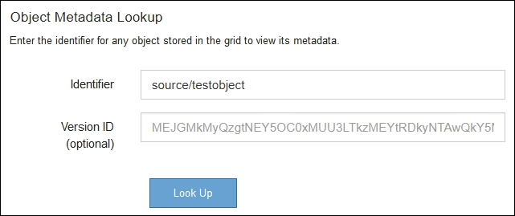

= オブジェクトデータの場所を確認する
:allow-uri-read: 
:icons: font
:imagesdir: ../media/

[role="lead"]
問題の内容によっては、オブジェクトデータの格納場所の確認が必要になることがあります。たとえば、 ILM ポリシーが想定どおりに機能し、オブジェクトデータが意図した場所に格納されていることを確認できます。

.必要なもの
* 次のいずれかのオブジェクト ID が必要です。
+
** *UUID* ：オブジェクトの Universally Unique Identifier です。UUID はすべて大文字で入力します。
** * CBID * ： StorageGRID 内のオブジェクトの一意の識別子。監査ログからオブジェクトの CBID を取得できます。CBID はすべて大文字で入力します。
** * S3 のバケットとオブジェクトキー * ：オブジェクトが S3 インターフェイスから取り込まれた場合、クライアントアプリケーションはバケットとオブジェクトキーの組み合わせを使用してオブジェクトを格納および識別します。
** * Swift のコンテナとオブジェクト名 * ：オブジェクトが Swift インターフェイスから取り込まれた場合、クライアントアプリケーションはコンテナとオブジェクト名の組み合わせを使用してオブジェクトを格納および識別します。

.手順
. ILM * > * Object metadata lookup * を選択します。
. [ * 識別子 * （ * Identifier * ） ] フィールドにオブジェクトの識別子を入力します。
+
UUID 、 CBID 、 S3 バケット / オブジェクトキー、または Swift コンテナ / オブジェクト名を入力できます。

. オブジェクトの特定のバージョンを検索する場合は、バージョン ID を入力します（オプション）。
+

. 「 * 検索 * 」を選択します。
+
オブジェクトメタデータの検索結果が表示されます。このページには、次の種類の情報が表示されます。

+
** システムメタデータ（オブジェクト ID （ UUID ）、バージョン ID （オプション）、オブジェクト名、コンテナの名前、テナントアカウントの名前または ID 、オブジェクトの論理サイズ、オブジェクトの作成日時、オブジェクトの最終変更日時など）。
** オブジェクトに関連付けられているカスタムユーザメタデータのキーと値のペア。
** S3 オブジェクトの場合、オブジェクトに関連付けられているオブジェクトタグのキーと値のペア。
** レプリケートオブジェクトコピーの場合、各コピーの現在の格納場所。
** イレイジャーコーディングオブジェクトコピーの場合、各フラグメントの現在の格納場所。
** クラウドストレージプール内のオブジェクトコピーの場合、外部バケットの名前とオブジェクトの一意の識別子を含むオブジェクトの場所。
** セグメント化されたオブジェクトとマルチパートオブジェクトの場合、セグメント ID とデータサイズを含むオブジェクトセグメントのリスト。100 個を超えるセグメントを持つオブジェクトの場合は、最初の 100 個のセグメントだけが表示されます。
** 未処理の内部ストレージ形式のすべてのオブジェクトメタデータ。この未加工のメタデータには、リリース間で維持されるとはかぎらない内部のシステムメタデータが含まれます。
+
次の例では、 2 つのレプリケートコピーとして格納された S3 テストオブジェクトのオブジェクトメタデータの検索結果が表示されています。

+
image::../media/object_lookup_results.png[オブジェクトの検索結果]

xref:../ilm/index.adoc[ILM を使用してオブジェクトを管理する]

xref:../s3/index.adoc[S3 を使用する]

xref:../swift/index.adoc[Swift を使用します]
