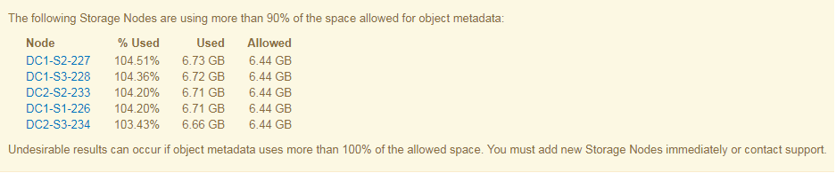

= メタデータに関する問題のトラブルシューティング
:allow-uri-read: 
:experimental: 
:icons: font
:imagesdir: ../media/

[role="lead"]
メタデータに関する問題の原因を特定するのに役立ついくつかのタスクを実行できます。

== Low metadata storage アラートをトラブルシューティングします

Low metadata storage * アラートがトリガーされた場合は、新しいストレージノードを追加する必要があります。

.必要なもの
* を使用して Grid Manager にサインインする必要があります xref:../admin/web-browser-requirements.adoc[サポートされている Web ブラウザ]。

StorageGRID は、各ストレージノードのボリューム 0 上にオブジェクトメタデータ用に一定量のスペースをリザーブします。このスペースは、実際のリザーブスペースと呼ばれ、オブジェクトメタデータに使用できるスペース（許容されるメタデータスペース）と、コンパクションや修復などの重要なデータベース処理に必要なスペースに分割されます。許可されるメタデータスペースは、オブジェクトの全体的な容量を決定します。

image::../media/metadata_allowed_space_volume_0.png[Metadata Allowed Space ：ボリューム 0]

オブジェクトメタデータがメタデータに使用できるスペースの使用量の 100% を超えると、データベース処理を効率的に実行できず、エラーが発生します。

可能です xref:monitoring-storage-capacity.adoc#monitor-object-metadata-capacity-for-each-storage-node[各ストレージノードのオブジェクトメタデータ容量を監視します] エラーを予測し、発生前に修正できるようにします。

StorageGRID は、次の Prometheus 指標を使用して、許可されているメタデータスペースの使用状況を測定します。

[listing]
----
storagegrid_storage_utilization_metadata_bytes/storagegrid_storage_utilization_metadata_allowed_bytes
----
この Prometheus 式が特定のしきい値に達すると、 * Low metadata storage * アラートがトリガーされます。

* * Minor * ：オブジェクトメタデータが、許可されているメタデータスペースの 70% 以上を使用しています。できるだけ早く新しいストレージノードを追加する必要があります。
* * Major * ：オブジェクトメタデータが使用しているメタデータスペースが 90% 以上あります。すぐに新しいストレージノードを追加する必要があります。
+

IMPORTANT: オブジェクトメタデータが使用可能なメタデータスペースの 90% 以上を使用している場合、ダッシュボードに警告が表示されます。この警告が表示された場合は、すぐに新しいストレージノードを追加する必要があります。オブジェクトメタデータの使用量は、使用できるスペースの 100% を超えないようにする必要があります。

* * クリティカル * ：オブジェクトメタデータが使用可能なメタデータスペースの 100% 以上を使用しており、重要なデータベース処理に必要なスペースを使い始めています。新しいオブジェクトの取り込みを停止し、すぐに新しいストレージノードを追加する必要があります。

次の例では、オブジェクトメタデータが使用しているメタデータスペースが 100% を超えています。これは重大な状況であり、データベース処理の効率低下とエラーの発生につながります。

IMPORTANT: ボリューム 0 のサイズが Metadata Reserved Space ストレージオプションより小さい場合（非本番環境など）は、「 Low metadata storage * 」アラートが正確に計算されないことがあります。

.手順
. [ * alerts * > * current * ] を選択します。
. アラートの表で、必要に応じて「 * Low metadata storage * 」アラートグループを展開し、表示する特定のアラートを選択します。
. アラートダイアログボックスで詳細を確認します。
. Major または Critical の * Low metadata storage * アラートがトリガーされた場合は、すぐに拡張を実行してストレージノードを追加します。
+

NOTE: StorageGRID は各サイトですべてのオブジェクトメタデータの完全なコピーを保持するため、グリッド全体のメタデータ容量は最も小規模なサイトのメタデータ容量によって制限されます。1 つのサイトにメタデータ容量を追加する必要がある場合も、追加する必要があります xref:../expand/index.adoc[他のサイトを展開します] 同じ数のストレージノードで異なります。

+
拡張の実行後、 StorageGRID によって既存のオブジェクトメタデータが新しいノードに再配分され、グリッドの全体的なメタデータ容量が増加します。ユーザによる操作は必要ありません。Low metadata storage * アラートがクリアされます。

== Services ： Status - Cassandra （ SVST ）アラームのトラブルシューティングを行います

Services ： Status - Cassandra （ SVST ）アラームは、ストレージノードに対する Cassandra データベースのリビルドが必要となる可能性があることを示します。Cassandra は StorageGRID 用のメタデータストアとして使用されます。

.必要なもの
* を使用して Grid Manager にサインインする必要があります xref:../admin/web-browser-requirements.adoc[サポートされている Web ブラウザ]。
* 特定のアクセス権限が必要です。
* 「 passwords.txt 」ファイルが必要です。

Cassandra が停止している（ストレージノードの電源がオフになっているなど）期間が 15 日を超える場合、ノードがオンライン状態に戻っても Cassandra は起動されません。この場合、該当する DDS サービスの Cassandra データベースをリビルドする必要があります。

可能です xref:running-diagnostics.adoc[診断を実行します] をクリックして、グリッドの現在の状態の追加情報 を取得します。

IMPORTANT: 停止期間が 15 日を超える Cassandra データベースのサービスが複数ある場合は、この手順は実行せずにテクニカルサポートに連絡してください。

.手順
. サポート * > * ツール * > * グリッドトポロジ * を選択します。
. アラームを表示するには、 [*_Site_*>*_Storage Node_*>*SSM*>*Services*>*Alarm*>*Main*] を選択します。
+
この例は、 SVST アラームがトリガーされたことを示しています。

+
image::../media/svst_alarm.gif[SSM のサービスのアラームページです]

+
SSM Services のメインページには、 Cassandra が実行されていないことも表示されます。

+
image::../media/cassandra_not_running.gif[SSM のサービスの概要ページを参照してください]

. [[restart_cassandra_from_The _Storage_Node, start=3]] ストレージノードから Cassandra を再起動してみます。
+
.. グリッドノードにログインします。
+
... 次のコマンドを入力します。 ssh admin@grid_node_name
... 「 passwords.txt 」ファイルに記載されたパスワードを入力します。
... root に切り替えるには、次のコマンドを入力します
... 「 passwords.txt 」ファイルに記載されたパスワードを入力します。root としてログインすると、プロンプトは「 $` 」から「 #」 に変わります。

.. 「 /etc/init.d/cassandra status 」と入力します
.. Cassandra が実行されていない場合は、再起動します。 /etc/init.d/Cassandra restart

. Cassandra が再起動されない場合は、 Cassandra が停止していた期間を調べます。Cassandra の停止期間が 15 日を超えている場合、 Cassandra データベースをリビルドする必要があります。
+

IMPORTANT: Cassandra データベースのサービスが複数停止している場合は、この手順は実行せずにテクニカルサポートに連絡してください。

+
グラフを作成するか、 servermanager.log ファイルを確認することで、 Cassandra が停止していた期間を調べることができます。

. Cassandra のグラフを確認する手順は次
+
.. サポート * > * ツール * > * グリッドトポロジ * を選択します。次に、 [* _ サイト _ * > * _ ストレージノード _ * > * SSM* > * サービス * > * レポート * > * チャート * ] を選択します。
.. 「 * Attribute * > * Service ： Status - Cassandra * 」を選択します。
.. [ 開始日 *] には、現在の日付よりも 16 日前の日付を入力します。[* 終了日 *] には、現在の日付を入力します。
.. [ 更新（ Update ） ] をクリックします。
.. グラフから Cassandra の停止期間が 15 日を超えていることがわかった場合は、 Cassandra データベースをリビルドします。

次のグラフの例では、 Cassandra が少なくとも 17 日間は停止していることがわかります。

image::../media/cassandra_not_running_chart.png[SSM のサービスの概要ページを参照してください]

. ストレージノードで servermanager.log ファイルを確認するには、次の手順を実行します。
+
.. グリッドノードにログインします。
+
... 次のコマンドを入力します。 ssh admin@grid_node_name
... 「 passwords.txt 」ファイルに記載されたパスワードを入力します。
... root に切り替えるには、次のコマンドを入力します
... 「 passwords.txt 」ファイルに記載されたパスワードを入力します。root としてログインすると、プロンプトは「 $` 」から「 #」 に変わります。

.. 「 cat /var/local/log/servermanagers.log 」と入力します
+
servermanager.log ファイルの内容が表示されます。

+
Cassandra の停止期間が 15 日を超えている場合、 servermanager.log ファイルに次のメッセージが表示されます。

+
[listing]
----
"2014-08-14 21:01:35 +0000 | cassandra | cassandra not
started because it has been offline for longer than
its 15 day grace period - rebuild cassandra
----
.. このメッセージのタイムスタンプが手順に従って Cassandra の再起動を試行した時間になっていることを確認してください ,ストレージノードから Cassandra を再起動します。
+
Cassandra のエントリは 1 つとは限らないため、最新のエントリを確認する必要があります。

.. Cassandra の停止期間が 15 日を超えている場合、 Cassandra データベースをリビルドする必要があります。
+
手順については、を参照してください xref:../maintain/recovering-storage-node-that-has-been-down-more-than-15-days.adoc[ストレージノードを 15 日以上停止した状態にリカバリします]。

.. Cassandra をリビルドしたあともアラームがクリアされない場合は、テクニカルサポートに連絡してください。

== Cassandra のメモリ不足エラー（ SMTT アラーム）のトラブルシューティング

Total Events （ SMTT ）アラームは、 Cassandra データベースでメモリ不足エラーが発生するとトリガーされます。このエラーが発生した場合は、テクニカルサポートに連絡して問題 の処理を依頼してください。

Cassandra データベースにメモリ不足エラーが発生すると、ヒープダンプが作成され、 Total Events （ SMTT ）アラームがトリガーされて、 Cassandra Heap Out Of Memory Errors のカウントが 1 つ増えます。

.手順
. イベントを表示するには、 * support * > * Tools * > * Grid topology * > * Configuration * を選択します。
. Cassandra Heap Out Of Memory Errors のカウントが 1 以上であることを確認します。
+
可能です xref:running-diagnostics.adoc[診断を実行します] をクリックして、グリッドの現在の状態の追加情報 を取得します。

. /var/local/core/` に移動して 'cassandra.hprof` ファイルを圧縮し ' テクニカル・サポートに送信します
. 'cassandra.hprof' ファイルのバックアップを作成し '/var/local/core/directory' から削除します
+
このファイルは 24GB もの大きさになることがあるため、削除してスペースを解放してください。

. 問題 が解決したら、 Cassandra Heap Out Of Memory Errors のカウントに [* Reset * （リセット * ） ] チェックボックスを選択します。次に、 * 変更を適用 * を選択します。
+

NOTE: イベント数をリセットするには、 Grid Topology Page Configuration 権限が必要です。

