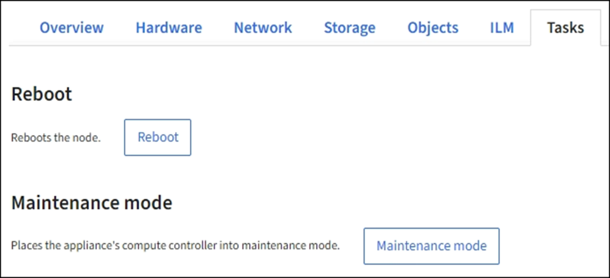

= グリッドノードをリブートするには、タスクタブを使用します
:icons: font
:imagesdir: ../media/

[role="lead"]
Task タブでは ' 選択したノードを再起動できますすべてのノードの [ タスク ] タブが表示されます。

.必要なもの
* を使用して Grid Manager にサインインします xref:../admin/web-browser-requirements.adoc[サポートされている Web ブラウザ]。
* Maintenance または Root アクセス権限が必要です。
* プロビジョニングパスフレーズを用意します。

[ タスク ] タブを使用して、ノードをリブートできます。アプライアンスノードの場合は、 Task タブを使用して、アプライアンスをメンテナンスモードにすることもできます。

* Task タブからグリッドノードをリブートすると、ターゲットノードで reboot コマンドが実行されます。ノードをリブートすると、ノードがシャットダウンして再起動します。すべてのサービスが自動的に再開されます。
+
ストレージノードをリブートする場合は、次の点に注意してください。

+
** ILM ルールに取り込み動作に Dual commit が指定されている場合、またはルールで Balanced が指定されていて、必要なすべてのコピーをただちに作成できない場合は、 StorageGRID は新たに取り込まれたオブジェクトをただちに同じサイトの 2 つのストレージノードにコミットしてあとから ILM を評価します。1 つのサイトで複数のストレージノードをリブートすると、リブート中はこれらのオブジェクトにアクセスできない場合があります。
** ストレージノードのリブート中もすべてのオブジェクトにアクセスできるようにするには、ノードをリブートする前に、サイトでのオブジェクトの取り込みを約 1 時間停止します。

* リンク設定の変更やストレージコントローラの交換など、特定の手順を実行するために StorageGRID アプライアンスのメンテナンスモードへの切り替えが必要になる場合があります。手順については、アプライアンスのハードウェアの設置とメンテナンスの手順を参照してください。
+

NOTE: まれに、 StorageGRID アプライアンスをメンテナンスモードにすると、アプライアンスにリモートアクセスできなくなることがあります。

.手順
. [* nodes （ノード） ] を選択します
. リブートするグリッドノードを選択します。
. [* タスク * （ Tasks * ） ] タブを選択します。
+

. [Reboot] を選択します。
+
確認のダイアログボックスが表示されます。

+
image::../media/nodes_tasks_reboot.png[ノード > タスク > リブートボタン]

+

NOTE: プライマリ管理ノードをリブートすると、サービスの停止中はブラウザと Grid Manager の接続が一時的に失われることを知らせる確認ダイアログボックスが表示されます。

. プロビジョニングパスフレーズを入力し、 * OK * をクリックします。
. ノードがリブートするまで待ちます。
+
サービスがシャットダウンするまでに時間がかかる場合があります。

+
ノードのリブート中は、ノード * ページの左側にグレーのアイコン（ Administratively Down ）が表示されます。すべてのサービスが再び開始されてノードが正常にグリッドに接続されると、「ノード * 」ページには正常なステータスが表示され（ノード名の左側にアイコンが表示されない）、アラートがアクティブではないこと、およびノードがグリッドに接続されていることが示されます。

xref:../sg6000/index.adoc[SG6000 ストレージアプライアンス]

xref:../sg5700/index.adoc[SG5700 ストレージアプライアンス]

xref:../sg5600/index.adoc[SG5600 ストレージアプライアンス]

xref:../sg100-1000/index.adoc[SG100 および SG1000 サービスアプライアンス]
