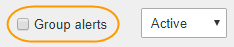

= 現在のアラートを表示します
:icons: font
:imagesdir: ../media/

[role="lead"]
アラートがトリガーされると、ダッシュボードにアラートアイコンが表示されます。ノードに関するアラートアイコンは、ノードページにも表示されます。アラートをサイレント化しないかぎり、 E メール通知も送信される場合があります。

.必要なもの
* を使用して Grid Manager にサインインする必要があります xref:../admin/web-browser-requirements.adoc[サポートされている Web ブラウザ]。
* 必要に応じて、次のビデオを視聴しました。 https://netapp.hosted.panopto.com/Panopto/Pages/Viewer.aspx?id=2680a74f-070c-41c2-bcd3-acc5013c9cdd["ビデオ : アラートの概要"^]。
+
[link=https://netapp.hosted.panopto.com/Panopto/Pages/Viewer.aspx?id=2680a74f-070c-41c2-bcd3-acc5013c9cdd]
image::../media/video-screenshot-alert-overview.png[ビデオ : アラートの概要]

.手順
. アクティブなアラートが 1 つ以上ある場合は、次のいずれかを実行します。
+
** ダッシュボードのヘルスパネルで、アラートアイコンをクリックするか、 * 現在のアラート * をクリックします。（警告アイコンと * 現在のアラート * リンクは、少なくとも 1 つのアラートが現在アクティブである場合にのみ表示されます）。
** [ * alerts * > * current * ] を選択します。
+
[Current Alerts] ページが表示されます。StorageGRID システムに現在影響しているすべてのアラートが表示されます。

+
image::../media/alerts_current_page.png[現在のアラートページ]

+
デフォルトでは、アラートは次のように表示されます。

** 最後にトリガーされたアラートが最初に表示されます。
** 同じタイプの複数のアラートが 1 つのグループとして表示されます。
** サイレント化されているアラートは表示されません。
** 特定のノードの特定のアラートが複数の重大度のしきい値に達した場合は、最も重大度の高いアラートのみが表示されます。つまり、アラートが Minor 、 Major 、 Critical の各重大度のしきい値に達した場合は、 Critical アラートのみが表示されます。

+
現在のアラートページは 2 分ごとに更新されます。

. 表内の情報を確認します。
+
[cols="1a,3a"]
|===
| 列ヘッダー | 説明 

 a| 
名前
 a| 
アラートの名前と概要 。

 a| 
重大度
 a| 
アラートの重大度。複数のアラートがグループ化されている場合は、各重大度で発生しているアラートのインスタンスの数がタイトル行に表示されます。

** * 重要 * image:../media/icon_alert_red_critical.png["アイコンアラート赤アラーム"]：異常な状態で、 StorageGRID のノードやサービスの通常の動作が停止しています。基盤となる問題 にすぐに対処する必要があります。問題 が解決されないと、サービスの停止やデータの損失を招くおそれがあります。
** * メジャー * image:../media/icon_alert_orange_major.png["アイコンアラートオレンジメジャー"]：異常な状態で、現在の処理に影響しているか、重大アラートのしきい値に近づいています。Major アラートを調査し、根本的な問題に対処して、異常な状態が発生した場合に StorageGRID のノードやサービスが正常に動作しなくなる事態を防ぐ必要があります。
** * マイナー * image:../media/icon_alert_yellow_minor.png["アイコンアラート黄マイナー"]：システムは正常に動作していますが、継続するとシステムの動作に影響する可能性がある異常な状態が発生しています。自動的にクリアされない Minor アラートを監視し、解決して、深刻な問題が生じないようにする必要があります。

 a| 
トリガーされた時刻
 a| 
アラートがトリガーされてからの時間。複数のアラートがグループ化されている場合は、タイトル行にアラートの最新のインスタンス（ _newnewest _ ）と最も古いインスタンス（ _oldest _ ）の時間が表示されます。

 a| 
サイト / ノード
 a| 
アラートが発生しているサイトとノードの名前。複数のアラートがグループ化されている場合、サイト名とノード名はタイトル行に表示されません。

 a| 
ステータス
 a| 
アラートがアクティブであるか、またはサイレント化されているか。複数のアラートがグループ化され、ドロップダウンですべてのアラート * が選択されている場合、タイトル行には、そのアラートのアクティブなインスタンスの数と、サイレント化されたインスタンスの数が表示されます。

 a| 
現在の値
 a| 
アラートをトリガーした指標の現在の値。一部のアラートでは、アラートの理解と調査に役立つ値が追加で表示されます。たとえば、 Low object data storage * アラートには、使用されているディスクスペースの割合、ディスクスペースの総容量、使用されているディスクスペースの容量の値が表示されます。

* 注：複数のアラートがグループ化されている場合、現在の値はタイトル行に表示されません。

|===
. アラートのグループを展開または折りたたむには、次の手順を実行します
+
** グループ内の個々のアラートを表示するには、見出しの下キャレットをクリックします image:../media/icon_alert_caret_down.png["下キャレットアイコン"] をクリックするか、グループの名前をクリックします。
** グループ内の個々のアラートを非表示にするには、見出しの上キャレットをクリックします image:../media/icon_alert_caret_up.png["上キャレットアイコン"] をクリックするか、グループの名前をクリックします。
+
image::../media/alerts_page_expanded_alert_group.png[アラートページ拡張アラートグループ]

. アラートのグループではなく個々のアラートを表示するには、テーブルの上部にある ［ * グループアラート * ］ チェックボックスの選択を解除します。
+

. アラートまたはアラートグループをソートするには、上下の矢印をクリックします image:../media/icon_alert_sort_column.png["ソート用矢印アイコン"] をクリックします。
+
** グループアラート * を選択すると、アラートグループと各グループ内の個々のアラートの両方がソートされます。たとえば、グループ内のアラートを「時間トリガー」でソートして、特定のアラートの最新のインスタンスを確認できます。
** グループアラート * が選択されていない場合は、アラートのリスト全体がソートされます。たとえば、すべてのアラートを * Node/Site * でソートして、特定のノードに影響しているすべてのアラートを表示できます。

. アラートをステータスでフィルタリングするには、テーブルの上部にあるドロップダウンメニューを使用します。
+
image::../media/alerts_page_active_drop_down.png[アラートステータスのドロップダウン]

+
** 現在のすべてのアラート（アクティブなアラートとサイレント化されたアラートの両方）を表示するには、 * All alerts * を選択します。
** アクティブな現在のアラートだけを表示するには、「 * アクティブ * 」を選択します。
** サイレント化されている現在のアラートだけを表示するには、「 * Silented * 」を選択します。を参照してください xref:silencing-alert-notifications.adoc[アラート通知をサイレント化する]。

. 特定のアラートの詳細を表示するには、テーブルでアラートを選択します。
+
アラートのダイアログボックスが表示されます。を参照してください xref:viewing-specific-alert.adoc[特定のアラートを表示する]。

