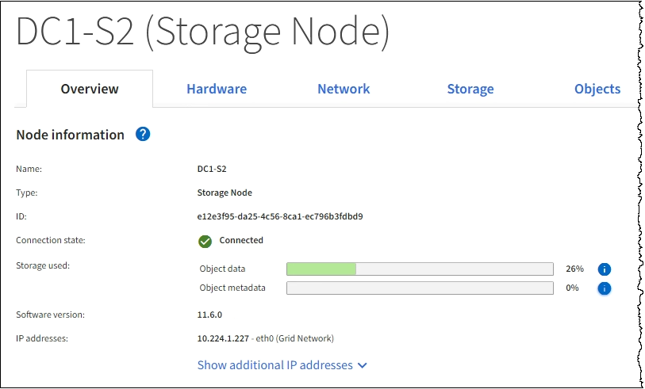

= 概要タブを表示します
:allow-uri-read: 
:icons: font
:imagesdir: ../media/

[role="lead"]
Overview タブには ' 各ノードに関する基本的な情報が表示されますまた、ノードに現在影響しているアラートも表示されます。

すべてのノードの Overview （概要）タブが表示されます。

== ノード情報

Overview （概要）タブの Node Information （ノード情報）セクションには、グリッドノードに関する基本情報が表示されます。

 ページの [ 概要 ] タブ]

ノードの概要情報には次のものがあります。

* * Name * ：ノードに割り当てられたホスト名で、 Grid Manager に表示されます。
* * タイプ * ：ノードのタイプ - 管理ノード、プライマリ管理ノード、ストレージノード、ゲートウェイノード、またはアーカイブノード。
* * ID * ：ノードの一意の識別子。 UUID とも呼ばれます。
* * 接続状態 * ： 3 つの状態のいずれか。最も重大な状態のアイコンが表示されます。
+
** * 不明 * image:../media/icon_alarm_blue_unknown.png["青の疑問符アイコン"]：不明な理由でノードがグリッドに接続されていません。たとえば、ノード間のネットワーク接続が失われた、電源が切れたなどの原因が考えられます。* Unable to communicate with node * アラートがトリガーされる場合もあります。他のアラートもアクティブになる可能性があります。この状況にはすぐに対処する必要があります。
+

NOTE: 管理されたシャットダウン処理の実行中に、ノードが Unknown と表示されることがありますこのような場合、 Unknown 状態は無視してかまいません。

** * 管理上のダウン * image:../media/icon_alarm_gray_administratively_down.png["グレーの疑問符アイコン"]：ノードが想定される理由でグリッドに接続されていません。たとえば、ノードまたはノード上のサービスが正常にシャットダウンされた、ノードがリブート中である、ソフトウェアのアップグレード中であるなどの原因が考えられます。1 つ以上のアラートがアクティブになっている可能性もあります。
** * 接続済み * image:../media/icon_alert_green_checkmark.png["アイコンアラートの緑のチェックマーク"]：ノードがグリッドに接続されています。

* * Storage Used * ：ストレージノードのみ。
+
** * Object data * ：ストレージノードで使用されているオブジェクトデータに使用可能な合計スペースの割合。
** * Object metadata * ：ストレージノードで使用されているオブジェクトメタデータに使用可能な合計スペースの割合。

* * ソフトウェアバージョン * ：ノードにインストールされている StorageGRID のバージョン。
* * HA グループ * ：管理ノードとゲートウェイノードのみ。ノードのネットワークインターフェイスがハイアベイラビリティグループに含まれている場合、およびそのインターフェイスがプライマリインターフェイスかどうかが表示されます。
* * ip addresses * ：ノードの IP アドレス。Show additional IP addresses * をクリックして、ノードの IPv4 および IPv6 アドレスとインターフェイスのマッピングを表示します。

== アラート

Overview （概要）タブの Alerts （アラート）セクションには、サイレント化されていないこのノードに現在影響しているアラートがすべて表示されます。アラート名をクリックすると、その他の詳細情報や推奨される対処方法が表示されます。

image::../media/nodes_page_alerts_table.png[ノードページアラートの表]

.関連情報
xref:monitoring-node-connection-states.adoc[ノードの接続状態を監視します]

xref:viewing-current-alerts.adoc[現在のアラートを表示します]

xref:viewing-specific-alert.adoc[特定のアラートを表示する]
