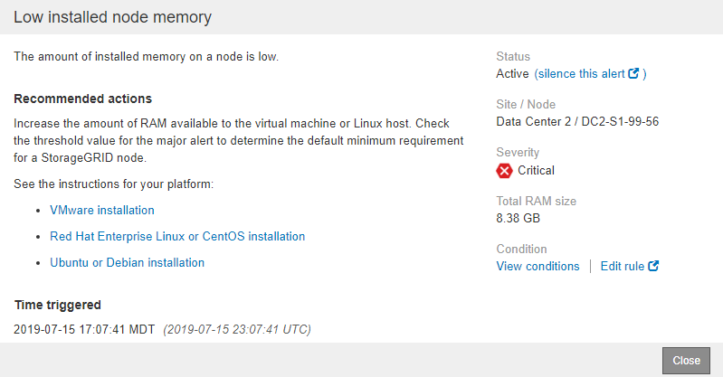

= 特定のアラートを表示する
:icons: font
:imagesdir: ../media/

[role="lead"]
StorageGRID システムに現在影響しているアラートや解決されたアラートに関する詳細情報を表示できます。これには、推奨される対処方法、アラートがトリガーされた時間、アラートに関連する指標の現在の値などの情報が含まれます。

必要に応じて、を実行できます xref:silencing-alert-notifications.adoc[現在のアラートをサイレント化する] または xref:editing-alert-rules.adoc[アラートルールを更新]。

.必要なもの
* を使用して Grid Manager にサインインします xref:../admin/web-browser-requirements.adoc[サポートされている Web ブラウザ]。

.手順
. 現在のアラートと解決済みのアラートのどちらを表示するかに基づいて、次のいずれかを実行します。
+
[cols="1a,2a"]
|===
| 列ヘッダー | 説明 

 a| 
現在のアラート
 a| 
** ダッシュボードのヘルスパネルで、 * 現在のアラート * リンクをクリックします。このリンクは、少なくとも 1 つのアラートが現在アクティブである場合にのみ表示されます。このリンクは、現在のアラートがない場合、または現在のすべてのアラートがサイレント化されている場合は表示されません。
** [ * alerts * > * current * ] を選択します。
** [* nodes * （ノード * ） ] ページで、警告アイコンが表示されているノードの [* Overview * （概要 * ） ] タブを選択します。次に、 [Alerts] セクションでアラート名をクリックします。

 a| 
解決済みのアラート
 a| 
** ダッシュボードのヘルスパネルで、最近解決したアラート * リンクをクリックします。（このリンクは、過去 1 週間に 1 つ以上のアラートがトリガーされ、解決された場合にのみ表示されます。過去 1 週間にトリガーされて解決されたアラートがない場合は、このリンクが非表示になります）。
** [ * alerts * > * Resolved * ] を選択します。

|===
. 必要に応じて、アラートのグループを展開し、表示するアラートを選択します。
+

NOTE: アラートグループの見出しではなく、アラートを選択します。

+
image::../media/alerts_page_select_alert.png[[ アラート ] ページ選択アラート]

+
ダイアログボックスが表示され、選択したアラートの詳細が表示されます。

+

. アラートの詳細を確認します。
+
[cols="1a,2a"]
|===
| 情報 | 説明 

 a| 
_TITLE_
 a| 
アラートの名前。

 a| 
_ 最初の段落 _
 a| 
アラートの概要 。

 a| 
推奨される対処方法
 a| 
このアラートの推奨される対処方法。

 a| 
トリガーされた時刻
 a| 
アラートがローカルの時刻と UTC でトリガーされた日時。

 a| 
解決時刻
 a| 
解決済みのアラートの場合のみ、アラートがローカルの時刻と UTC で解決された日時。

 a| 
ステータス
 a| 
アラートのステータス。 Active 、 Silved 、または Resolved です。

 a| 
サイト / ノード
 a| 
アラートの影響を受けるサイトとノードの名前。

 a| 
重大度
 a| 
アラートの重大度。

** * 重要 * image:../media/icon_alert_red_critical.png["アイコンアラート赤アラーム"]：異常な状態で、 StorageGRID のノードやサービスの通常の動作が停止しています。基盤となる問題 にすぐに対処する必要があります。問題 が解決されないと、サービスの停止やデータの損失を招くおそれがあります。
** * メジャー * image:../media/icon_alert_orange_major.png["アイコンアラートオレンジメジャー"]：異常な状態で、現在の処理に影響しているか、重大アラートのしきい値に近づいています。Major アラートを調査し、根本的な問題に対処して、異常な状態が発生した場合に StorageGRID のノードやサービスが正常に動作しなくなる事態を防ぐ必要があります。
** * マイナー * image:../media/icon_alert_yellow_minor.png["アイコンアラート黄マイナー"]：システムは正常に動作していますが、継続するとシステムの動作に影響する可能性がある異常な状態が発生しています。自動的にクリアされない Minor アラートを監視し、解決して、深刻な問題が生じないようにする必要があります。

 a| 
データ値 _
 a| 
このアラートに関する指標の現在の値。一部のアラートでは、アラートの理解と調査に役立つ値が追加で表示されます。たとえば、「 Low metadata storage * 」アラートには、使用されているディスクスペースの割合、ディスクスペースの総容量、使用されているディスクスペースの容量の値が表示されます。

|===
. 必要に応じて、 * silence this alert * をクリックして、このアラートをトリガーしたアラートルールをサイレント化します。
+
アラートルールをサイレント化するには、 Manage Alerts または Root アクセス権限が必要です。

+

IMPORTANT: アラートルールをサイレント化する場合は注意が必要です。アラートルールがサイレント化されている場合、重大な処理が完了しないかぎり、根本的な問題が検出されないことがあります。

. アラートルールの現在の条件を表示するには、次の手順を実行します。
+
.. アラートの詳細から、 * 状態の表示 * をクリックします。
+
定義されている各重大度の Prometheus 式がポップアップに表示されます。

+
image::../media/alerts_page_details_modal_view_condition.png[Alerts Page Details Modal View 条件]

.. ポップアップを閉じるには、ポップアップの外側をクリックします。

. 必要に応じて、 * Edit rule * をクリックして、このアラートをトリガーしたアラートルールを編集します。
+
アラートルールを編集するには、 Manage Alerts または Root アクセス権限が必要です。

+

IMPORTANT: アラートルールを編集する場合は注意が必要です。トリガー値を変更した場合、重大な処理を完了できなくなるまで、根本的な問題が検出されないことがあります。

. 警告の詳細を閉じるには、 * 閉じる * をクリックします。

