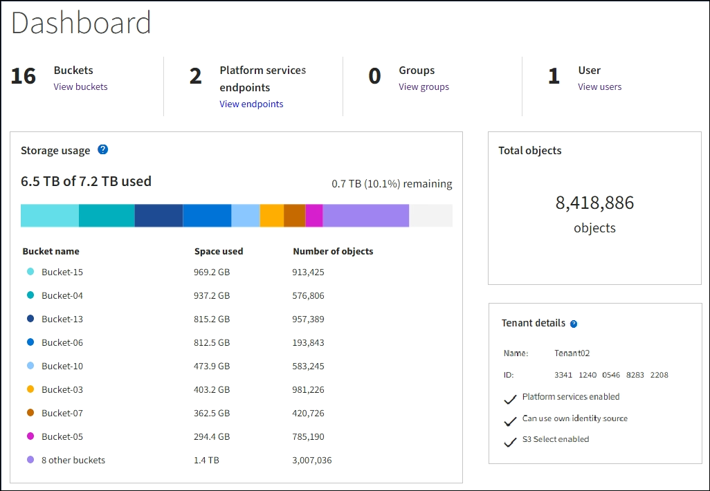

= Tenant Manager を確認します
:allow-uri-read: 
:icons: font
:imagesdir: ../media/

[role="lead"]
Tenant Manager は、テナントユーザがストレージアカウントを設定、管理、および監視するためにアクセスするブラウザベースのグラフィカルインターフェイスです。

Tenant Manager にサインインしたテナントユーザは管理ノードに接続しています。

== Tenant Manager のダッシュボード

グリッド管理者が Grid Manager またはグリッド管理 API を使用してテナントアカウントを作成すると、テナントユーザが Tenant Manager にサインインできるようになります。

Tenant Manager のダッシュボードでは、テナントユーザがストレージの使用状況を一目で監視できます。ストレージの使用状況パネルには、テナントの最大バケット（ S3 ）またはコンテナ（ Swift ）のリストが含まれます。Space Used の値は、バケットまたはコンテナ内のオブジェクトデータの合計量です。棒グラフは、これらのバケットまたはコンテナの相対サイズを表します。

棒グラフの上に表示される値は、テナントのすべてのバケットまたはコンテナに使用されているスペースの合計です。テナントで使用可能な最大ギガバイト数、テラバイト数、またはペタバイト数をアカウント作成時に指定した場合は、使用されているクォータの量と残りのクォータも表示されます。

== ストレージメニュー（ S3 テナントのみ）

ストレージのメニューは S3 テナントアカウントに対してのみ表示されます。S3 ユーザはこのメニューを使用して、アクセスキーの管理、バケットの作成と削除、プラットフォームサービスエンドポイントの管理を行うことができます。

image::../media/s3_menu.png[S3 メニュー]

=== アクセスキー

S3 テナントユーザは次のようにアクセスキーを管理できます。

* Manage Your Own S3 Credentials 権限が設定されたユーザは、自分の S3 アクセスキーを作成または削除できます。
* Root Access 権限が設定されたユーザは、 S3 root アカウント、自分のアカウント、およびその他すべてのユーザのアクセスキーを管理できます。root アクセスキーは、バケットポリシーで root アクセスキーが明示的に無効になっていないかぎり、テナントのバケットとオブジェクトへのフルアクセスも提供します。
+

NOTE: 他のユーザのアクセスキーの管理は、 Access Management メニューから行います。

=== バケット

適切な権限を持つ S3 テナントユーザは、バケットに関連する次のタスクを実行できます。

* バケットを作成する
* 新しいバケットの S3 オブジェクトロックを有効にする（ StorageGRID システムで S3 オブジェクトロックが有効になっていることを前提）
* 整合性レベル設定を更新します
* デフォルトの保持設定を適用します
* Cross-Origin Resource Sharing （ CORS ）の設定
* テナントに属するバケットの最終アクセス日時の更新設定の有効化または無効化
* 空のバケットを削除します
* を使用してバケット内のオブジェクトを管理します xref:../tenant/use-s3-console.adoc[Experimental S3 Console の略]

グリッド管理者がテナントアカウントにプラットフォームサービスの使用を許可した場合、適切な権限を持つ S3 テナントユーザは次のタスクも実行できます。

* S3 イベント通知の設定。この通知は、 AWS Simple Notification Service ™（ SNS ）をサポートするデスティネーションサービスに送信できます。
* CloudMirror レプリケーションの設定。テナントから外部の S3 バケットにオブジェクトが自動的にレプリケートされるようにすることができます。
* 検索統合の設定。検索統合は、オブジェクトの作成、削除、またはそのメタデータやタグの更新が行われるたびに、デスティネーションの検索インデックスにオブジェクトメタデータを送信します。

=== プラットフォームサービスのエンドポイント

グリッド管理者がテナントアカウントにプラットフォームサービスの使用を許可した場合、 Manage Endpoints 権限のある S3 テナントユーザは、各プラットフォームサービスのデスティネーションエンドポイントを設定できます。

== Access 管理メニュー

アクセス管理メニューを使用すると、 StorageGRID テナントでフェデレーテッドアイデンティティソースからユーザグループをインポートして、管理権限を割り当てることができます。StorageGRID システム全体でシングルサインオン（ SSO ）が有効になっていないかぎり、テナントがローカルテナントグループおよびユーザを管理することもできます。

image::../media/access_management_menu.png[Access 管理メニュー]

.関連情報
* xref:exploring-grid-manager.adoc[Grid Manager の詳細を見る]
* xref:../tenant/index.adoc[テナントアカウントを使用する]

