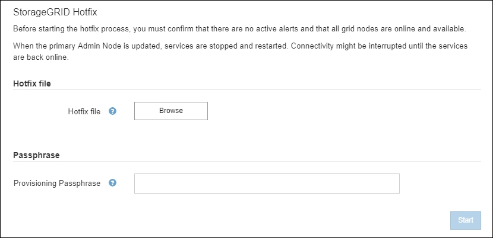

= メンテナンスを実施します
:icons: font
:imagesdir: ../media/

[role="lead"]
StorageGRID システムを最新の状態に保ち、効率的に実行するために、さまざまなメンテナンス手順を実行します。Grid Manager には、メンテナンスタスクを実行するプロセスを支援するツールとオプションが用意されている。

== ソフトウェアの更新

Grid Manager の Software Update ページでは、次の 3 種類のソフトウェア更新を実行できます。

* StorageGRID ソフトウェアのアップグレード
* StorageGRID ホットフィックス
* SANtricity OS のアップグレード

== StorageGRID ソフトウェアのアップグレード

新しい StorageGRID 機能リリースが利用可能になったときは、ソフトウェアアップグレードページの指示に従って、必要なファイルをアップロードし、 StorageGRID システムをアップグレードします。プライマリ管理ノードから、すべてのデータセンターサイトのすべてのグリッドノードをアップグレードする必要があります。

StorageGRID ソフトウェアのアップグレード中も、クライアントアプリケーションはオブジェクトデータの取り込みと読み出しを継続できます。

== ホットフィックス

次のフィーチャーリリースまでの間にソフトウェアの問題が検出されて解決された場合は、 StorageGRID システムにホットフィックスを適用する必要があります。

StorageGRID のホットフィックスには、フィーチャーパックまたはフィーチャーパックに含まれないソフトウェアの変更が含まれます。今後のリリースにも同じ変更が含まれます。

以下に示す StorageGRID ホットフィックスページでは、ホットフィックスファイルをアップロードできます。

ホットフィックスは、最初にプライマリ管理ノードに適用されます。その後、 StorageGRID システム内のすべてのノードで同じソフトウェアバージョンが実行されるまで、他のグリッドノードへのホットフィックスの適用を承認する必要があります。個々のグリッドノード、グリッドノードのグループ、またはすべてのグリッドノードを選択して、承認順序をカスタマイズできます。

NOTE: 新しいバージョンのホットフィックスによってすべてのグリッドノードが更新されますが、ホットフィックスの実際の変更内容が、特定のタイプのノードの特定のサービスにしか影響しない場合があります。たとえば、あるホットフィックスが、ストレージノード上の LDR サービスにしか影響しない場合があります。

== SANtricity OS のアップグレード

ストレージアプライアンスのストレージコントローラが適切に機能しない場合は、コントローラの SANtricity OS ソフトウェアのアップグレードが必要となることがあります。SANtricity OS ファイルを StorageGRID システムのプライマリ管理ノードにアップロードし、 Grid Manager からアップグレードを適用できます。

以下の SANtricity ページでは、 SANtricity OS アップグレードファイルをアップロードできます。

image::../media/santricity_os_upgrade_first.png[StorageGRID First SANtricity OS ページ]

ファイルをアップロードしたあと、個々のストレージノードまたはすべてのノードでアップグレードを承認できます。ノードを選択的に承認できるため、アップグレードのスケジュールを簡単に設定できます。アップグレード用にノードを承認すると、システムによってヘルスチェックが実行され、ノードに適用できる場合はアップグレードがインストールされます。

== 拡張手順

StorageGRID システムを拡張するには、ストレージノードにストレージボリュームを追加するか、既存のサイトに新しいグリッドノードを追加するか、新しいデータセンターサイトを追加します。ストレージノードで SG6060 ストレージアプライアンスを使用している場合は、拡張シェルフを 1 台または 2 台追加して、ノードのストレージ容量を 2 倍または 3 倍にすることができます。

拡張は現在のシステムの処理を中断せずに実行できます。ノードまたはサイトを追加するときは、まず新しいノードを導入し、そのあとにグリッドの拡張ページから拡張手順 を実行します。

image::../media/grid_expansion_progress.png[この図には説明が付随しています。]

== ノードのリカバリ手順

グリッドノードの障害は、ハードウェア、仮想化、オペレーティングシステム、またはソフトウェアの障害によってそのノードが動作しなくなったり、信頼性が低下した場合に発生することがあります。

グリッドノードのリカバリ手順は、グリッドノードがホストされているプラットフォームと、そのグリッドノードのタイプによって異なります。グリッドノードのタイプごとに、厳密に従う必要があるリカバリ手順 があります。通常は、障害グリッドノードのデータをできるだけ保持し、障害ノードを修理または交換し、リカバリページを使用して交換用ノードを設定し、ノードのデータをリストアします。

たとえば、次のフローチャートは、管理ノードで障害が発生した場合のリカバリ用手順 を示しています。

== 運用停止手順

グリッドノードまたはデータセンターサイト全体を StorageGRID システムから完全に削除できます。

たとえば、次のような場合は 1 つ以上のグリッドノードの運用を停止できます。

* システムに大きなストレージノードを追加したあとに、オブジェクトを保持したまま小さなストレージノードを 1 つ以上削除する場合。
* 総ストレージ容量を減らす必要がある場合。
* ゲートウェイノードまたは非プライマリ管理ノードが不要になった場合。
* 切断されていて、リカバリしたりオンラインに戻したりすることができないノードがグリッドに含まれている場合。

Grid Manager の運用停止ページを使用して、次のタイプのグリッドノードを削除できます。

* ストレージノード：特定の要件を満たすのに十分なノードがサイトに残っていない場合
* ゲートウェイノード
* 非プライマリ管理ノード

image::../media/decommission_nodes_page_all_connected.png[運用停止ページのスクリーンショット]

Grid Manager の運用停止サイトページを使用してサイトを削除できます。接続されたサイトの運用停止では、運用サイトが削除され、データが保持されます。切断されたサイトの運用停止処理によって障害が発生したサイトが削除されますが、データは保持されませDecommission Site ウィザードでは、サイトの選択、サイトの詳細の表示、 ILM ポリシーの改訂、 ILM ルールからのサイト参照の削除、およびノードの競合の解決のプロセスを実行できます。

image::../media/decommission_site_step_select_site.png[サイトの運用停止手順 1.]

== ネットワークのメンテナンス手順

実行する必要があるネットワークメンテナンス手順には、次のものがあります。

* グリッドネットワークのサブネットを更新しています
* グリッドの導入時に最初に設定されたネットワーク設定を変更する場合は、 IP 変更ツールを使用します
* Domain Name System （ DNS ；ドメインネームシステム）サーバの追加、削除、更新
* ネットワークタイムプロトコル（ NTP ）サーバの追加、削除、更新：グリッドノード間でデータが正確に同期されるようにします
* グリッドから分離された可能性があるノードへのネットワーク接続のリストア

== ホストレベルおよびミドルウェアの手順

一部のメンテナンス手順は、 Linux または VMware に導入されている StorageGRID ノード、または StorageGRID 解決策 のその他のコンポーネントに固有のものです。たとえば、グリッドノードを別の Linux ホストに移行したり、 Tivoli Storage Manager （ TSM ）に接続されているアーカイブノードでメンテナンスを実行したりすることができます。

== アプライアンスノードのクローニング

アプライアンスノードのクローニングを使用すると、グリッド内の既存のアプライアンスノードを、同じ論理 StorageGRID サイトに含まれる新しい設計または拡張された機能のアプライアンスに簡単に置き換えることができます。このプロセスでは、すべてのデータが新しいアプライアンスに転送され、古いアプライアンスノードを交換するためにアプライアンスが稼働中になり、古いアプライアンスは設置前の状態になります。クローニングは、ハードウェアのアップグレードプロセスを提供します。アップグレードプロセスは簡単に実行でき、アプライアンスを交換する方法の 1 つとしても利用できます。

== グリッドノードの手順

特定のグリッドノードで特定の手順を実行する必要がある場合があります。たとえば、グリッドノードのリブートや、特定のグリッドノードサービスの手動による停止と再起動が必要になることがあります。グリッドノードの作業手順には、 Grid Manager から実行できるものと、グリッドノードにログインしてノードのコマンドラインから実行する必要があるものがあります。

.関連情報
* xref:../admin/index.adoc[StorageGRID の管理]
* xref:../upgrade/index.adoc[ソフトウェアをアップグレードする]
* xref:../expand/index.adoc[グリッドを展開します]
* xref:../maintain/index.adoc[リカバリとメンテナンス]

