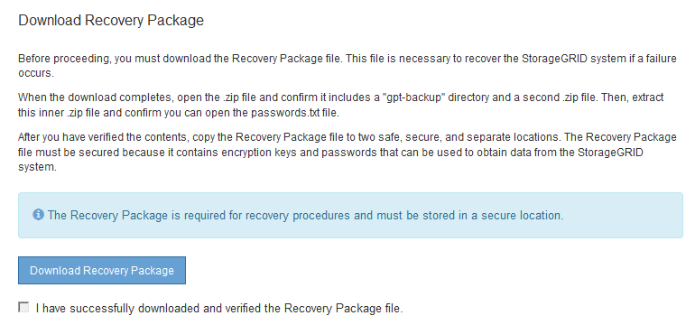

= 構成を確認し、インストールを完了します
:icons: font
:imagesdir: ../media/

[role="lead"]
インストールを正常に完了するために、入力した設定情報をよく確認する必要があります。

.手順
. 「 * 概要 * 」ページを表示します。
+
image::../media/11_gmi_installer_summary_page.gif[この図には説明が付随しています。]

. グリッドの設定情報がすべて正しいことを確認します。Summary （サマリ）ページの Modify （変更）リンクを使用して、戻ってエラーを修正します。
. 「 * Install * 」をクリックします。
+

NOTE: クライアントネットワークを使用するようにノードが設定されている場合、 * Install * をクリックすると、そのノードのデフォルトゲートウェイがグリッドネットワークからクライアントネットワークに切り替わります。接続を失った場合は、アクセス可能なサブネット経由でプライマリ管理ノードにアクセスしていることを確認する必要があります。を参照してください xref:../network/index.adoc[ネットワークのガイドライン] を参照してください。

. [ リカバリパッケージのダウンロード ] をクリックします。
+
グリッドトポロジを定義するポイントまでインストールが進むと、リカバリパッケージファイル（ .zip ）をダウンロードし、そのファイルのコンテンツにアクセスできることを確認するように求められます。リカバリパッケージファイルのダウンロードが必要となるのは、グリッドノードで障害が発生した場合に StorageGRID システムをリカバリできるようにするためです。インストールはバックグラウンドで続行されますが、このファイルをダウンロードして検証するまでは、インストールを完了して StorageGRID システムにアクセスすることができません。

. 「 .zip 」ファイルの内容を展開できることを確認し、安全で安全な 2 つの場所に保存します。
+

IMPORTANT: リカバリパッケージファイルには StorageGRID システムからデータを取得するための暗号キーとパスワードが含まれているため、安全に保管する必要があります。

. [I have successfully downloaded and verified the Recovery Package file*] チェックボックスをオンにし、 [ 次へ ] をクリックします。
+

+
インストールがまだ進行中の場合は、ステータスページが表示されます。このページには、グリッドノードごとのインストールの進捗状況が表示されます。

+
image::../media/12_gmi_installer_status_page.gif[この図には説明が付随しています。]

+
すべてのグリッドノードが完了ステージに到達すると、 Grid Manager のサインインページが表示されます。

. 「 root 」ユーザおよびインストール時に指定したパスワードを使用して Grid Manager にサインインします。

