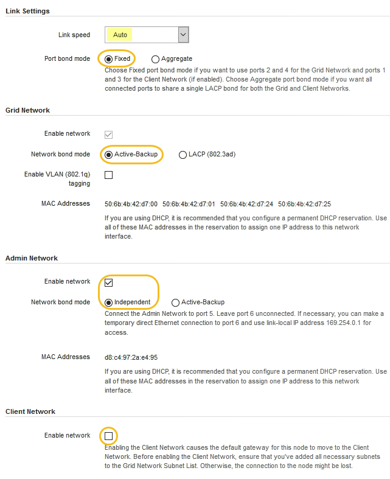

= ネットワークリンクの設定（ SG100 および SG1000 ）
:allow-uri-read: 
:icons: font
:imagesdir: ../media/

[role="lead"]
アプライアンスをグリッドネットワーク、クライアントネットワーク、および管理ネットワークに接続するために使用するポートのネットワークリンクを設定できます。リンク速度およびポートボンディングモードとネットワークボンディングモードを設定できます。

.必要なもの
* ケーブルのタイプとリンク速度に応じて、必要な追加の機器を入手しておきます。
* 選択した速度をサポートするスイッチにネットワークポートを接続しておきます。

アグリゲートポートボンディングモード、 LACP ネットワークボンディングモード、または VLAN タギングを使用する場合

* アプライアンスのネットワークポートを、 VLAN と LACP をサポートするスイッチに接続しておきます。
* 複数のスイッチを LACP ボンドに加える場合は、 Multi-Chassis Link Aggregation （ MLAG ）グループまたは同等の機能をサポートするスイッチを使用します。
* VLAN 、 LACP 、 MLAG などを使用するようにスイッチを設定する方法について理解しておく必要があります。
* 各ネットワークに使用する一意の VLAN タグを確認しておきます。この VLAN タグが各ネットワークパケットに追加され、ネットワークトラフィックが正しいネットワークにルーティングされます。

次の図では、 4 つのネットワークポートが固定ポートボンディングモードでボンディングされています（デフォルトの構成）。

* SG100 固定ポートボンディングモード *

image::../media/sg100_fixed_port_draft.png[SG100 Fixed ポートボンディングモード]

* SG1000 の固定ポートボンディングモード *

image::../media/sg1000_fixed_port.png[SG1000 Fixed ポートボンディングモード]

|===
| コールアウト | ボンディングされるポート 

 a| 
C
 a| 
このネットワークを使用する場合、ポート 1 とポート 3 がクライアントネットワーク用にボンディングされます。

 a| 
G
 a| 
ポート 2 とポート 4 がグリッドネットワーク用にボンディングされます。

|===
次の図では、 4 つのネットワークポートが Aggregate ポートボンディングモードでボンディングされています。

* SG100 アグリゲートポートボンディングモード *

image::../media/sg100_aggregate_ports.png[アグリゲートポートボンディングモード： SG100]

* SG1000 Aggregate ポートボンディングモード *

image::../media/sg1000_aggregate_ports.png[Aggregate ポートボンディングモード - SG1000]

|===
| コールアウト | ボンディングされるポート 

 a| 
1.
 a| 
4 つのポートすべてを 1 つの LACP ボンドにグループ化して、すべてのポートをグリッドネットワークとクライアントネットワークのトラフィックに使用できるようにします。

|===
次の表に、 4 つのネットワークポートを設定するためのオプションをまとめます。デフォルトの設定は太字で示しています。デフォルト以外の設定を使用する場合にのみ、 Link Configuration ページで設定を行う必要があります。

NOTE: LACP 送信ハッシュポリシーは、デフォルトで layer2+3 モードに設定されています。必要に応じて、グリッド管理 API を使用して layer3+4 モードに変更できます。

* * 固定（デフォルト）ポートボンディングモード *
+
|===
| ネットワークボンディングモード | クライアントネットワークが無効な場合（デフォルト） | クライアントネットワークが有効になりました 

 a| 
Active-Backup （デフォルト）
 a| 
** ポート 2 と 4 がグリッドネットワークにアクティブ / バックアップボンドを使用します。
** ポート 1 と 3 は使用されません。
** VLAN タグはオプションです。

 a| 
** ポート 2 と 4 がグリッドネットワークにアクティブ / バックアップボンドを使用します。
** ポート 1 と 3 がクライアントネットワークに Active-Backup ボンドを使用します。
** ネットワーク管理者用に、両方のネットワークに VLAN タグを指定できます。

 a| 
LACP （ 802.3ad ）
 a| 
** ポート 2 と 4 がグリッドネットワークに LACP ボンドを使用します。
** ポート 1 と 3 は使用されません。
** VLAN タグはオプションです。

 a| 
** ポート 2 と 4 がグリッドネットワークに LACP ボンドを使用します。
** ポート 1 と 3 がクライアントネットワークに LACP ボンドを使用します。
** ネットワーク管理者用に、両方のネットワークに VLAN タグを指定できます。

|===
* * アグリゲートポートボンディングモード *
+
|===
| ネットワークボンディングモード | クライアントネットワークが無効な場合（デフォルト） | クライアントネットワークが有効になりました 

 a| 
LACP （ 802.3ad ）のみ
 a| 
** ポート 1~4 がグリッドネットワークに単一の LACP ボンドを使用します。
** 単一の VLAN タグでグリッドネットワークのパケットが識別されます。

 a| 
** ポート 1~4 がグリッドネットワークとクライアントネットワークに単一の LACP ボンドを使用します。
** 2 つの VLAN タグで、グリッドネットワークのパケットとクライアントネットワークのパケットを分離できます。

|===

詳細については、サービスアプライアンスの GbE ポートの接続に関する記事を参照してください。

次の図では、 SG100 上の 2 つの 1GbE 管理ポートが管理ネットワーク用に Active-Backup ネットワークボンディングモードでボンディングされています。

次の図では、アプライアンスの 2 つの 1GbE 管理ポートが管理ネットワーク用に Active-Backup ネットワークボンディングモードでボンディングされています。

* SG100 管理ネットワーク・ポートがボンディングされています *

image::../media/sg100_bonded_management_ports.png[ボンディングされている管理ネットワークのポート SG100]

* SG1000 管理ネットワークのポートがボンディングされています *

image::../media/sg1000_bonded_management_ports.png[SG1000 のボンディングされている管理ネットワークポート]

.手順
. StorageGRID アプライアンスインストーラのメニューバーから、 *Configure Networking *>*Link Configuration * をクリックします。
+
Network Link Configuration ページには、アプライアンスの図と、ネットワークポートおよび管理ポートの番号が表示されます。

+
* SG100 ポート *

+
image::../media/sg100_configuring_network_ports.png[SG100 背面コネクタ]

+
* SG1000 ポート *

+
image::../media/sg1000_configuring_network_ports.png[SG1000 ポート]

+
Link Status テーブルには、番号が付けられたポート（ SG1000 を参照）のリンク状態と速度が表示されます。

+
image::../media/sg1000_configuring_network_link_status.png[SG1000 リンクステータス]

+
このページに初めてアクセスしたときの動作は次のとおりです。

+
** * リンク速度 * は * 自動 * に設定されています。
** * ポートボンディングモード * は「 * Fixed 」に設定されます。
** * グリッドネットワークの場合、ネットワークボンディングモード * が「アクティブ / バックアップ」に設定されます。
** 管理ネットワーク * が有効になっており、ネットワークボンディングモードが * Independent * に設定されています。
** クライアントネットワーク * が無効になっています。
+

. [* Link speed * （リンク速度 * ） ] ドロップダウンリストから、ネットワークポートのリンク速度を選択します。
+
グリッドネットワークとクライアントネットワークに使用するネットワークスイッチも、この速度をサポートし、この速度に対応するように設定する必要があります。設定されたリンク速度に適したアダプタまたはトランシーバを使用する必要があります。このオプションはリンク速度と前方誤り訂正（ FEC ）モードの両方をリンクパートナーとネゴシエートするため、可能な場合は自動リンク速度を使用します。

. 使用する StorageGRID ネットワークを有効または無効にします。
+
グリッドネットワークは必須です。このネットワークは無効にできません。

+
.. アプライアンスが管理ネットワークに接続されていない場合は、管理ネットワークの * ネットワークを有効にする * チェックボックスの選択を解除します。
+
image::../media/admin_network_disabled.gif[管理ネットワークを有効または無効にするチェックボックスを示すスクリーンショット]

.. アプライアンスがクライアントネットワークに接続されている場合は、クライアントネットワークの * ネットワークを有効にする * チェックボックスをオンにします。
+
これで、データ NIC ポートでのクライアントネットワークの設定が表示されます。

. 表を参照して、ポートボンディングモードとネットワークボンディングモードを設定します。
+
次の例では、次のよう

+
** * グリッドネットワークとクライアントネットワークでアグリゲート * と * LACP * を選択。各ネットワークに一意の VLAN タグを指定する必要があります。値は 0~4095 の間で選択できます。
** * 管理ネットワーク用に選択されたアクティブ / バックアップ * 。
+
image::../media/sg1000_network_link_configuration_aggregate.png[Network Link Configuration Aggregate の値]

. 選択に問題がなければ、 * 保存 * をクリックします。
+

NOTE: 接続しているネットワークまたはリンクを変更すると、接続が失われる可能性があります。1 分以内に再接続されない場合は、アプライアンスに割り当てられている他の IP アドレスのいずれかを使用して、 StorageGRID アプライアンス・インストーラの URL を再入力します。 +`*https://_services_appliance_IP_:8443*`

xref:obtaining-additional-equipment-and-tools-sg100-and-sg1000.adoc[追加の機器と工具の入手（ SG100 および SG1000 ）]
