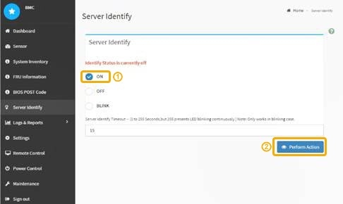

= コントローラ識別 LED のオンとオフを切り替えます
:allow-uri-read: 
:icons: font
:imagesdir: ../media/

[role="lead"]
コントローラの前面と背面にある青色の識別 LED は、データセンターでアプライアンスを特定するのに役立ちます。

識別するコントローラの BMC IP アドレスが必要です。

.手順
. コントローラの BMC インターフェイスにアクセスします。
. 「 * サーバー識別 * 」を選択します。
. 「 * オン * 」を選択し、「 * アクションの実行 * 」を選択します。
+

青色の識別 LED は、コントローラの前面（図）と背面（図）に点灯します。

image::../media/sg6060_front_panel_service_led_on.jpg[前面識別 LED オン]

NOTE: コントローラにベゼルが取り付けられている場合、前面の識別 LED が見えにくいことがあります。

コントローラ識別 LED を消灯するには、次の手順を実行します。

* コントローラの前面パネルにある識別 LED スイッチを押します。
* コントローラの BMC インターフェイスから、 * Server identify * を選択し、 * off * を選択して、 * Perform Action * を選択します。

コントローラの前面と背面の青色の識別 LED が消灯します。

image::../media/sg6060_front_panel_service_led_off.jpg[前面識別 LED オフ]

xref:locating-controller-in-data-center.adoc[データセンターでコントローラを探します]

xref:accessing-bmc-interface-sg1000.adoc[BMC インターフェイスにアクセスします]
