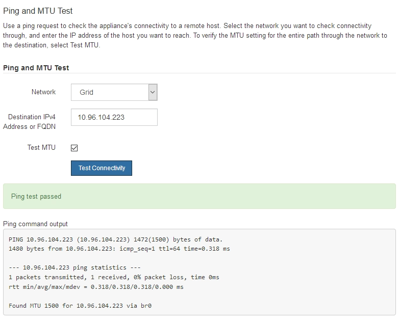

= ネットワーク接続を確認します
:allow-uri-read: 
:icons: font
:imagesdir: ../media/

[role="lead"]
使用する StorageGRID ネットワークに、アプライアンスからアクセスできることを確認する必要があります。ネットワークゲートウェイ経由のルーティングを検証するには、 StorageGRID アプライアンスインストーラと異なるサブネット上の IP アドレスとの接続をテストする必要があります。MTU 設定を確認することもできます。

.手順
. StorageGRID アプライアンスインストーラのメニューバーから、 *Configure Networking *>*Ping and MTU Test * をクリックします。
+
[Ping and MTU Test] ページが表示されます。

+
image::../media/ping_test_start.png[StorageGRID アプライアンスインストーラの ping および MTU テストオプションのスクリーンショット]

. [* ネットワーク *] ドロップダウンボックスから、テストするネットワークを選択します。グリッド、管理、またはクライアント。
. そのネットワーク上のホストの IPv4 アドレスまたは完全修飾ドメイン名（ FQDN ）を入力します。
+
たとえば、ネットワーク上のゲートウェイやプライマリ管理ノードに ping を送信できます。

. 必要に応じて、 * Test MTU * チェックボックスをオンにして、ネットワーク経由でデスティネーションへのパス全体の MTU 設定を確認します。
+
たとえば、アプライアンスノードと別のサイトのノードの間のパスをテストできます。

. [ 接続のテスト * ] をクリックします。
+
ネットワーク接続が有効な場合は、「 Ping test passed 」メッセージと ping コマンドの出力が表示されます。

+

.関連情報
xref:configuring-network-links-sg100-and-sg1000.adoc[ネットワークリンクの設定（ SG100 および SG1000 ）]

xref:changing-mtu-setting.adoc[MTU 設定を変更します]
