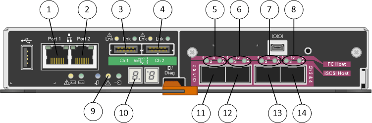

= ハードウェアの構成図
:icons: font
:imagesdir: ../media/

[role="lead"]
StorageGRID アプライアンス SG5612 と SG5660 の両モデルには、 E2700 コントローラと E5600SG コントローラが含まれています。次の図で、モデルとコントローラの違いを確認してください。

== モデル SG5612 2U ： E2700 コントローラと E5600SG コントローラの背面

|===
| コールアウト | 説明 

 a| 
1.
 a| 
E2700 コントローラ

 a| 
2.
 a| 
E5600SG コントローラ

|===

== モデル SG5660 4U ： E2700 コントローラと E5600SG コントローラの背面図

E2700 コントローラは E5600SG コントローラの上にあります。

image::../media/sg5660_4u_rear_view.gif[2 台のコントローラを備えた SG5660 の背面図]

|===
| コールアウト | 説明 

 a| 
1.
 a| 
E2700 コントローラ

 a| 
2.
 a| 
E5600SG コントローラ

|===

== E2700 コントローラの背面

image::../media/sga_controller_2700_diagram_callouts.gif[E2700 の構成図]

|===
| コールアウト | 説明 

 a| 
1.
 a| 
管理ポート 1 （ SANtricity Storage Manager がインストールされているネットワークに接続）

 a| 
2.
 a| 
管理ポート 2 （設置作業でラップトップへの接続に使用）

 a| 
3.
 a| 
SAS インターコネクトポート 1

 a| 
4.
 a| 
SAS インターコネクトポート 2

 a| 
5.
 a| 
シリアル接続ポート

 a| 
6.
 a| 
デジタル表示ディスプレイ

|===

NOTE: E2700 コントローラの背面にある「 Drive Expansion 」というラベルが付いた 2 つの SAS ポートは使用しません。StorageGRID アプライアンスでは拡張ドライブシェルフはサポートされません。

== E5600SG コントローラの背面

|===
| コールアウト | 説明 

 a| 
1.
 a| 
管理ポート 1 StorageGRID の管理ネットワークに接続します。

 a| 
2.
 a| 
管理ポート 2 のオプション：

* StorageGRID の管理ネットワークへの冗長接続を確保するには、管理ポート 1 とボンディングします。
* 一時的なローカルアクセス用（ IP 169.254.0.1 ）に空けておくことができます。
* DHCP によって割り当てられた IP アドレスを使用できない場合は、設置時の IP 設定に使用します。

 a| 
3.
 a| 
SAS インターコネクトポート 1

 a| 
4.
 a| 
SAS インターコネクトポート 2

 a| 
5.
 a| 
10GbE ネットワークポート 1 の障害 LED とアクティブ LED

 a| 
6.
 a| 
10GbE ネットワークポート 2 の障害 LED とアクティブ LED

 a| 
7.
 a| 
10GbE ネットワークポート 3 の障害 LED とアクティブ LED

 a| 
8.
 a| 
10GbE ネットワークポート 4 の障害 LED とアクティブ LED

 a| 
9.
 a| 
警告 LED が必要です

 a| 
10.
 a| 
デジタル表示ディスプレイ

 a| 
11.
 a| 
10GbE ネットワークポート 1

 a| 
12.
 a| 
10GbE ネットワークポート 2

 a| 
13
 a| 
10GbE ネットワークポート 3

 a| 
14
 a| 
10GbE ネットワークポート 4

|===

NOTE: StorageGRID アプライアンス E5600SG コントローラのホストインターフェイスカード（ HIC ）では、 10Gb のイーサネット接続のみがサポートされます。iSCSI 接続には使用できません。
