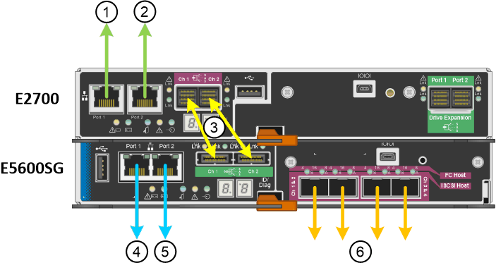

= SG5600 アプライアンスのネットワーク接続の確認
:allow-uri-read: 
:icons: font
:imagesdir: ../media/

[role="lead"]
StorageGRID アプライアンスを設置する前に、アプライアンスに接続できるネットワークを確認し、各コントローラのポートがどのように使用されるかを把握する必要があります。

== StorageGRID アプライアンスのネットワーク

StorageGRID アプライアンスをストレージノードとして導入する場合は、次のネットワークに接続できます。

* * StorageGRID のグリッドネットワーク * ：グリッドネットワークは、すべての内部 StorageGRID トラフィックに使用されます。このネットワークによって、グリッド内のすべてのノードが、すべてのサイトおよびサブネットにわたって相互に接続されます。グリッドネットワークは必須です。
* * StorageGRID の管理ネットワーク * ：管理ネットワークは、システムの管理とメンテナンスに使用するクローズドネットワークです。管理ネットワークは通常はプライベートネットワークであり、サイト間でルーティング可能にする必要はありません。管理ネットワークはオプションです。
* * StorageGRID のクライアントネットワーク * ：クライアントネットワークは、 S3 や Swift などのクライアントアプリケーションへのアクセスを提供するために使用されるオープンネットワークです。クライアントネットワークはグリッドへのクライアントプロトコルアクセスを提供するため、グリッドネットワークを分離してセキュリティを確保できます。クライアントネットワークはオプションです。
* * SANtricity Storage Manager 用の管理ネットワーク * （オプション）： E2700 コントローラは、 SANtricity Storage Manager がインストールされている管理ネットワークに接続します。これにより、アプライアンス内のハードウェアコンポーネントの監視と管理が可能になります。この管理ネットワークは、 StorageGRID の管理ネットワークと同じにすることも、独立した管理ネットワークにすることもできます。
+
オプションの SANtricity Storage Manager ネットワークが接続されていないと、 SANtricity の一部の機能を使用できない場合があります。

NOTE: StorageGRID ネットワークの詳細については、 _ グリッド入門 _ を参照してください。

== StorageGRID アプライアンスの接続

StorageGRID アプライアンスを設置するときは、 2 台のコントローラを相互に接続するとともに、必要なネットワークに接続する必要があります。この図は、 E2700 コントローラを上部に、 E5600SG コントローラを下部に配置した SG5660 の 2 台のコントローラを示しています。SG5612 では、 E2700 コントローラは E5600SG コントローラの左側にある。

|===
| 項目 | ポート | ポートのタイプ | 機能 

 a| 
1.
 a| 
E2700 コントローラの管理ポート 1
 a| 
1Gb （ RJ-45 ）イーサネット
 a| 
E2700 コントローラを、 SANtricity Storage Manager がインストールされているネットワークに接続します。

 a| 
2.
 a| 
E2700 コントローラの管理ポート 2
 a| 
1Gb （ RJ-45 ）イーサネット
 a| 
設置時に E2700 コントローラをサービスラップトップに接続します。

 a| 
3.
 a| 
各コントローラの 2 つの SAS インターコネクトポート、 Ch 1 および Ch 2
 a| 
E2700 コントローラ： Mini-SAS - HD

E5600SG コントローラ： Mini-SAS
 a| 
2 台のコントローラを相互に接続します。

 a| 
4.
 a| 
E5600SG コントローラの管理ポート 1
 a| 
1Gb （ RJ-45 ）イーサネット
 a| 
E5600SG コントローラを StorageGRID の管理ネットワークに接続します。

 a| 
5.
 a| 
E5600SG コントローラの管理ポート 2
 a| 
1Gb （ RJ-45 ）イーサネット
 a| 
* 管理ネットワークへの冗長接続が必要な場合は、管理ポート 1 とボンディングできます。
* 一時的なローカルアクセス用（ IP 169.254.0.1 ）に空けておくことができます。
* DHCP によって割り当てられた IP アドレスを使用できない場合、設置時に E5600SG コントローラをサービスラップトップに接続するために使用できます。

 a| 
6.
 a| 
E5600SG コントローラの 4 つのネットワークポート
 a| 
10GbE （光ファイバ）
 a| 
StorageGRID のグリッドネットワークおよびクライアントネットワークに接続します。「 E5600SG コントローラでの 10 GbE ポート接続」を参照してください。

|===
xref:port-bond-modes-for-e5600sg-controller-ports.adoc[E5600SG コントローラポートのポートボンディングモード]

xref:gathering-installation-information-sg5600.adoc[設置情報の収集（ SG5600 ）]

xref:cabling-appliance-sg5600.adoc[ケーブルアプライアンス（ SG5600 ）]

xref:../network/index.adoc[ネットワークのガイドライン]

xref:../vmware/index.adoc[VMware をインストールする]

xref:../rhel/index.adoc[Red Hat Enterprise Linux または CentOS をインストールします]

xref:../ubuntu/index.adoc[Ubuntu または Debian をインストールします]
