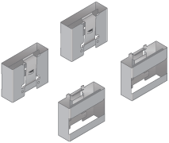

= 開梱（ SG5600 ）
:icons: font
:imagesdir: ../media/

[role="lead"]
StorageGRID アプライアンスを設置する前にすべて開梱し、内容物を納品書の項目と比較します。

* * 60 ドライブを搭載した 4U シャーシ * SG5660 エンクロージャ
+
image::../media/appliance_enclosure.gif[4U エンクロージャです]

* * SG5612 エンクロージャは 12 ドライブ * の 2U シャーシ
+
image::../media/appliance_enclosure_2u.gif[DE1600 2U シャーシ]

* *4U ベゼルまたは 2U エンドキャップ *
+
image:../media/appliance_bezel.gif["4U ベゼル"] image:../media/appliance_bezel_2u_endcaps.gif["2U エンドキャップ"]

* * NL-SAS ドライブ *
+
image::../media/appliance_drive.gif[ドライブ]

+
2U SG5612 にはドライブがあらかじめ取り付けられていますが、安全性を確保するために SG5660 は 4U には取り付けません。

* * E5600SG コントローラ *
+
image::../media/sga_controller_5600_diagram.gif[E5600 コントローラ]

* * E2700 コントローラ *
+
image::../media/sga_controller_2700_diagram.gif[E2700 コントローラ]

* * 取り付けレールとネジ *
+
image::../media/appliance_mounting_rail_kit.png[取り付け用のレールキット]

* * エンクロージャハンドル（ 4U エンクロージャのみ） *
+

== ケーブルとコネクタ

StorageGRID アプライアンスには、出荷時に次のケーブルとコネクタが付属しています。

* * お住まいの国の電源コード *
+
image::../media/appliance_power_cords.gif[電源コード]

+
コンセントなどの外部電源に接続するための AC 電源コードが 2 本付属しています。キャビネットによっては、アプライアンスに付属している電源コードではなく特別な電源コードを使用する場合があります。

* * SAS インターコネクトケーブル *
+
image::../media/appliance_mini_sas_cables.gif[Mini SAS ケーブル]

+
mini-SAS-HD コネクタと mini-SAS コネクタが付いた 0.5m の SAS インターコネクトケーブル 2 本。

+
正方形のコネクタは E2700 コントローラに、長方形のコネクタは E5600SG コントローラに接続します。

