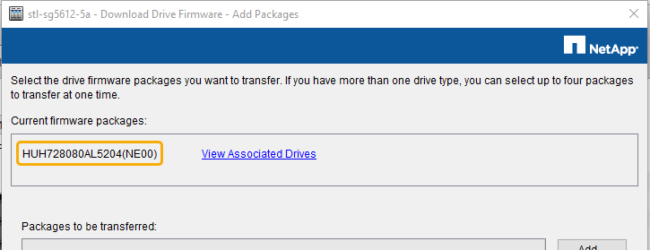

= SANtricity Storage Manager を使用してドライブファームウェアをアップグレードします
:allow-uri-read: 
:icons: font
:imagesdir: ../media/

[role="lead"]
ドライブファームウェアをアップグレードして、最新の機能とバグ修正をすべて適用します。

.必要なもの
* ストレージアプライアンスのステータスが「最適」であることを確認します。
* すべてのドライブのステータスが最適な状態である必要があります
* 最新バージョンの SANtricity Storage Manager がインストールされていて、 StorageGRID のバージョンと互換性があることを確認しておきます。
+
xref:upgrading-santricity-os-on-storage-controllers-using-grid-manager-sg5600.adoc[Grid Manager を使用してストレージコントローラの SANtricity OS をアップグレード]

+
xref:upgrading-santricity-os-on-e2700-controller-using-maintenance-mode.adoc[E2700 コントローラで、メンテナンスモードを使用して SANtricity OS をアップグレードします]

* これで完了です xref:placing-appliance-into-maintenance-mode.adoc[StorageGRID アプライアンスをメンテナンスモードにしました]。
+

NOTE: 保守モードでは、ストレージコントローラへの接続が中断され、すべての I/O アクティビティが停止されて、すべてのドライブがオフラインになります。

IMPORTANT: 一度に複数の StorageGRID アプライアンスでドライブファームウェアをアップグレードしないでください。お使いの導入モデルや ILM ポリシーによっては、原因 データを使用できなくなる場合があります。

.手順
. アプライアンスがに接続されていることを確認します xref:placing-appliance-into-maintenance-mode.adoc[メンテナンスモード]。
. Web ブラウザを開き、 SANtricity Storage Manager:+`*https://_E2700_Controller_IP_*` の URL として IP アドレスを入力します
. 必要に応じて、 SANtricity Storage Manager 管理者のユーザ名とパスワードを入力します。
. SANtricity エンタープライズ管理で、 * デバイス * タブを選択します。
+
SANtricity Array Management （アレイ管理）ウィンドウが開きます。

. SANtricity アレイ管理で、アップグレードするドライブが格納されているストレージアレイをダブルクリックします。
. ストレージアレイとドライブの両方のステータスが最適であることを確認します。
. ストレージアプライアンスに現在インストールされているドライブファームウェアのバージョンを確認します。
+
.. SANtricity Enterprise Management から、 * Upgrade * > * Drive Firmware * を選択します。
+
Download Drive Firmware - Add Packages （ドライブファームウェアのダウンロード - パッケージの追加）ウィンドウに、現在使用中のドライブファームウェアファイルが表示されます。

.. 現在のファームウェアパッケージに含まれているドライブファームウェアのリビジョンとドライブ ID をメモします。
+

+
次の例では、

+
*** ドライブファームウェアのリビジョンは * NE00 * です。
*** ドライブ識別子は * HUH7280AL5204 * です。

+
View associated Drives * を選択して、ストレージアプライアンス内のドライブの位置を表示します。

. 使用可能なドライブファームウェアのアップグレードをダウンロードして準備します。
+
.. Web ブラウザを開き、ネットアップサポート Web サイトにアクセスして、 ID とパスワードを使用してログインします。
+
https://["ネットアップサポート"^]

.. ネットアップサポート Web サイトで、「 * Downloads * 」タブを選択し、「 * E-Series Disk Drive Firmware * 」を選択します。
+
E-Series Disk Firmware ページが表示されます。

.. ストレージアプライアンスにインストールされているドライブ識別子 * をそれぞれ検索し、各ドライブ識別子に最新のファームウェアリビジョンが適用されていることを確認します。
+
*** ファームウェアリビジョンがリンクでない場合、このドライブ識別子には最新のファームウェアリビジョンが含まれます。
*** ドライブ識別子が記載されたドライブのパーツ番号が 1 つ以上であれば、それらのドライブでファームウェアのアップグレードを実行できます。任意のリンクを選択してファームウェアファイルをダウンロードできます。
+
image::../media/sg_storage_mgr_download_drive_firmware.png[E シリーズディスクファームウェアのページです]

.. 新しいファームウェアリビジョンがリストされている場合は、ファームウェアリビジョンのリンクを選択します( ダウンロード ) 列をクリックして ' ファームウェア・ファイルを含む .zip アーカイブをダウンロードします
.. サポートサイトからダウンロードしたドライブファームウェアのアーカイブファイルを展開（解凍）します。

. ドライブファームウェアのアップグレードをインストールします。
+
.. SANtricity ストレージ・マネージャの [ ドライブ・ファームウェアのダウンロード - パッケージの追加 ] ウィンドウで '[* 追加 ] を選択します
.. ファームウェアファイルが保存されているディレクトリに移動し、最大 4 つのファームウェアファイルを選択します。
+
ドライブファームウェアファイルのファイル名は、 +`D_HCUC101212CSS600_30602291_MS01_2800_0002.dll' のようになります

+
複数のファームウェアファイルを選択して同じドライブのファームウェアをアップグレードすると、ファイルの競合エラーが発生することがあります。ファイルの競合エラーが発生した場合は、エラーダイアログが表示されます。このエラーを解決するには、 [OK] を選択し、ドライブのファームウェアのアップグレードに使用する以外のファームウェアファイルをすべて削除します。ファームウェアファイルを削除するには、転送するパッケージ情報領域でファームウェアファイルを選択し、 * 削除 * を選択します。また、一度に選択できるドライブファームウェアパッケージは最大 4 つです。

.. 「 * OK 」を選択します。
+
選択したファームウェアファイルで転送されるパッケージがアップデートされ、情報領域が更新されます。

.. 「 * 次へ * 」を選択します。
+
[Download Drive Firmware - Select Drives] ウィンドウが開きます。

+
*** アプライアンス内のすべてのドライブで、設定情報とアップグレードの可否がスキャンされます。
*** 選択したファームウェアでアップグレード可能な互換性があるドライブ（ストレージアレイのドライブの種類によって異なる）が表示されます。デフォルトでは、オンライン処理としてアップグレード可能なドライブが表示されます。
*** ドライブに対して選択したファームウェアが、推奨されるファームウェア情報領域に表示されます。ファームウェアを変更する必要がある場合は、前のダイアログに戻るには、「 * 戻る」を選択します。

.. ドライブアップグレード機能から、 * パラレル * ダウンロード操作または * すべて * を選択します。
+
アプライアンスがメンテナンスモードになっていて、すべてのドライブとすべてのボリュームの I/O アクティビティが停止されているため、これらのアップグレード方式のいずれかを使用できます。

.. 互換性のあるドライブで、選択したファームウェアファイルをアップグレードするドライブを選択します。
+
*** ドライブを 1 つ以上アップグレードする場合は、各ドライブを選択します。
*** 互換性のあるすべてのドライブについて、 * すべて選択 * を選択します。
+
ベストプラクティスとして、同じモデルのドライブをすべて同じファームウェアリビジョンにアップグレードすることを推奨します。

.. 「完了」を選択し、「はい」と入力して「 * OK 」を選択します。
+
*** ドライブファームウェアのダウンロードとアップグレードが開始され、すべてのドライブのファームウェア転送のステータスが Download Drive Firmware - Progress で示されます。
*** アップグレードに参加している各ドライブのステータスが、更新されたデバイスの転送の進行状況列に表示されます。
+
24 ドライブのシステムですべてのドライブがアップグレードされている場合は、ドライブファームウェアの並行アップグレード処理が完了するまでに最大 90 秒かかることがあります。大規模なシステムでは、実行時間が少し長くなります。

.. ファームウェアのアップグレードプロセスでは、 + を実行できます
+
*** [* Stop] を選択して、進行中のファームウェアのアップグレードを停止します。実行中のファームウェアのアップグレードが完了します。ファームウェアアップグレードを試行したドライブには、それぞれのステータスが表示されます。残りのドライブのステータスが「 Not Attempted 」と表示されます。
+

IMPORTANT: ドライブファームウェアのアップグレードプロセスを停止すると、データが失われたり、ドライブを使用できなくなったりする可能性があります。

*** [ 名前を付けて保存 ] を選択して、ファームウェアアップグレードの進行状況の概要に関するテキストレポートを保存します。レポートは、デフォルトの .log ファイル拡張子で保存されます。ファイル拡張子またはディレクトリを変更する場合は、 [Save Drive Download Log] でパラメータを変更します。

.. ドライブファームウェアのダウンロード - 進捗状況を監視します。ドライブの更新領域には、ファームウェアのアップグレードが予定されているドライブのリストと、各ドライブのダウンロードおよびアップグレードの転送ステータスが表示されます。
+
アップグレードに参加している各ドライブの進捗状況とステータスが Transfer Progress 列に表示されます。アップグレード中にエラーが発生した場合は、推奨される対処方法を実行します。

+
*** * 保留中 *
+
スケジュールされているがまだ開始されていないオンラインファームウェアダウンロード処理の場合は、このステータスが表示されます。

*** * 実行中 *
+
ファームウェアをドライブに転送しています。

*** * 再構成を実行中 *
+
このステータスは、ドライブの高速再構築中にボリューム転送が実行された場合に表示されます。コントローラのリセットまたは障害が原因で、コントローラ所有者がボリュームを転送している場合が一般的です。

+
ドライブの完全な再構築が開始されます。

*** * 失敗 - 一部 *
+
問題が発生して残りのファイルを転送できなくなるまで、ファームウェアはドライブに一部だけ転送されました。

*** * 失敗 - 無効な状態 *
+
ファームウェアが無効です。

*** * 失敗 - その他 *
+
ドライブの物理的な問題が原因で、ファームウェアをダウンロードできませんでした。

*** * 未試行 *
+
ファームウェアがダウンロードされませんでした。ダウンロードが停止してからアップグレードを実行できなかった、ドライブがアップグレードの対象にならなかった、エラーが原因でダウンロードができなかったなどのさまざまな理由が原因である可能性があります。

*** * 成功 *
+
ファームウェアが正常にダウンロードされました。

. ドライブファームウェアのアップグレードが完了したら、次の手順を実行
+
** ドライブファームウェアダウンロードウィザードを閉じるには、 * 閉じる * を選択します。
** ウィザードを再開するには、 * 転送詳細 * を選択します。

. この手順 が正常に完了し、ノードを保守モードにしている間に実行する追加の手順がある場合は、すぐに実行します。処理が完了した場合、または何らかの障害が発生して最初からやり直したい場合は、 * Advanced * > * Reboot Controller * を選択し、次のいずれかのオプションを選択します。
+
** [Reboot into StorageGRID （の再起動） ] を選択します
** メンテナンスモードを維持したままコントローラをリブートするには、 * Reboot into Maintenance Mode * を選択します。手順 で障害が発生したために最初からやり直す場合は、このオプションを選択します。ノードのリブートが完了したら、障害が発生した手順 の該当する手順から再起動します。
+
image::../media/reboot_controller_from_maintenance_mode.png[コントローラをメンテナンスモードでリブートします]

+
アプライアンスがリブートしてグリッドに再参加するまでに最大 20 分かかることがあります。リブートが完了し、ノードが再びグリッドに参加したことを確認するには、 Grid Manager に戻ります。ノード * ページには、アプライアンスノードの正常なステータス（ノード名の左側にアイコンが表示されない）が表示されます。これは、アクティブなアラートがなく、ノードがグリッドに接続されていることを示します。

+
image::../media/node_rejoin_grid_confirmation.png[アプライアンスノードがグリッドに再参加しました]

