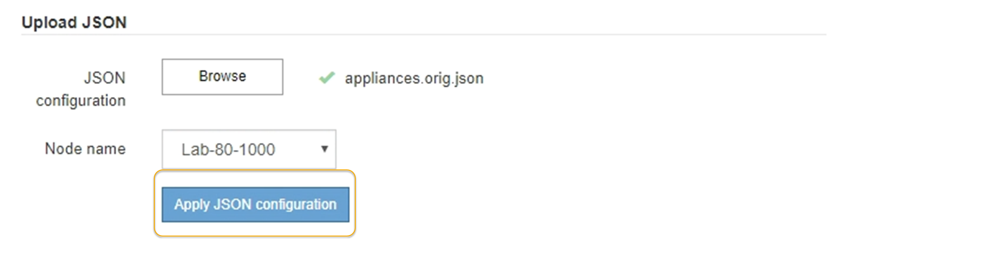

= StorageGRID アプライアンスインストーラを使用してアプライアンスの設定を自動化する
:allow-uri-read: 
:icons: font
:imagesdir: ../media/

[role="lead"]
設定情報を含む JSON ファイルを使用して、アプライアンスの設定を自動化することができます。ファイルは StorageGRID アプライアンスインストーラを使用してアップロードします。

.必要なもの
* アプライアンスは、 StorageGRID 11.5 以降と互換性のある最新のファームウェアを使用している必要があります。
* を使用して設定するアプライアンスで StorageGRID アプライアンスインストーラに接続する必要があります xref:../admin/web-browser-requirements.adoc[サポートされている Web ブラウザ]。

.このタスクについて
次の設定など、アプライアンスの設定作業を自動化することができます。

* グリッドネットワーク、管理ネットワーク、およびクライアントネットワークの IP アドレス
* BMC インターフェイス
* ネットワークリンク
+
** ポートボンディングモード
** ネットワークボンディングモード
** リンク速度

アップロードした JSON ファイルを使用してアプライアンスを設定する方が、 StorageGRID アプライアンスインストーラの複数のページを使用して手動で設定を行うよりも効率的です。特に、多数のノードを設定する必要がある場合は効果的です。構成ファイルはノードごとに 1 つずつ適用する必要があります。

NOTE: アプライアンスのインストールと設定の両方を自動化したい経験のあるユーザは、「 configure -sSGA .py 」スクリプトを使用できます。[+]xref:automating-installation-configuration-appliance-nodes-configure-sga-py-script.adoc[configure-sga.py スクリプトを使用して、アプライアンスノードのインストールと設定を自動化します]

.手順
. 次のいずれかの方法で JSON ファイルを生成します。
+
** ConfigBuilder アプリケーション
+
https://["ConfigBuilder.netapp.com"^]

** configure -SGA .py アプライアンスの構成スクリプトスクリプトは、 StorageGRID アプライアンスインストーラ（ * Help * > * アプライアンス構成スクリプト * ）からダウンロードできます。configure-sga.py スクリプトを使用して設定を自動化する手順を参照してください。
+
xref:automating-installation-configuration-appliance-nodes-configure-sga-py-script.adoc[configure-sga.py スクリプトを使用して、アプライアンスノードのインストールと設定を自動化します]

+
JSON ファイル内のノード名は、次の要件に従う必要があります。

+
*** 1 文字以上 32 文字以下の有効なホスト名を指定する必要があります
*** アルファベット、数字、およびハイフンを使用できます
*** 1 文字目または最後の文字をハイフンにすることはできません
*** 数字だけを含めることもできません
+

IMPORTANT: JSON ファイル内のノード名（最上位の名前）が一意であることを確認してください。一意でないと、 JSON ファイルを使用して複数のノードを設定できません。

. 「 * Advanced * > * Update Appliance Configuration * 」を選択します。
+
[Update Appliance Configuration] ページが表示されます。

+
image::../media/update_appliance_configuration.png[アプライアンス設定ページを更新します]

. アップロードする設定の JSON ファイルを選択します。
+
.. [ * 参照 * ] を選択します。
.. ファイルを探して選択します。
.. 「 * 開く * 」を選択します。
+
ファイルがアップロードされて検証されます。検証プロセスが完了すると、ファイル名が緑色のチェックマークの横に表示されます。

+

IMPORTANT: JSON ファイルの構成に「 link_config 」、「 networks 」、またはその両方のセクションが含まれている場合は、アプライアンスへの接続が失われる可能性があります。1 分以内に再接続されない場合は、アプライアンスに割り当てられている他の IP アドレスのいずれかを使用して、アプライアンスの URL を再入力します。

+
image::../media/update_appliance_configuration_valid_json.png[アプライアンス設定の JSON がアップロードされました]

+
ノード名 * ドロップダウンには、 JSON ファイルで定義された最上位のノード名が表示されます。

+

NOTE: ファイルが有効でない場合、ファイル名は赤色で表示され、黄色のバナーにエラーメッセージが表示されます。無効なファイルはアプライアンスに適用されません。ConfigBuilder を使用して、有効な JSON ファイルを作成できます。

. ノード名 * ドロップダウンのリストからノードを選択します。
+
Apply JSON configuration * ボタンが有効になっている。

+

. Apply JSON configuration * を選択します。
+
選択したノードに構成が適用されます。

