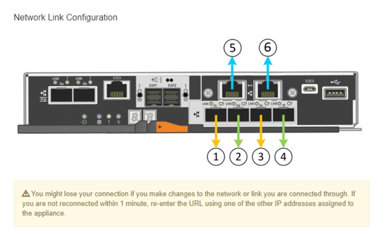
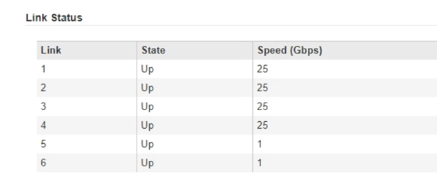
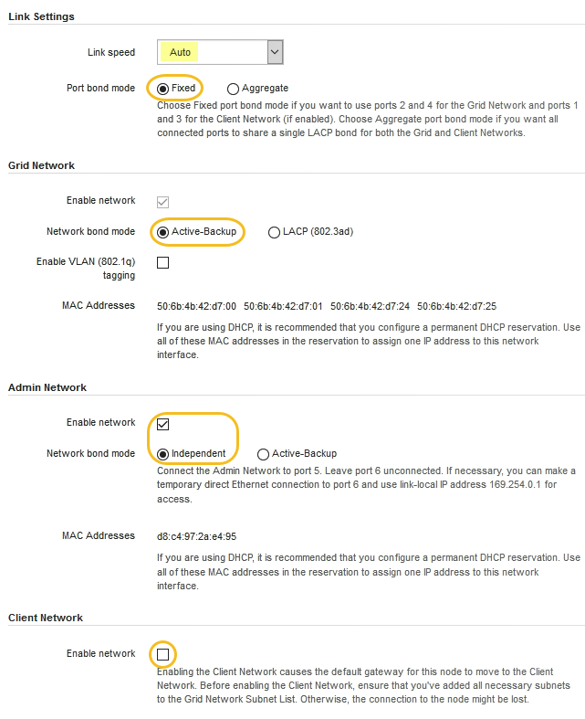
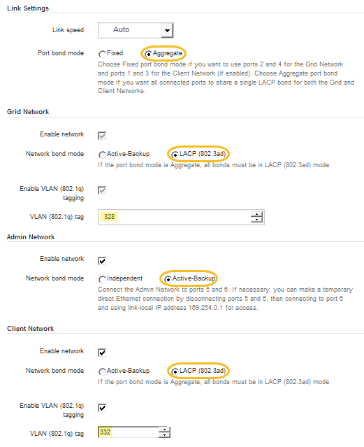

= ネットワークリンクの設定（ SG5700 ）
:allow-uri-read: 
:icons: font
:imagesdir: ../media/

[role="lead"]
アプライアンスをグリッドネットワーク、クライアントネットワーク、および管理ネットワークに接続するために使用するポートのネットワークリンクを設定できます。リンク速度およびポートボンディングモードとネットワークボンディングモードを設定できます。

.必要なもの
10 / 25GbE ポートに 25GbE のリンク速度を使用する場合は、次の要件があります。

* 使用するポートに SFP28 トランシーバを取り付けておきます。
* この速度をサポートするスイッチにポートを接続しておきます。
* この速度を使用するようにスイッチを設定する方法を理解しておきます。

10 / 25GbE ポートにアグリゲートポートボンディングモード、 LACP ネットワークボンディングモード、または VLAN タギングを使用する場合は、次の要件があります。

* アプライアンスのポートを、 VLAN と LACP をサポートするスイッチに接続しておきます。
* 複数のスイッチを LACP ボンドに加える場合は、 Multi-Chassis Link Aggregation （ MLAG ）グループまたは同等の機能をサポートするスイッチを使用します。
* VLAN 、 LACP 、 MLAG などを使用するようにスイッチを設定する方法について理解しておく必要があります。
* 各ネットワークに使用する一意の VLAN タグを確認しておきます。この VLAN タグが各ネットワークパケットに追加され、ネットワークトラフィックが正しいネットワークにルーティングされます。
* 管理ネットワークにアクティブ / バックアップモードを使用する場合は、コントローラの両方の管理ポートにイーサネットケーブルを接続しておきます。

.このタスクについて
次の図では、 4 つの 10 / 25GbE ポートが Fixed ポートボンディングモードでボンディングされています（デフォルトの構成）。

image::../media/e5700sg_fixed_port.gif[E5700SG コントローラの 10 / 25GbE ポートが固定モードでボンディングされた状態を示す図]

|===
| コールアウト | ボンディングされるポート 

 a| 
C
 a| 
このネットワークを使用する場合、ポート 1 とポート 3 がクライアントネットワーク用にボンディングされます。

 a| 
G
 a| 
ポート 2 とポート 4 がグリッドネットワーク用にボンディングされます。

|===
次の図では、 4 つの 10 / 25GbE ポートがアグリゲートポートボンディングモードでボンディングされています。

image::../media/e5700sg_aggregate_port.gif[E5700SG コントローラの 10 / 25GbE ポートがアグリゲートモードでボンディングされた状態を示す図]

|===
| コールアウト | ボンディングされるポート 

 a| 
1.
 a| 
4 つのポートすべてを 1 つの LACP ボンドにグループ化して、すべてのポートをグリッドネットワークとクライアントネットワークのトラフィックに使用できるようにします。

|===
次の表に、 4 つの 10 / 25GbE ポートを設定するためのオプションをまとめます。デフォルトの設定は太字で示しています。デフォルト以外の設定を使用する場合にのみ、 Link Configuration ページで設定を行う必要があります。

* * 固定（デフォルト）ポートボンディングモード *
+
|===
| ネットワークボンディングモード | クライアントネットワークが無効な場合（デフォルト） | クライアントネットワークが有効になりました 

 a| 
Active-Backup （デフォルト）
 a| 
** ポート 2 と 4 がグリッドネットワークにアクティブ / バックアップボンドを使用します。
** ポート 1 と 3 は使用されません。
** VLAN タグはオプションです。

 a| 
** ポート 2 と 4 がグリッドネットワークにアクティブ / バックアップボンドを使用します。
** ポート 1 と 3 がクライアントネットワークに Active-Backup ボンドを使用します。
** 両方のネットワークにVLANタグを指定できます。

 a| 
LACP （ 802.3ad ）
 a| 
** ポート 2 と 4 がグリッドネットワークに LACP ボンドを使用します。
** ポート 1 と 3 は使用されません。
** VLAN タグはオプションです。

 a| 
** ポート 2 と 4 がグリッドネットワークに LACP ボンドを使用します。
** ポート 1 と 3 がクライアントネットワークに LACP ボンドを使用します。
** 両方のネットワークにVLANタグを指定できます。

|===
* * アグリゲートポートボンディングモード *
+
|===
| ネットワークボンディングモード | クライアントネットワークが無効な場合（デフォルト） | クライアントネットワークが有効になりました 

 a| 
LACP （ 802.3ad ）のみ
 a| 
** ポート 1~4 がグリッドネットワークに単一の LACP ボンドを使用します。
** 単一の VLAN タグでグリッドネットワークのパケットが識別されます。

 a| 
** ポート 1~4 がグリッドネットワークとクライアントネットワークに単一の LACP ボンドを使用します。
** 2 つの VLAN タグで、グリッドネットワークのパケットとクライアントネットワークのパケットを分離できます。

|===

ポートボンディングモードとネットワークボンディングモードの詳細については、 E5700SG コントローラでの 10 / 25GbE ポートの接続に関する情報を参照してください。

この図では、 E5700SG コントローラの 2 つの 1GbE 管理ポートが管理ネットワーク用に Active-Backup ネットワークボンディングモードでボンディングされています。

image::../media/e5700sg_bonded_management_ports.gif[SG6000 のボンディングされた管理ポート]

.手順
. StorageGRID アプライアンスインストーラのメニューバーから、 *Configure Networking *>*Link Configuration * をクリックします。
+
Network Link Configuration ページには、アプライアンスの図と、ネットワークポートおよび管理ポートの番号が表示されます。

+

+
Link Status テーブルには、番号が付けられたポートのリンクステート（アップ / ダウン）と速度（ 1/10/25 / 40/100Gbps ）が表示されます。

+

+
このページに初めてアクセスしたときの動作は次のとおりです。

+
** * リンク速度 * は * 10GbE * に設定されています。
** * ポートボンディングモード * は「 * Fixed 」に設定されます。
** * グリッドネットワークのネットワークボンディングモード * が「アクティブ / バックアップ」に設定されています。
** 管理ネットワーク * が有効になっており、ネットワークボンディングモードが * Independent * に設定されています。
** クライアントネットワーク * が無効になっています。
+

. 10 / 25GbE ポートに 25GbE のリンク速度を使用する場合は、リンク速度のドロップダウンリストから * 25GbE * を選択します。
+
グリッドネットワークとクライアントネットワークに使用するネットワークスイッチも、この速度をサポートし、この速度に対応するように設定する必要があります。ポートに SFP28 トランシーバを取り付ける必要があります。

. 使用する StorageGRID ネットワークを有効または無効にします。
+
グリッドネットワークは必須です。このネットワークは無効にできません。

+
.. アプライアンスが管理ネットワークに接続されていない場合は、管理ネットワークの * ネットワークを有効にする * チェックボックスの選択を解除します。
+
image::../media/admin_network_disabled.gif[管理ネットワークを有効または無効にするチェックボックスを示すスクリーンショット]

.. アプライアンスがクライアントネットワークに接続されている場合は、クライアントネットワークの * ネットワークを有効にする * チェックボックスをオンにします。
+
これで、 10 / 25GbE ポートでのクライアントネットワークの設定が表示されます。

. 表を参照して、ポートボンディングモードとネットワークボンディングモードを設定します。
+
この例では、次のように

+
** * グリッドネットワークとクライアントネットワークでアグリゲート * と * LACP * が選択されました。各ネットワークに一意の VLAN タグを指定する必要があります。値は 0~4095 の間で選択できます。
** * 管理ネットワーク用に選択されたアクティブ / バックアップ * 。
+

. 選択に問題がなければ、 * 保存 * をクリックします。
+

NOTE: 接続しているネットワークまたはリンクを変更すると、接続が失われる可能性があります。1 分以内に再接続されない場合は、アプライアンスに割り当てられている他の IP アドレスのいずれかを使用して、 StorageGRID アプライアンス・インストーラの URL を再入力します。 +`*https://_E5700SG_Controller_IP_:8443*`

.関連情報
xref:port-bond-modes-for-e5700sg-controller-ports.adoc[E5700SG コントローラポートのポートボンディングモード]
