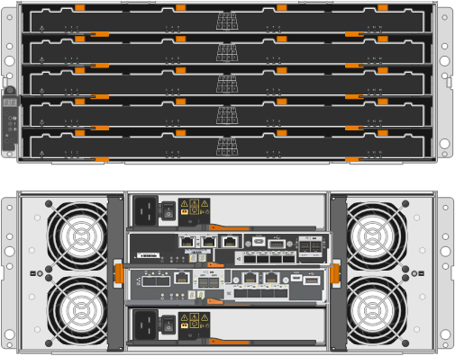

= StorageGRID SG5700 アプライアンスの概要
:allow-uri-read: 
:icons: font
:imagesdir: ../media/

[role="lead"]
SG5700 StorageGRID アプライアンスは、 StorageGRID グリッドにおいてストレージノードとして機能する、ストレージとコンピューティングを統合したプラットフォームです。アプライアンスは、アプライアンスストレージノードと仮想（ソフトウェアベース）ストレージノードを組み合わせたハイブリッドグリッド環境で使用できます。

StorageGRID SG5700シリーズアプライアンスには次のような特長があります。

* StorageGRID ストレージノードのストレージ要素とコンピューティング要素を統合します。
* ストレージノードの導入と設定を簡易化するために、 StorageGRID アプライアンスインストーラが搭載されています。
* ハードウェアの管理と監視に使用する E シリーズ SANtricity System Manager が搭載されています。
* StorageGRID のグリッドネットワークとクライアントネットワークとの 10GbE または 25GbE 接続を最大 4 つサポートします。
* Full Disk Encryption（FDE）ドライブまたは連邦情報処理標準（FIPS）ドライブがサポートされます。これらのドライブを SANtricity System Manager のドライブセキュリティ機能と併用すると、データへの不正アクセスを防止できます。

SG5700アプライアンスには、SG5712とSG5712、SG5712、SG5760とSG5712、SG5712の60Xの4つのモデルがあります。ストレージコントローラのインターコネクトポートの場所を除き、SG5712とSG5712の機能に違いはありません。同様に、SG5760とSG5760Xには、ストレージコントローラ上のインターコネクトポートの場所を除き、仕様や機能に違いはありません。

モデルには次のコンポーネントが含まれています。

[cols="1a,2a,3a,4a,5a"]
|===
| コンポーネント | SG5712 | SG5712X | SG5760 | SG5760X 

 a| 
コンピューティングコントローラ
 a| 
E5700SG コントローラのものです
 a| 
E5700SG コントローラのものです
 a| 
E5700SG コントローラのものです
 a| 
E5700SG コントローラのものです

 a| 
ストレージコントローラ
 a| 
E2800Aコントローラ
 a| 
E2800Bコントローラ
 a| 
E2800Aコントローラ
 a| 
E2800Bコントローラ

 a| 
シャーシ
 a| 
E シリーズ DE212C エンクロージャ： 2 ラックユニット（ 2U ）エンクロージャ
 a| 
E シリーズ DE212C エンクロージャ： 2 ラックユニット（ 2U ）エンクロージャ
 a| 
E シリーズ DE460C エンクロージャ： 4 台のラックユニット（ 4U ）エンクロージャ
 a| 
E シリーズ DE460C エンクロージャ： 4 台のラックユニット（ 4U ）エンクロージャ

 a| 
ドライブ
 a| 
12 本の NL-SAS ドライブ（ 3.5 インチ）
 a| 
12 本の NL-SAS ドライブ（ 3.5 インチ）
 a| 
60 本の NL-SAS ドライブ（ 3.5 インチ）
 a| 
60 本の NL-SAS ドライブ（ 3.5 インチ）

 a| 
冗長電源装置とファン
 a| 
電源 / ファンキャニスター × 2
 a| 
電源 / ファンキャニスター × 2
 a| 
2 つの電源キャニスターと 2 つのファンキャニスター
 a| 
2 つの電源キャニスターと 2 つのファンキャニスター

|===
StorageGRID アプライアンスで使用可能な最大物理ストレージは、各エンクロージャ内のドライブの数に応じて決まっています。ドライブを増設したシェルフを追加してストレージを拡張することはできません。

== モデルSG5712および5712X

この図はSG5712とSG5712 12SG5712の前面と背面を示しています。SG5712とSG5712は、12本のドライブを搭載した2Uエンクロージャです。

*SG5712前面および背面図*

image::../media/sg5712_front_and_back_views.gif[SG5712 アプライアンスの前面と背面]

SG5712 には、 2 台のコントローラと 2 つの電源 / ファンキャニスターが含まれています。

*SG5712コンポーネント*

image::../media/sg5712_with_callouts.gif[SG5712 アプライアンスのコントローラと電源 / ファンキャニスター]

[cols="1a,2a"]
|===
| コールアウト | 説明 

 a| 
1.
 a| 
E2800Aコントローラ（ストレージコントローラ）

 a| 
2.
 a| 
E5700SG コントローラ（コンピューティングコントローラ）

 a| 
3.
 a| 
電源 / ファンキャニスター

|===
* SG5712X前面および背面*

image::../media/sg5712x_front_and_back_views.gif[SG5712Xアプライアンスの前面および背面です]

SG5712Xには、2つのコントローラと2つの電源/ファンキャニスターが搭載されています。

*SG5712Xコンポーネント*

image::../media/sg5712x_with_callouts.gif[SG5712Xアプライアンスのコントローラと電源/ファンキャニスター]

[cols="1a,2a"]
|===
| コールアウト | 説明 

 a| 
1.
 a| 
E2800Bコントローラ（ストレージコントローラ）

 a| 
2.
 a| 
E5700SG コントローラ（コンピューティングコントローラ）

 a| 
3.
 a| 
電源 / ファンキャニスター

|===

== モデルSG5760およびSG5712

この図は、SG5760モデルとSG5712 60Xモデルの前面と背面を示しています。この4Uエンクロージャは、5つのドライブドロワーに60本のドライブを搭載します。

* SG5760の前面と背面*

image::../media/sg5760_front_and_back_views.gif[SG5760 アプライアンスの前面と背面です]

SG5760 には、コントローラ 2 台、ファンキャニスター 2 台、電源キャニスター 2 台が搭載されています。

* SG5760のコンポーネント*

image::../media/sg5760_with_callouts.gif[コントローラ,fan canisters,and power canisters in SG5760 appliance]

[cols="1a,2a"]
|===
| コールアウト | 説明 

 a| 
1.
 a| 
E2800Aコントローラ（ストレージコントローラ）

 a| 
2.
 a| 
E5700SG コントローラ（コンピューティングコントローラ）

 a| 
3.
 a| 
ファンキャニスター（ 2 つのうちの 1 つ）

 a| 
4.
 a| 
電源キャニスター（ 2 つのうちの 1 つ）

|===
*SG5760X前面および背面*

SG5760Sには、2台のコントローラ、2つのファンキャニスター、2つの電源キャニスターが搭載されています。

*SG5760Xコンポーネント*

image::../media/sg5760x_with_callouts.gif[コントローラ,fan canisters,and power canisters in SG5760X appliance]

[cols="1a,2a"]
|===
| コールアウト | 説明 

 a| 
1.
 a| 
E2800Bコントローラ（ストレージコントローラ）

 a| 
2.
 a| 
E5700SG コントローラ（コンピューティングコントローラ）

 a| 
3.
 a| 
ファンキャニスター（ 2 つのうちの 1 つ）

 a| 
4.
 a| 
電源キャニスター（ 2 つのうちの 1 つ）

|===
.関連情報
http://mysupport.netapp.com/info/web/ECMP1658252.html["NetApp E シリーズシステムのドキュメントのサイト"^]
